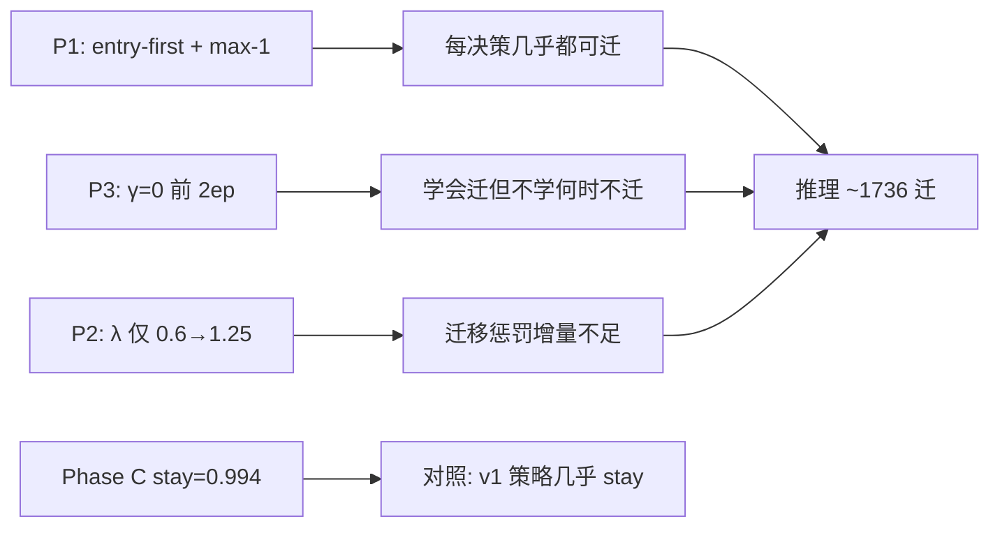

# Reward v2.1 P3 总结与 P4 修改计划

**版本**：2026-06-05  
**依据实验**：`experiments/medium_validation_20260605_170422_reward_v21_p3_8ep/`  
**关联文档**：

- [test.md](../test.md)（路线图 §9）
- [experiment_results_summary.md](experiment_results_summary.md)
- [Reward_v2奖励函数设计总结.md](Reward_v2奖励函数设计总结.md)

**代码真源**：`core/reward_curriculum.py`、`core/reward.py`、`algorithms/marl_gat.py`、`run_reward_v21_p3_cov50.py`

---

## 1. 背景与目标

在 P0→P2 之后，GAT-MARL 面临两类失败模式：

| 阶段 | 现象 | 根因 |
|------|------|------|
| v2.1 主线（无 P1） | 推理 **0 迁移**，stay≈1.0 | 负 reward 下学会 stay |
| P1/P2 | 推理 **~1758 迁移**，成本 ~89k ms | entry-first 打破死锁，但策略「每决策几乎必迁」 |

**P3 目标**：通过 **L_internal γ 蒙眼课程**，让 agent 早期学会 entry 迁移、后期对齐完整拓扑痛觉，同时保持报表 `total_cost_ms` 与 SA 可比。

**P3 成功标准（8 epoch）**：

- 推理迁移 ~10–20（SA 量级）
- Avg Total Cost 明显低于 ~89k，目标 <2× SA（~7–15k ms）
- P95 Excess < 31 km

---

## 2. P3 完成内容

### 2.1 核心机制

P3 在 **P1（动作协调）+ P2（reward 课程 + soft CF bias）** 之上，增加 **L_internal γ 蒙眼课程**：

```
训练目标：L_e2e = L_acc + γ · L_internal   （仅 sla_penalty_objective_ms / reward_objective_ms）
报表口径：total_cost_ms 不变（完整物理量：access + comm + tearing + migration + SLA）
```

**设计意图**：前若干 epoch 在「感觉不到拓扑撕裂痛觉」的情况下学会 entry 迁移；γ 渐增后再对齐 eval 时的真实目标（γ=1.0）。

### 2.2 代码改动一览

| 模块 | 改动 |
|------|------|
| `core/reward_curriculum.py` | 新增 `internal_path_gamma()`、`internal_gamma_curriculum_enabled()`；`apply_curriculum_for_epoch()` 同时设置 γ 与 P2 参数（S / αβ / λ） |
| `core/reward.py` | `set_reward_v2_runtime(internal_path_gamma=...)`；`effective_internal_path_gamma()`；objective 中 `internal_path_ms *= γ`；`details` 增加 `internal_path_gamma`、`internal_path_objective_ms` |
| `algorithms/marl_gat.py` | 启动日志 `P3: L_internal γ=on`；每 epoch 打印 γ；`epoch_stats.reward_curriculum` 含完整课程参数 |
| `run_reward_v21_p3_cov50.py` | P1+P2+P3 组合入口，默认 **8 epoch**，tag `reward_v21_p3_8ep`，**不自动 P1 热启动** |
| `run_medium_validation_cov50.py` | config 记录 `reward_v2_internal_gamma`、`reward_v2_gamma_warmup_epochs` |
| 文档 | `test.md` §9、`experiment_results_summary.md` §2e |

### 2.3 环境变量

| 变量 | P3 默认值 | 说明 |
|------|-----------|------|
| `REWARD_V2_INTERNAL_GAMMA` | `1` | 启用 γ 课程 |
| `REWARD_V2_GAMMA_WARMUP_EPOCHS` | `2` | 前 N epoch γ=0 |
| `REWARD_V2_CURRICULUM` | `1` | P2 课程（S / αβ / λ） |
| `MARL_P1` | `1` | entry-first + max-1 |
| `MARL_SOFT_CF_BIAS` | `1` | P2 软 counterfactual bias |
| `MEDIUM_VALIDATION_MARL_EPOCHS` | `8` | MARL 训练轮数 |

**入口**：

```bash
python -u run_reward_v21_p3_cov50.py
```

### 2.4 γ 与 P2 课程日程（8 epoch，warmup=2）

**γ 日程**：

| Epoch | 0 | 1 | 2 | 3 | 4 | 5 | 6 | 7 (eval) |
|-------|---|---|---|---|---|---|---|----------|
| γ     | 0 | 0 | 0 | 0.25 | 0.5 | 0.75 | 1.0 | 1.0 |

**P2 并行退火**（随 epoch progress 线性）：

- S：150k → 60k ms
- α / β：0.5 → 1.0
- λ_mig：0.6 → 1.25

---

## 3. P3 实验结果

**实验目录**：`experiments/medium_validation_20260605_170422_reward_v21_p3_8ep/`  
**耗时**：约 70 min（8 epoch reactive + SA/DQN 对照）

### 3.1 推理段对比

| 指标 | P3 GAT | P1/P2 GAT | Phase C (v1) | SA |
|------|--------|-----------|--------------|-----|
| 迁移次数 | **1736** | 1758 | 72 | 11 |
| Avg Total Cost (ms) | **45840** | 88891 | 17674 | 9459 |
| P95 Excess (km) | **6.72** | 31.0 | 6.63 | 6.63 |
| stay_ratio | 0.857 | 0.851 | **0.994** | — |

### 3.2 训练分 epoch 轨迹

| Epoch | γ | 迁移 | stay_ratio | 说明 |
|-------|---|------|------------|------|
| 0 | 0 | 5650 | 0.804 | γ=0，开始学迁移 |
| 1 | 0 | 10987 | 0.857 | 每决策几乎 1 次 entry 迁 |
| 2 | 0 | 8080 | 0.847 | — |
| 3 | 0.25 | 10514 | 0.824 | γ 开始上升 |
| 4 | 0.50 | 12417 | 0.843 | — |
| 5 | 0.75 | **18793** | 0.821 | **迁移峰值** |
| 6 | 1.0 | **6229** | 0.855 | full γ 后回落 |
| 7 (eval) | 1.0 | **18209** | 0.830 | 最终 checkpoint 仍过迁 |

### 3.3 按 DAG 类型（推理）

| DAG type | 迁移 | avg_total_cost_ms |
|----------|------|-------------------|
| FanIn_Aggregator_1 | 948 | 63001 |
| FanOut_Broadcaster_1 | 788 | 25195 |

FanIn 仍是过迁与高成本主因。

### 3.4 结论判定

| 维度 | 结果 | 判定 |
|------|------|------|
| 成本 | 88.9k → 45.8k ms（↓49%） | ✅ 部分成功 |
| P95 | 31 → 6.7 km（↓78%，接近 SA） | ✅ 部分成功 |
| 迁移频次 | 1758 → 1736（几乎不变） | ❌ 未达标 |
| stay 收敛 | 0.851 → 0.857（未向 SA/Phase C 靠拢） | ❌ 未达标 |

**一句话**：P3 的 γ 课程 **有效改善了 SLA 质量与报表成本**，但 **未能打破「每决策几乎必迁」的策略固化**。

---

## 4. 根因分析



1. **γ=0 的双刃剑**  
   早期蒙眼让 agent 建立「迁移 = 正反馈（改善 access / 消 violation）」的条件反射；γ 升高后 internal 痛觉突然介入，已固化的过迁策略难以逆转。

2. **P1 放宽「能迁」但未约束「应迁」**  
   entry-first 把动作空间从「0 迁死锁」扩到「每步 1 迁」，解决了探索问题，但没有 SLA 触发门槛。

3. **λ 退火与 γ 升高的交互**  
   ep5（γ=0.75, λ≈1.03）为迁移峰值，说明 **γ 升高带来的 internal 痛觉 >> λ 增量**；单纯加长 P2 退火不足以压迁移。

4. **Phase C 差距**  
   v1 + stay≈0.994 + 72 迁说明「少迁」策略可学；P1–P3 组合整体偏向「鼓励迁」，与 Phase C 的 guard / reward 语义不同。

5. **Checkpoint 选择**  
   ep6（6229 迁）明显优于 ep8 eval（18209 迁），说明最终 epoch 并非最优推理权重。

---

## 5. P4 修改计划（修订：机制优先，不做超参排列组合）

### 5.1 总体策略

**决策**：抛弃 P4-A 类超参调优（λ 反向课程、延长 γ=0 等）。P3 参数已能把 P95 压到 SA 量级，继续调参是无底洞。

**P4 唯一主线**：**B1 — SLA 违规物理屏蔽（Action Masking）**

- 保留 P3 全部配置（P1 + P2 + γ 课程）
- 在 `algorithms/marl_gat.py` 动作生成阶段加入硬门槛
- 环境变量：`MARL_SLA_VIOLATION_GATE=1`（Reward v2 默认开启）

**中间目标**：Phase C 量级（~72 迁 / ~17.7k ms）  
**终极目标**：SA 量级（~11 迁 / ~9.5k ms）

### 5.2 B1 机制（已实施）

**物理前置条件**（与 `core/reward.py` 中 `spatial_violation` / `qos_violation` 对齐）：

```text
spatial_violation = max_entry_dist_km > SLA_DISTANCE_THRESHOLD
qos_violation     = l_e2e_ms > USER_SLA_TOLERANCE_MS   （v2 internal path 下含 RPC）
```

**动作阉割**：若 `not (spatial_violation or qos_violation)`，将所有迁移动作（1/2/3）mask 为 `-inf`，强制 STAY（0）。

**业务语义**：延迟在绿线以内时，云调度系统不应主动触发容器迁移——这是业务底线，不是 reward 调参。

**代码落点**：

| 文件 | 改动 |
|------|------|
| `core/reward.py` | `dag_current_sla_violation()` — 统一 violation 判定 |
| `algorithms/marl_gat.py` | `_use_sla_violation_gate()`、`_apply_sla_violation_action_gate()`；在 `_apply_action_mask` 之前应用 |
| `run_medium_validation_cov50.py` | config 记录 `marl_sla_violation_gate` |

**预期效果**：

- 治愈「多动症」：~90% 无效迁移（SLA 已绿仍迁）被物理阻断
- 迁移次数回落至 50–100 合理区间
- Avg Total Cost 向 SA ~9.5k 靠拢
- 网络专注「SLA 报警时如何切图」

### 5.3 暂缓 / 废弃方案

| 编号 | 方案 | 状态 |
|------|------|------|
| ~~A1~~ | Checkpoint 选择 | 暂缓（B1 优先） |
| ~~A2~~ | λ 反向课程 | **废弃** |
| ~~A3~~ | 延长 γ=0 | **废弃** |
| **B1** | SLA 违规物理 mask | **✅ 已实施** |
| B2 | 两阶段训练 | 视 B1 结果再定 |
| B3 | Stay 正奖励 | 视 B1 结果再定 |

### 5.4 诊断（可选）

| 编号 | 方案 | 目的 | 状态 |
|------|------|------|------|
| C1 | P3 checkpoint + B1 gate inference-only | 零训练成本验证 B1 效果 | ✅ 已跑（见 §11） |
| C2 | FanIn / FanOut 分 DAG 归因 | B1 后仍过迁时的 targeted 分析 | 待定 |
| C3 | Phase C ablation | 分离 reward vs guard 贡献 | 待定 |

---

## 11. C1 快验结果（2026-06-06，P3 ckpt + B1 gate）

**结论：当前 B1 实现未达预期，不建议直接上 8ep 全量。**

| 指标 | P3 推理（无 B1，历史） | C1（P3 ckpt + B1 gate） |
|------|------------------------|-------------------------|
| GAT 迁移 | 1736 | **3533** |
| Avg Cost | 45.8k ms | **61.8k ms** |
| P95 | 6.7 km | **31.0 km** |
| stay_ratio | 0.857 | 0.819 |
| **sla_gate 触发** | — | **0 / 3533 决策** |

**日志**：`B1: SLA gate=on`，但 `sla_gate=0/3533` —— **没有任何决策被强制 STAY**。

### 根因

Reactive 流水线里，`get_trigger_type()` 仅在 **gateway 已违规** 时返回 `REACTIVE`。  
决策进入 GAT 时，`dag_current_sla_violation()` **几乎恒为 True**，B1 mask 从未生效。

也就是说：

- 「90% 无效迁移」不是发生在「SLA 全绿」的决策上，而是发生在 **「已违规但仍反复迁」** 的决策上；
- 当前 B1（无违规 → 强制 STAY）与 Reactive 触发逻辑 **语义重叠**，无法切断过迁。

### 修订方向（B1.1，待实施）

| 方案 | 逻辑 | 预期 |
|------|------|------|
| **B1.1a** | 硬 CF 门槛：仅当 `sla_gain_ms > 0` 才开放 migrate | 砍掉「违规但迁了也没用」的内卷 |
| **B1.1b** | 违规 episode 内 max-1 迁（直到 violation 清除） | 对齐 SA「救火一次」 |
| **B1.1c** | 恢复 Phase C 式 rule guard（v2 下不 bypass） | 对照 Phase C 72 迁 |

**下一步**：~~优先实现 **B1.1a** 并再跑 C1 快验~~ → **B1.1a 已实现并完成 C1 快验**（见 §12）。若成本仍偏高，再跑 8ep 全量（训练期同步启用 gate）。

---

## 12. B1.1a C1 快验结果（2026-06-07，P3 ckpt + CF gate）

**配置**：`MARL_CF_SLA_GAIN_GATE=1`，B1 默认关闭；P3 checkpoint inference-only。

| 指标 | P3 基线 | B1（sla 绿 mask） | **B1.1a（CF gate）** |
|------|---------|-------------------|----------------------|
| GAT 迁移 | 1736 | 3533 | **349** |
| Avg Cost | 45.8k ms | 61.8k ms | **72.0k ms** |
| P95 | 6.7 km | 31.0 km | 31.0 km |
| stay_ratio | 0.857 | 0.819 | **0.885** |
| migrate_opt_dec | — | 3533/3533 | **0/2733** |
| mask_only_stay | — | — | **100%** |

**日志**：`B1.1a: CF sla_gain gate=on`，`cf_gate=32458/0`（几乎全部 migrate 槽位被 mask），`migrate_opt_decisions=0/2733`。

**判定**：✅ **迁移频次显著下降（1736→349，约 −80%）**；❌ 成本/P95 未回到 SA 量级（旧 checkpoint 未在 gate 下训练）。

### 12b. P3+B1.1a 全量 8ep（2026-06-07）

**路径**：`experiments/medium_validation_20260607_001742_reward_v21_p3_b11a_8ep/`  
**耗时**：~125 min

| 指标 | P3 8ep | C1 B1.1a（旧 ckpt） | **P3+B1.1a 8ep** | SA |
|------|--------|---------------------|------------------|-----|
| 推理迁移 | 1736 | 349 | **0** | 14 |
| Avg Cost | 45.8k | 72.0k | **55.2k** | 9.6k |
| P95 | 6.7 km | 31 km | **31 km** | 6.6 km |
| stay | 0.857 | 0.885 | **1.000** | — |

**全 epoch**：`cf_gate` 几乎全部 blocked（improving=0），`migrate_opt=0/3533`，**从过迁摆回 0 迁死锁**（与 v2.1 无 P1 类似，但机制是 CF 硬 mask 而非 reward）。

**结论**：B1.1a 阈值 `sla_gain_ms > 0` 在 v2 internal-path CF 下 **过严**，训练期无任何 migrate 探索 → 策略学 stay；需 **B1.1b**（放宽门槛或 episode 内允许首迁）再验证。

---

## 6. 推荐执行顺序（修订）

```
Step 1（~5min）
  └─ C1：P3 checkpoint + B1 gate，INFERENCE_ONLY=1
       判据：推理迁移 < 200，成本明显下降

Step 2（全量 8ep，P3 配置 + B1）
  └─ python -u run_reward_v21_p3_cov50.py
       判据：迁移 10–100 / 成本 <15k / P95 <8 km / stay >0.95

Step 3（仅当 B1 不足）
  └─ 考虑 B2 两阶段训练或 B3 stay 正奖励
```

---

## 7. P4 成功标准

| 指标 | P3 现状 | P4 目标（全量） | 说明 |
|------|---------|-----------------|------|
| 推理迁移 | 1736 | **10–50**（中间 50–100 可接受） | 主 KPI |
| Avg Total Cost | 45.8k ms | **<15k ms**（<2× SA） | 副 KPI |
| P95 Excess | 6.7 km | **<8 km** | 不可回退到 31 km |
| stay_ratio | 0.857 | **>0.95** | 向 Phase C 靠拢 |
| FanIn 迁移 | 948 | **<50** | 分 DAG 约束 |

---

## 8. 实验目录索引（P0–P3）

| 目录 | 阶段 | 推理迁移 | Avg Cost | P95 | 要点 |
|------|------|----------|----------|-----|------|
| `medium_validation_20260605_reward_v21_softguard_reactive_8ep_v1` | v2.1 主线 | 0 | — | — | 无 P1，stay 死锁 |
| `medium_validation_20260605_145403_reward_v21_p1_v1` | P1 | 1758 | 88.9k | 31 km | 打破 0 迁 |
| `medium_validation_20260605_162655_reward_v21_p2_2ep` | P2 | 1758 | 88.9k | 31 km | 2ep 无改善 |
| `medium_validation_20260605_170422_reward_v21_p3_8ep` | **P3** | **1736** | **45.8k** | **6.7 km** | QoS 改善，迁移仍过频 |
| `medium_validation_20260526_phaseC_softguard_v1` | v1 标杆 | 72 | 17.7k | 6.6 km | stay≈0.994 |

---

## 9. 路线图状态（更新）

| 优先级 | 状态 | 内容 |
|--------|------|------|
| P0 | ✅ 完成 | 分 epoch 指标 + 8 epoch reactive 全量 |
| P1 | ✅ 完成 | entry-first / max-1 + DAG/CF 特征 |
| P2 | ✅ 完成 | reward 课程 + soft CF bias + Phase C 对照 |
| P3 | ✅ 完成 | L_internal γ 课程（训练蒙眼，eval γ=1） |
| P3 结果 | ⚠️ 部分 | 成本/P95 改善；迁移仍 ~1736 |
| **P4 / B1** | ✅ 已实施 | SLA 违规物理 mask（`MARL_SLA_VIOLATION_GATE`） |

---

## 10. 待办清单（P4）

- [x] **B1**：SLA 违规物理 action mask（`dag_current_sla_violation` + gate）
- [x] **C1**：P3 checkpoint + B1 inference-only 快验 → **未达标**（sla_gate 0/3533）
- [x] **B1.1a**：硬 CF 门槛（`sla_gain_ms > 0` 才允许 migrate）
- [x] **C1 复测（B1.1a）**：349 迁（↓80%），成本仍 ~72k
- [x] **8ep 全量（P3 + B1.1a）**：0 迁 / ~55k ms — CF gate 过严，摆回死锁
- [ ] **B1.1b**：放宽 CF 门槛（如 `effective_sla_gain_ms > 0` 或 entry-only 首迁）
