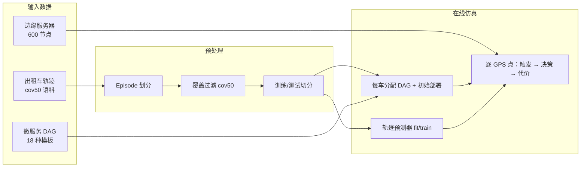

# 中期报告：移动边缘动态环境下微服务反应式自适应迁移方法

**研究定位**：研究生毕业论文第三项研究  
**文档性质**：已完成工作梳理（方法论与建模）  
**版本**：2026-06-11  
**说明**：本文档仅描述问题建模、系统设计与算法框架等已完成工作；系统性实验设计与结果分析将在后续阶段开展，本文不涉及实验数据与结论。

---

## 一、研究背景与问题定义

### 1.1 研究背景

在移动边缘计算（Mobile Edge Computing, MEC）场景中，微服务以有向无环图（DAG）形式组织，节点间存在调用依赖与流量权重差异。移动用户（如车载终端）持续改变地理位置，导致用户到微服务**入口节点**的接入距离与时延动态变化；当 QoS 超出服务等级协议（SLA）阈值时，系统需决定是否迁移、迁移哪些节点以及迁移至哪台边缘服务器。

该问题的难点在于：迁移决策并非单点优化，而需在**接入时延、跨服通信开销、拓扑撕裂代价、镜像/状态迁移成本与 SLA 违规惩罚**之间进行多目标权衡；同时，DAG 拓扑结构决定了部分高流量依赖边上的微服务应协同部署，否则即便入口节点靠近用户，内部调用链仍可能产生显著端到端延迟。

### 1.2 研究目标

本研究旨在面向移动边缘动态环境，设计一套**面向复杂 DAG 拓扑依赖的微服务反应式自适应迁移方法**，核心目标包括：

1. 建立可反映用户移动与 SLA 漂移的边缘微服务迁移仿真模型；
2. 构建反应式/主动式双层触发机制，在环境变化时启动迁移决策；
3. 利用图注意力网络（GAT）编码 DAG 拓扑与上下文特征，结合 CTDE 多智能体强化学习（MARL）实现在线协同决策；
4. 建立与物理量一致的端到端总成本奖励模型，并扩展 traffic-aware 联合迁移（COLOCATE）动作空间，使决策粒度与 DAG 调用关系对齐。

### 1.3 问题形式化

对每个移动用户 \(u\) 在离散时刻 \(t\)，系统维护：

- 用户位置 \((lat_u, lon_u)\)；
- 分配的 DAG 类型 \(G = (V, E, w)\)，其中 \(V\) 为微服务节点集合，\(E\) 为调用边，\(w(e)\) 为边流量权重；
- 节点部署映射 \(\pi: V \rightarrow S\)，\(S\) 为边缘服务器集合。

在每个仿真步，系统依次执行：

1. **触发检测**：判断当前是否需启动迁移（Reactive 或 Proactive）；
2. **候选生成**：基于用户位置选取 \(K\) 个最近边缘服务器作为候选目标；
3. **联合决策**：各可部署节点在动作空间内选择 STAY 或迁移至某候选服务器（或 COLOCATE 联合迁移）；
4. **代价评估**：按物理模型计算接入时延、内部路径时延、通信/撕裂/迁移成本及 SLA 惩罚，得到总成本 \(C_{total}\)。

优化目标是在动态轨迹上最小化长期累积总成本，同时控制迁移频次与拓扑合理性。

---

## 二、数据来源与预处理

本研究仿真平台依赖三类核心数据：**移动用户轨迹**、**边缘服务器部署位置**与**微服务 DAG 拓扑模板**。三类数据在系统中分别承担"环境动态性""基础设施空间布局""应用拓扑与调用强度"三种角色；迁移算法主路径仅使用轨迹的物理位置字段，不使用任何用户健康或画像属性。

### 2.1 数据总览

| 数据类别 | 原始/真源文件 | 算法实际使用字段 | 在仿真中的作用 |
|----------|---------------|------------------|----------------|
| 移动用户轨迹 | `data/taxi_with_health_info.csv` | `taxi_id`, `date_time`, `latitude`, `longitude`, `episode_id`（预处理新增） | 驱动用户移动、触发 SLA 变化、训练轨迹预测器 |
| 边缘服务器位置 | `data/edge_server_locations.csv` | `edge_server_id`, `longitude`, `latitude` | 候选服务器选取、距离/时延计算、覆盖过滤 |
| 微服务 DAG 模板 | `core/microservice_dags.py` | 节点属性、`edges` 流量权重 | 每车绑定一种业务拓扑，决定调用依赖与迁移代价 |

**默认预处理语料**（全项目统一入口）：

```text
data/processed/taxi_cleaned_active100_min100_eps2h_cov50.csv
```

对应元数据摘要：`data/processed/taxi_cleaned_active100_min100_eps2h_cov50.summary.json`

---

### 2.2 移动用户轨迹数据

#### 2.2.1 数据来源与构成

移动用户由**北京地区出租车 GPS 轨迹**模拟。数据经多阶段整合， lineage 如下：

```text
data/taxi_raw/*.txt          # 分片原始轨迹（taxi_id, date_time, lon, lat）
        ↓ 合并
combined_taxi_data.csv       # 汇总轨迹（脚本中间产物）
        ↓ 可选：随机配对健康画像（见 §2.4）
data/taxi_with_health_info.csv   # 当前算法入口原始 CSV（≈105 万行，≈56 MB）
        ↓ load_data / cov50 过滤
data/processed/taxi_cleaned_active100_min100_eps2h_cov50.csv
```

**原始轨迹字段**（`taxi_raw` 分片示例）：

| 字段 | 类型 | 说明 |
|------|------|------|
| `taxi_id` | int | 车辆唯一标识 |
| `date_time` | datetime | GPS 采样时刻 |
| `longitude` | float | 经度（WGS-84，北京区域约 116°–117°） |
| `latitude` | float | 纬度（北京区域约 39°–40°） |

**时间跨度与采样特征**  
预处理后语料时间范围为 **2008-02-02 13:30:00 至 2008-02-08 17:39:00**。相邻 GPS 点间隔多为 **约 10 分钟**（部分时段因运营状态变化存在更长间隔），该离散采样粒度直接用于 Proactive 触发中 TTV 窗口与轨迹预测步长对齐。

**空间范围**  
轨迹点主要分布于北京城区及周边（脚本可视化过滤范围：经度 116.0°–116.8°，纬度 39.3°–40.5°），与边缘服务器坐标处于同一地理坐标系，可基于 Haversine 大圆距离进行统一的 km 级物理建模。

#### 2.2.2 算法使用的字段与丢弃策略

`core/data_loader.py` 在加载时**仅保留物理移动相关列**：

```python
CORE_COLUMNS = ["taxi_id", "date_time", "latitude", "longitude"]
```

原始 CSV 中附带的 `Age`、`Physical_Activity`、`CVD_Risk_Score`、`Hypertension`、`Diabetes` 等健康画像列在加载阶段即被丢弃，**不参与**迁移触发、状态构建、奖励计算或强化学习训练。这一设计保证第三项研究聚焦于"用户移动 → 接入时延变化 → 迁移决策"的物理因果链，避免引入与 MEC 迁移无关的协变量。

#### 2.2.3 标准清洗管线（`load_data`）

对原始 CSV 执行以下阶段一清洗（`processed_csv=False` 时）：

| 步骤 | 操作 | 默认参数 | 目的 |
|------|------|----------|------|
| 1 | 列筛选 | 仅保留 CORE_COLUMNS | 去除非物理字段 |
| 2 | 时间解析与排序 | 按 `(taxi_id, date_time)` | 保证时序正确 |
| 3 | 缺失值剔除 | `dropna(lat/lon)` | 去除无效坐标 |
| 4 | 时间去重 | `(taxi_id, date_time)` 保留首条 | 消除重复采样 |
| 5 | 速度毛刺清洗 | `v_max_kmh = 200` | 删除相邻点隐含速度 > 200 km/h 的跳变点 |
| 6 | 最小轨迹长度 | `min_vehicle_points = 100` | 剔除轨迹过短车辆 |
| 7 | 活跃车辆筛选 | `active_users_limit = 100` | 保留轨迹点数 Top-100 车辆 |
| 8 | Episode 划分 | `gap_dt_hours = 2.0` | 同车相邻点间隔 > 2 h 则开启新 episode |

Episode 划分使轨迹预测器与触发逻辑能识别"行程中断"，避免跨 episode 的错误速度外推。

#### 2.2.4 边缘覆盖过滤（cov50 语料）

在标准清洗之上，`scripts/export_coverage_cleaned_taxi_data.py` 施加**边缘服务器覆盖约束**，生成主实验语料 `*_cov50.csv`：

| 参数 | 默认值 | 含义 |
|------|--------|------|
| `coverage_km` | 50.0 | 轨迹点保留条件：到最近边缘服务器距离 ≤ 50 km |
| `min_episode_coverage_ratio` | 0.8 | Episode 保留条件：覆盖内点占比 ≥ 80% |
| `active_users_limit` | 100 | 过滤后再次保留 Top-100 活跃车辆 |
| `min_vehicle_points` | 100 | 再次执行最小点数过滤 |

**过滤逻辑（三步）**：

1. 对每个轨迹点计算到全部边缘服务器的最近距离，标记 `_in_coverage`；
2. 按 `(taxi_id, episode_id)` 统计覆盖内点比例，丢弃比例 < 0.8 的 episode；
3. 仅保留 `_in_coverage = True` 的轨迹点，重新分配 `episode_id`。

**设计动机**：原始轨迹含大量远离任何边缘服务器的郊区/途外片段；cov50 过滤使仿真样本集中于"边缘有效覆盖范围内"的移动场景，更贴近 MEC 服务部署与迁移的实际适用区域。

**cov50 语料规模**（来自 `*.summary.json`，2026-05-11 导出）：

| 指标 | 数值 |
|------|------|
| 基础清洗后行数 | 811,073 |
| 基础清洗后车辆数 | 628 |
| Episode 过滤后行数 | 791,662 |
| 点级覆盖过滤后行数 | 791,014 |
| **最终行数** | **205,936** |
| **最终车辆数** | **100** |
| **Episode 总数** | **244** |
| 最近服务器距离 P50 | 0.61 km |
| 最近服务器距离 P95 | 25.48 km |
| 最近服务器距离最大值 | 49.57 km（≤ coverage_km） |

#### 2.2.5 训练/测试划分策略

仿真脚本支持两种车辆级切分，保证训练与测试车辆不重叠：

| 切分方式 | 使用脚本 | 策略 |
|----------|----------|------|
| 随机 80/20 | `run_comparison.py` | `default_rng(42)` 按 `taxi_id` 随机划分 |
| 风险暴露均衡 | `run_medium_validation_cov50.py`、`run_full_pipeline_cov50.py` | 按每车"最近服务器 SLA 风险暴露"贪心均衡划分 |

**风险暴露均衡切分**（中等/全量验证主协议）对每辆车计算：

- `nearest_over_15`：最近边缘服务器距离超过 SLA 阈值（15 km）的轨迹点数；
- `nearest_10_to_15`：处于 10–15 km 边界风险区的点数；
- `risk_score = nearest_over_15 + 0.25 × nearest_10_to_15`。

在固定测试车辆比例下，贪心搜索使测试集在**行数占比**与**风险分数占比**上均接近目标比例，减少"测试集缺乏 proactive 机会或 SLA 风险样本偏斜"的问题。

轨迹预测器 `SimpleTrajectoryPredictor` 仅在**训练车辆**轨迹上 `fit()`，测试车辆作为未见用户评估泛化能力。

---

### 2.3 边缘服务器部署数据

#### 2.3.1 数据文件与字段

| 属性 | 说明 |
|------|------|
| 文件路径 | `data/edge_server_locations.csv` |
| 节点规模 | **600** 台边缘服务器 |
| 核心字段 | `edge_server_id`（唯一 ID）、`Name`（站点名称）、`longitude`、`latitude` |

算法运行时仅使用 `edge_server_id` 与经纬度，构建 `{server_id → (lat, lon)}` 查找表（`build_servers_info()`），供 Haversine 距离、候选服务器 Top-K 查询及覆盖过滤使用。

#### 2.3.2 空间分布与选取策略

600 台边缘服务器坐标分布于北京及周边区域，与出租车轨迹空间范围相匹配。对用户当前位置 \((lat_u, lon_u)\)：

1. 计算到全部 600 台服务器的 Haversine 距离；
2. 选取距离最近的 **Top-3** 作为该次迁移决策的候选目标集；
3. 最近服务器距离同时用于 SLA 判定、Reactive urgency 编码及 cov50 覆盖过滤。

该"多站点 + 近邻候选"设定模拟 MEC 中用户处于多个可用边缘节点覆盖范围内的典型部署形态。

---

### 2.4 辅助数据：健康画像（不进入迁移算法）

原始 CSV 中的健康相关列来自独立的健康统计数据，经离线脚本随机配对至出租车 ID：

| 步骤 | 脚本 | 说明 |
|------|------|------|
| 筛选北京地区健康记录 | `scripts/filter_beijing_health.py` | 从 `heart_attack_china.csv` 筛选 `Province` 含 Beijing 的记录 → `beijing_data.csv` |
| 随机配对至轨迹 | `scripts/add_context_to_trajectory.py` | 从 `combined_taxi_data.csv` 抽样最多 1777 个 `taxi_id`，与健康记录随机配对（`random_state=42`），输出 `taxi_with_health_info.csv` |

配对字段包括 `Age`、`Physical_Activity`、`CVD_Risk_Score`、`Hypertension`、`Diabetes`。**上述字段仅存在于原始 CSV 中，在 `load_data()` 阶段被剔除，不参与本研究的迁移建模与算法训练。** 若论文中需说明数据 lineage，可注明其为轨迹数据的附属上下文，与第三项研究的方法论无直接关联。

---

### 2.5 微服务 DAG 拓扑与调用强度数据

#### 2.5.1 模板库来源与规模

微服务应用拓扑定义于 `core/microservice_dags.py`，共 **18 种** DAG 模板，由**生产环境微服务调用链 trace** 离线提取并抽象而来（提取工具：`scripts/extract_microservice_dags.py`）。模板按拓扑形态命名，涵盖：

| 类型前缀 | 数量 | 拓扑含义 |
|----------|------|----------|
| `FanIn_Aggregator_*` | 3 | 多上游微服务 → 单一聚合节点（常有状态） |
| `FanOut_Broadcaster_*` | 3 | 单一广播源 → 多下游有状态微服务 |
| `Diamond_DAG_*` | 3 | 菱形依赖（分叉后汇合） |
| `Pipeline_Chain_*` | 3 | 链式流水线调用 |
| `Data_Heavy_DAG_*` | 3 | 数据密集型子图 |
| `Compute_Heavy_DAG_*` | 3 | 计算密集型子图 |

每种模板结构：

```python
{
    "probability": float,        # 新车分配该 DAG 的权重（按原始 trace 出现频率归一化）
    "nodes": {
        "MS_xxxxx": {
            "image_mb": int,     # 容器镜像大小 → 迁移传输代价
            "state_mb": int,     # 状态数据大小 → 有状态服务迁移代价
            "is_stateful": bool,
        },
    },
    "edges": {
        (src, dst): traffic,     # 调用强度（原始 trace RPC 计数尺度）
    },
}
```

#### 2.5.2 离线提取原则

`core/dag_complexity.py` 中的 `dagify_component_edges()` 规定从原始调用图到 DAG 的转换规则：

- 对弱连通子图按确定性节点序定向，**保留前向边**，丢弃回边/环边；
- 节点数限制在 4–12 之间，适配在线 GAT-MARL 的小图规模；
- 跨模板可共享节点名（如 `MS_37691`），表示同一微服务在不同业务 DAG 中复用；仿真中每车仅实例化一种 DAG，部署相互独立。

#### 2.5.3 调用强度（traffic）的使用

边权重 `traffic` 源自生产 trace 的 RPC 调用计数，在系统中用于：

| 用途 | 模块 | 说明 |
|------|------|------|
| 通信/撕裂代价 | `core/reward.py` | 跨服边的 RPC 阻塞时间与 tearing 流量 |
| GAT 邻接矩阵 | `core/marl_state_builder.py` | `log(1 + RPC)` 归一化边权重 |
| COLOCATE pattern | `core/colocate_pattern.py` | 高流量边（> T_critical）决定联合迁移节点集合 |
| 节点特征 | 状态构建 | 关联边流量累加、邻居同机比例等 |

仿真运行时，reward 计算中通过 `EDGE_RPC_SCALING = 0.01` 将 trace 计数映射为物理 RPC 调用次数，**仅改变绝对尺度，不改变边间相对排序**。

#### 2.5.4 仿真中的 DAG 分配

每辆出租车**首次出现**时：

1. 按各模板 `probability` 权重随机抽取一种 DAG 类型；
2. 将该 DAG 全部可部署节点**初始部署**于距当前位置最近的边缘服务器；
3. 此后每次 GPS 采样点更新用户位置，按 SLA 触发迁移决策。

该机制使同一仿真语料中并存多种业务拓扑，考察算法对不同 DAG 结构的自适应能力。

---

### 2.6 数据加载与复现入口

**推荐加载方式**（跳过重复清洗，秒级加载）：

```python
from core.data_loader import load_data, DEFAULT_PROCESSED_TAXI_PATH, DEFAULT_SERVER_PATH
import pandas as pd

df = load_data(processed_csv=DEFAULT_PROCESSED_TAXI_PATH)
servers_df = pd.read_csv(DEFAULT_SERVER_PATH)
```

**重新导出 cov50 语料**：

```powershell
python scripts/export_coverage_cleaned_taxi_data.py --coverage-km 50 --active-users-limit 100
```

**重新导出基础清洗语料（无覆盖过滤）**：

```powershell
python -m core.data_loader --export
```

导出时自动生成 `*.summary.json` 元数据，记录各过滤阶段的行数、车辆数、时间范围与距离分位数，便于论文中复现数据描述。

---

### 2.7 数据在仿真中的流转关系



---

## 三、边缘环境与微服务 DAG 建模

### 3.1 移动用户与边缘基础设施

移动用户位置序列由 §2.2 所述 cov50 预处理轨迹驱动；边缘基础设施由 §2.3 所述 600 台服务器坐标构成。对用户当前位置，通过 Haversine 公式计算到各服务器的地理距离，并选取 Top-\(K\)（默认 \(K=3\)）最近服务器作为迁移候选集。用户移动是引发接入时延变化与 SLA 漂移的主要环境因素。

### 3.2 微服务 DAG 结构

微服务应用以多种典型 DAG 拓扑建模，涵盖 FanIn 聚合、FanOut 广播、Diamond、Pipeline、Data-Heavy、Compute-Heavy 等结构。每个 DAG 包含：

| 要素 | 含义 |
|------|------|
| `nodes` | 可部署微服务节点，属性含 `image_mb`（镜像大小）、`state_mb`（状态数据大小）、`is_stateful`（是否有状态） |
| `edges` | 服务调用边及 `traffic` 权重（RPC 调用强度） |
| `probability` | 用户首次接入时随机分配该 DAG 的概率 |

**外部节点与可部署节点**  
DAG 中的 USER、UNKNOWN 等节点仅用于拓扑建模，不参与迁移决策。可部署节点集合由拓扑解析得到，是 MARL 中各智能体的决策对象。

**服务入口节点**  
SLA 判定围绕**服务入口**（service entry）展开：优先取外部节点直接调用的可部署节点；多入口 DAG 采用 max-entry 口径——任一入口超阈即视为违规。该设计符合"用户感知 QoS 由入口接入决定"的实际语义。

**初始部署**  
用户首次出现时，系统将其 DAG 全部可部署节点初始放置于距当前位置最近的边缘服务器，此后随用户移动动态调整。

### 3.3 物理时延与带宽模型

接入时延采用传播时延与固定路由开销之和：

\[
L_{access}(d) = \frac{d}{v_{fiber}} + L_{router}, \quad v_{fiber} \approx 200 \text{ km/ms},\; L_{router} = 2 \text{ ms}
\]

其中 \(d\) 为用户到服务入口的 Haversine 距离（km）。

**跨服 RPC 时延**  
对 DAG 边 \((src, dst)\)，若两节点部署于不同服务器，则边有效时延为：

\[
L_{edge} = \left(\frac{d_{src,dst}}{v_{fiber}} + L_{router}\right) \times N_{RPC}(traffic)
\]

同服部署时 \(L_{edge} = 0\)。\(N_{RPC}\) 由边流量经缩放因子映射为实际 RPC 调用次数。

**内部路径时延**  
对 DAG 内部调用链，采用**关键路径累加**（critical-path max accumulation）计算端到端内部时延 \(L_{internal}\)，反映拓扑依赖对总延迟的贡献。

**迁移传输成本**  
节点迁移代价由镜像与状态数据量、有效带宽及基础迁移开销共同决定；Reactive 触发下迁移段附加系数，反映紧急迁移的资源竞争。大状态有状态服务的迁移成本显著高于无状态轻量节点。

**拓扑撕裂代价**  
跨服务器的高流量边产生 tearing/backhaul 传输开销，与 RPC 数据量及边缘回传带宽相关；该代价鼓励高依赖节点协同部署。

---

## 四、迁移触发机制

系统采用**反应式（Reactive）与主动式（Proactive）** 双层触发架构，触发逻辑与奖励/ QoS 尺度解耦，仅依赖距离（km）与接入时延（ms）。

### 4.1 反应式触发（Reactive）

当**当前状态已违反 SLA** 时触发 Reactive 迁移。判定条件为以下二者之一成立：

- **空间违规**：用户到服务入口距离 \(d > D_{SLA}\)（默认 \(D_{SLA} = 15\) km）；
- **QoS 违规**：接入时延 \(L_{access}(d) > L_{tolerance}\)。

Reactive 表示系统已进入"用户可感知的服务劣化"状态，需立即做出迁移响应。触发上下文编码中，第三维 urgency 因子随 SLA 超额距离递增（\(1 + \min(\Delta d / D_{SLA}, 2)\)），使策略网络感知违规严重程度。

### 4.2 主动式触发（Proactive）

主动式迁移基于 **Time-To-Violation（TTV）** 逻辑，在用户尚未违规但预测轨迹显示即将违规时提前触发：

1. 若当前已 Reactive 违规，直接返回 Reactive（不重复 Proactive）；
2. 利用轨迹预测器向前预测 \(H\) 步（默认 \(H=15\)）用户位置；
3. 计算预测轨迹中首次达到 SLA 违规的时间 \(T_{TV}\)；
4. 估计当前 DAG 完成迁移所需时间 \(T_{mig}\)；
5. 若 \(T_{TV} \leq T_{mig} + \Delta t_{step}\)（\(\Delta t_{step}\) 与 GPS 采样间隔对齐），则触发 Proactive。

该机制使迁移决策窗口与离散轨迹采样粒度一致，避免"预测已违规但下一观测步才 Reactive"的时序断裂。

### 4.3 轨迹预测模块

采用轻量级速度模型（SimpleTrajectoryPredictor）：

- 训练阶段为各车辆学习平均经纬度步长；
- 在线推理时融合本地瞬时速度与历史均值（EMA）；
- 预测步长与真实 GPS 采样间隔动态对齐，而非固定 60 秒。

预测输出用于 Proactive 触发与未来 SLA 风险评估，为策略提供移动性上下文特征。

---

## 五、GAT-MARL 决策框架

### 5.1 总体架构：CTDE 多智能体强化学习

本研究采用 **Centralized Training, Decentralized Execution（CTDE）** 范式：

- **智能体定义**：每个可部署微服务节点对应一个 agent；
- **参数共享**：所有 agent 共享同一 Actor 网络；
- **集中式 Critic**：训练阶段 Critic 接收图级 embedding、触发/移动上下文及联合动作 one-hot，评估联合动作价值；
- **分布式执行**：推理阶段各节点仅依赖本地图嵌入与共享 Actor 独立选动作。

该架构适合 DAG 规模较小（≤12 节点）、节点间存在拓扑耦合但需在线低时延决策的边缘场景。

### 5.2 图编码器（GraphEncoder）

采用轻量级 GAT 风格消息传递网络，输入包括：

| 输入 | 维度/含义 |
|------|-----------|
| 节点特征 | 17 维：当前/候选服务器距离、迁移成本、状态属性、entry CF 增益等 |
| 邻接矩阵 | 由边 traffic 经 log-RPC 归一化得到的无向加权邻接 |
| 触发上下文 | 3 维 trigger one-hot + urgency + 6 维 DAG 类型 family 编码 |
| 移动上下文 | 2 维：预测轨迹相对当前位置的平均位移 |
| 候选特征 | 12 维：Top-3 候选服务器距离、占用状态、entry 反事实 SLA 增益 |

消息传递过程：

\[
h_i = \text{ReLU}\left(\text{LN}\left(W_{self} x_i + W_{nb} \sum_{j} \frac{A_{ij}}{\sum_k A_{ik}} x_j \right)\right)
\]

输出为各节点的 64 维图嵌入，供 Actor 与 Critic 使用。

### 5.3 动作空间与协调机制

**基础动作空间（单节点阶段）**  
每个节点在 `{STAY, CANDIDATE_1, CANDIDATE_2, CANDIDATE_3}` 四元离散动作中选择，分别对应保持当前部署或迁移至第 \(k\) 个最近候选服务器。

**P1 动作协调（entry-first + max-1）**  
- **entry-first**：非入口节点默认仅允许 STAY，入口节点优先获得迁移动作权限，避免多节点无序竞争；
- **max-1**：每次触发决策中，主动迁移预算为 1（被动跟随不计入预算），控制迁移频次。

**COLOCATE 联合迁移动作空间（P4 扩展）**  
针对"单节点 rescue 无法兼顾 DAG 调用关系"的问题，扩展动作空间为：

\[
\mathcal{A} = \{\text{STAY}\} \cup \{\text{COLOCATE}(s_k, \mathcal{P}_k)\}_{k=1}^{K}
\]

其中 \(\mathcal{P}_k\) 为 traffic-aware 联合迁移模式：从入口节点出发，沿高流量边（\(traffic > T_{critical}\)）连通扩展，确定应协同迁移至候选服务器 \(s_k\) 的节点集合。\(T_{critical}\) 由 DAG 边流量分布数据推导（\(median \times 2\)），无需人工调参。

COLOCATE 执行时，pattern 内节点按迁移数据量升序依次迁移，减少并发带宽竞争；被动 follower 在动作 mask 上显示 STAY，但实际随 entry 同迁，policy 梯度仅回传至 active entry agent。

### 5.4 训练机制

| 组件 | 设计 |
|------|------|
| Replay Memory | 存储 joint transition（图状态、联合动作、共享/ per-agent reward） |
| Actor 更新 | Advantage 加权策略梯度 + entropy 正则 |
| Critic 更新 | 拟合 shared/training reward 的 TD 目标 |
| 探索 | ε-greedy 衰减；动作 mask 保证仅合法动作可选 |
| 梯度裁剪 | max_norm = 1.0，稳定小 DAG 上的训练 |
| n-step return | COLOCATE 场景下可选 n-step TD（N=16, γ=1.0），缓解联合迁移的单步信用分配难题 |

---

## 六、奖励与成本建模

### 6.1 端到端总成本分解

系统以毫秒（ms）为统一量纲，总成本定义为：

\[
C_{total} = L_{access} + L_{internal} + L_{comm} + L_{tearing} + L_{migration} + P_{SLA}
\]

| 分量 | 含义 |
|------|------|
| \(L_{access}\) | 用户到服务入口的接入时延 |
| \(L_{internal}\) | DAG 内部关键路径调用时延 |
| \(L_{comm}\) | 跨服通信代价 |
| \(L_{tearing}\) | 拓扑撕裂/回传代价 |
| \(L_{migration}\) | 镜像与状态迁移传输时延 |
| \(P_{SLA}\) | SLA 违规惩罚（与超额距离相关的非线性惩罚） |

该分解与报表口径一致，便于与启发式基线（如 SA）进行公平对比。

### 6.2 Reward v2 训练目标

采用 **Reward v2** 方案（`REWARD_SCHEME=v2`）：

- SLA 惩罚：\(\alpha \cdot E^2\) 形式，\(E\) 为超额距离（km）；
- 迁移代价：\(\lambda \cdot base \cdot \exp(size / \tau)\)，反映大状态服务迁移的非线性代价；
- 训练信号：\(-C_{total} / S\)，\(S\) 为 objective scale（默认 50k ms）。

**Direction A（总成本直接训练）**  
进一步简化为 `training_reward = -total_cost_ms / 10000`，关闭 per-agent λ penalty，使 RL 直接对齐报表总成本，避免手工分解权重引入的信用分配偏差。

### 6.3 课程学习机制

为解决"负 reward 下策略坍缩为全 STAY"与"放开迁移后过频迁移"的两极问题，设计分层课程：

| 阶段 | 机制 | 作用 |
|------|------|------|
| P1 | entry-first + max-1 | 打破 0 迁移死锁，控制决策频次 |
| P2 | S / αβ / λ 退火课程 | 逐步收紧 reward 尺度与惩罚强度 |
| P3 | \(L_{internal}\) 的 γ 蒙眼课程 | 前若干 epoch 令 γ=0，使 agent 在"感觉不到拓扑撕裂"时先学会 entry 迁移；γ 渐增至 1.0 后对齐完整 eval 目标 |

γ 日程示例（8 epoch，warmup=2）：epoch 0–3 为 γ=0，epoch 4–7 依次为 0.25 / 0.5 / 0.75 / 1.0。

### 6.4 MARL 奖励分配

`calculate_marl_rewards()` 将 DAG 级 shared reward 与 per-agent 信号结合：

- **Direction A 模式**：所有 deployable agent 共享 \(-C_{total}/10000\) 训练信号，可选 urgency-weighted distance bonus；
- **传统模式**：shared reward 减去 per-agent 迁移/local penalty，鼓励节点级成本意识。

报表 `total_cost_ms` 始终使用完整物理量，与训练信号解耦，保证 eval 口径一致。

---

## 七、Traffic-Aware 联合迁移（COLOCATE）建模

### 7.1 动机

单节点二元决策（STAY vs 迁移 1 个节点）存在根本局限：高流量依赖边上的下游节点若仍留驻远端服务器，\(L_{internal}\) 与 tearing 代价无法有效降低。拓扑感知模拟退火（SA）基线通过"联合 trial + 即时 Δcost 比较"实现 colocate，而 RL 需通过扩展动作空间与长期 reward 信号达到类似效果。

### 7.2 Mode-A Pattern 生成

COLOCATE pattern 生成规则（mode A）：

1. 计算 \(T_{critical} = median(\{w(e)\}) \times 2\)；
2. 选取 \(w(e) > T_{critical}\) 的高流量边；
3. 从 entry 节点出发沿高流量边做连通扩展，得到待协同迁移节点集合 \(\mathcal{P}\)；
4. 按 `image_mb + state_mb` 升序排列，优先迁移轻量节点。

该规则仅依赖 DAG 拓扑与边流量，不引入额外超参数；低流量边允许跨服部署，高流量边倾向同服，与微服务调用强度语义一致。

### 7.3 与 SA 基线的架构对齐

| 维度 | SA 基线 | GAT-MARL COLOCATE |
|------|---------|-------------------|
| 决策粒度 | 邻域含联合 colocate trial | STAY + K 个 COLOCATE pattern |
| 收益评估 | 即时 Δtotal < 0 | 多步 -total_cost 累积（可选 n-step） |
| 拓扑约束 | traffic-aware 部分 colocate | mode-A pattern 连通扩展 |
| 状态特征 | 全量 cost 枚举 | GAT 图嵌入 + 触发上下文 |

---

## 八、状态特征与上下文编码

### 8.1 节点级特征（17 维）

涵盖：当前服务器 ID 编码、到用户/候选距离、镜像/状态大小、是否 stateful、是否 entry 节点、当前 SLA 风险比、entry 反事实 SLA 增益（per-candidate）等。

### 8.2 图级上下文

- **Trigger context（9 维）**：Reactive/Proactive one-hot + urgency/risk + DAG family one-hot；
- **Mobility context（2 维）**：预测轨迹平均位移，归一化至 \([-1, 1]\)；
- **Candidate features（12 维）**：Top-3 候选的距离、占用、entry CF gain。

### 8.3 邻接矩阵构建

边权重 \(A_{ij} = \log(1 + N_{RPC}(w(e))) / \max\_log\_rpc\)，对称化后对角置 1。该编码使 GAT 能够区分高/低流量依赖强度，与 COLOCATE 的 traffic-aware 语义一致。

---

## 九、已完成工作汇总

截至中期节点，第三项研究已完成以下工作：

### 9.1 仿真平台与数据管线

- [x] 北京地区出租车 GPS 轨迹数据整合（`taxi_raw` → `taxi_with_health_info.csv`）；
- [x] 标准清洗管线：时间去重、速度毛刺过滤、最小轨迹长度、Top-100 活跃车辆、Episode 划分（`core/data_loader.py`）；
- [x] cov50 边缘覆盖过滤语料导出（205,936 行 / 100 车 / 244 episode，`scripts/export_coverage_cleaned_taxi_data.py`）；
- [x] 600 台边缘服务器部署位置数据加载与 Top-K 近邻候选查询；
- [x] 18 种生产 trace 提取的微服务 DAG 模板库（节点属性 + 边 traffic 权重）；
- [x] 风险暴露均衡的训练/测试车辆切分策略；
- [x] 在线仿真主循环（触发 → 候选 → 决策 → 代价评估 → 状态转移）。

### 9.2 物理与 QoS 建模

- [x] 接入时延、跨服 RPC、内部关键路径、tearing、非线性迁移成本的统一 ms 量纲建模；
- [x] SLA 违规判定（空间 + QoS 双通道）与服务入口语义；
- [x] Reactive / Proactive（TTV）双层触发机制；
- [x] 轻量级轨迹预测器及与 GPS 采样间隔对齐的 TTV 窗口。

### 9.3 算法框架

- [x] CTDE-GAT-MARL 完整实现（GraphEncoder + SharedNodeActor + CentralCritic）；
- [x] 17 维节点特征、9 维触发上下文、traffic 加权邻接矩阵的状态构建；
- [x] P1 动作协调（entry-first + max-1）；
- [x] COLOCATE 联合迁移动作空间与 mode-A pattern 生成；
- [x] n-step return 与 policy agent mask 的信用分配支持。

### 9.4 奖励与训练

- [x] Reward v2 端到端总成本分解与训练信号设计；
- [x] Direction A 总成本直接训练路径；
- [x] P2/P3 分层课程学习（S/αβ/λ 退火 + \(L_{internal}\) γ 蒙眼）；
- [x] MARL replay、Actor-Critic 更新、checkpoint 存取与推理模式。

### 9.5 对照基线接口

- [x] Nearest、SA（拓扑感知模拟退火）、DQN（逐节点 MLP）基线算法接口，便于后续对比实验统一入口。

---

## 十、后续工作计划（实验与论文撰写）

以下工作尚未在中期节点完成，列为后续阶段任务：

1. **系统性对比实验**：在 cov50 中等规模及全量数据集上，对比 GAT-MARL（含 COLOCATE）与 SA、DQN、Nearest 在总成本、SLA 违规、迁移频次、P95 excess 等指标；
2. **消融实验**：分别验证 GAT 拓扑编码、P1 协调、γ 课程、COLOCATE 动作空间、Direction A reward 等模块的贡献；
3. **Reactive / Proactive 双路径评估**：验证 TTV 主动迁移对 SLA 违规次数与总成本的改善；
4. **参数敏感性与可扩展性分析**：候选数 \(K\)、SLA 阈值、DAG 类型分布等对策略的影响；
5. **论文图表与结论撰写**：基于实验结果完成第三研究的论文章节。

---

## 十一、中期报告可用表述（可直接引用）

### 11.1 研究题目表述

**面向移动边缘动态环境的微服务 DAG 反应式自适应迁移方法研究**

### 11.2 研究内容概述（100–200 字）

本研究针对移动用户引发的服务接入时延劣化与 SLA 违规问题，基于北京地区出租车 GPS 轨迹（cov50 预处理语料，100 车 / 20 万+ 采样点）、600 台边缘服务器部署位置及 18 种生产 trace 提取的微服务 DAG 模板，建立 MEC 迁移仿真模型；设计 Reactive/Proactive 双层 SLA 触发机制；提出 CTDE 架构下的 GAT-MARL 在线决策框架；建立端到端总成本奖励模型与 COLOCATE 联合迁移扩展，实现迁移开销与服务质量的运行时动态权衡。

### 11.3 已完成工作表述（中期检查用）

已完成移动边缘微服务迁移仿真平台与数据管线搭建，包括：（1）基于北京出租车 GPS 轨迹的标准清洗与 cov50 边缘覆盖过滤（100 活跃车辆、244 个 episode、205,936 轨迹点）；（2）600 台边缘服务器空间布局与 Top-3 近邻候选机制；（3）18 种由生产调用链 trace 离线提取的微服务 DAG 模板（含镜像/状态属性与边调用强度）；（4）Reactive/Proactive 双层 SLA 触发与轨迹预测模块；（5）融合接入时延、内部关键路径、跨服通信、拓扑撕裂与镜像/状态迁移的 ms 量纲成本模型；（6）CTDE-GAT-MARL 决策框架及 COLOCATE 联合迁移扩展。算法框架与对照基线接口已就绪，待开展系统性实验验证。

### 11.4 数据来源表述（中期检查用，可选段落）

实验数据由三类来源构成：**①移动性数据**——北京地区出租车 GPS 轨迹，经速度毛刺清洗、Episode 划分及 50 km 边缘覆盖过滤，保留 100 辆活跃车辆共 205,936 个有效采样点（2008 年 2 月，采样间隔约 10 分钟）；**②基础设施数据**——600 台边缘服务器的地理坐标，用于距离计算与候选选取；**③应用拓扑数据**——18 种从生产微服务调用 trace 提取的 DAG 模板，边上 traffic 权重反映真实 RPC 调用强度。算法仅使用轨迹的时空坐标字段，不使用任何用户健康画像属性。

---

## 附录：核心模块与代码对应

| 模块 | 文件 |
|------|------|
| 轨迹加载与清洗 | `core/data_loader.py` |
| cov50 语料导出 | `scripts/export_coverage_cleaned_taxi_data.py` |
| DAG 离线提取 | `scripts/extract_microservice_dags.py` |
| SLA 触发 | `core/context.py` |
| 物理时延 | `core/physics_utils.py` |
| DAG 定义 | `core/microservice_dags.py` |
| 总成本/奖励 | `core/reward.py` |
| MARL 奖励分配 | `core/marl_reward.py` |
| 状态构建 | `core/marl_state_builder.py` |
| COLOCATE pattern | `core/colocate_pattern.py` |
| 课程学习 | `core/reward_curriculum.py` |
| GAT-MARL 主算法 | `algorithms/marl_gat.py` |
| 轨迹预测 | `prediction/simple_predictor.py` |
| SA 基线 | `algorithms/sa.py` |
