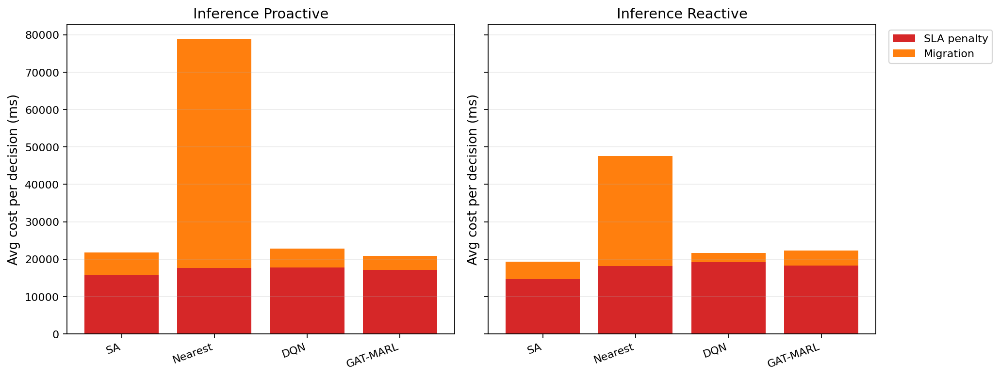

# 全量 cov50 训练与推理实验报告

**生成时间**：2026-05-20 10:51:39  
**输出目录**：`experiments/full_pipeline_20260519_2000_cov50_full_marl_quality`  
**数据文件**：`data\processed\taxi_cleaned_active100_min100_eps2h_cov50.csv`  
**数据规模**：Top-100 active taxis；train=148153 rows/80 taxis；test=57783 rows/20 taxis  
**切分方式**：greedy_balanced_by_nearest_server_exposure；test taxi ratio=0.200；test row ratio=0.281；test risk ratio=0.275  
**GAT-MARL epochs**：Proactive=8，Reactive=8  
**Checkpoint 目录**：`experiments\full_pipeline_20260519_2000_cov50_full_marl_quality\checkpoints`

## 训练段

| Algorithm | Migrations | Violations | Proactive Decisions | Avg Decision Time (ms) | Avg Access Latency (ms) | Avg Total System Cost (ms) |
|-----------|------------|------------|---------------------|------------------------|-------------------------|----------------------------|
| SA | 8339 | 17737 | 2375 | 6.34 | 2.10 | 21721.53 |
| Nearest | 14515 | 14573 | 2220 | 0.05 | 2.11 | 84338.20 |
| DQN | 23325 | 16940 | 2186 | 0.59 | 2.12 | 31592.66 |
| GAT-MARL | 4647 | 17847 | 2315 | 0.95 | 2.11 | 20265.56 |

| Algorithm | Migrations | Violations | Avg Decision Time (ms) | Avg Access Latency (ms) | Avg Total System Cost (ms) |
|-----------|------------|------------|------------------------|-------------------------|----------------------------|
| SA | 7918 | 17987 | 4.36 | 2.11 | 24660.40 |
| Nearest | 10848 | 15904 | 0.05 | 2.12 | 83297.43 |
| DQN | 22218 | 17443 | 0.40 | 2.13 | 33148.23 |
| GAT-MARL | 4022 | 14861 | 0.66 | 2.12 | 25074.77 |

## 推理段

| Algorithm | Migrations | Violations | Proactive Decisions | Avg Decision Time (ms) | Avg Access Latency (ms) | Avg Total System Cost (ms) |
|-----------|------------|------------|---------------------|------------------------|-------------------------|----------------------------|
| SA | 1853 | 5939 | 666 | 5.75 | 2.10 | 21854.64 |
| Nearest | 3381 | 5381 | 530 | 0.05 | 2.11 | 78791.95 |
| DQN | 2665 | 8758 | 607 | 0.44 | 2.10 | 22943.38 |
| GAT-MARL | 1085 | 6596 | 587 | 0.85 | 2.10 | 20925.24 |

| Algorithm | Migrations | Violations | Avg Decision Time (ms) | Avg Access Latency (ms) | Avg Total System Cost (ms) |
|-----------|------------|------------|------------------------|-------------------------|----------------------------|
| SA | 1565 | 7112 | 4.38 | 2.09 | 19409.06 |
| Nearest | 2337 | 5732 | 0.05 | 2.11 | 47614.67 |
| DQN | 1744 | 9862 | 0.29 | 2.09 | 21688.09 |
| GAT-MARL | 988 | 5591 | 0.74 | 2.11 | 22320.77 |

## 成本分解堆叠图

## 推理阶段成本分解均值

| Algorithm | Proactive SLA Penalty (ms) | Proactive Migration (ms) | Reactive SLA Penalty (ms) | Reactive Migration (ms) |
|-----------|----------------------------|--------------------------|---------------------------|-------------------------|
| SA | 15851.63 | 5948.86 | 14642.86 | 4701.52 |
| Nearest | 17574.01 | 61215.78 | 18122.82 | 29489.74 |
| DQN | 17744.79 | 5086.40 | 19170.55 | 2457.86 |
| GAT-MARL | 17107.77 | 3764.35 | 18267.20 | 3977.33 |

## 说明

- 本轮显式使用 cov50 清洗数据，不读取旧 cleaned CSV。
- DQN / GAT-MARL checkpoint 均写入本实验目录，推理阶段只读取本轮新训练权重。
- 结果会在每个算法完成后写入 `results.json` 和本报告，便于长任务中断后检查进度。
- Avg Decision Time 是算法计算耗时；Avg Access Latency 是真实接入延迟；Avg Total System Cost 是包含 SLA penalty 和迁移等代价的综合优化目标。

## DAG Proactive 迁移统计Proactive 按 DAG 自适应迁移统计（SA / Nearest / GAT-MARL 同口径）

**统一条件**：已启用前瞻（`use_proactive`）；`get_trigger_type(...) == PROACTIVE`；单次决策内在 **同一拓扑序 `sorted_nodes`** 上比较 `previous_assignments` 与决策后节点放置，统计发生变更的节点数 `migrated_nodes_count`；按 **DAG Name**（`dag_type`）聚合 `proactive_decisions` 与 `migrated_nodes`；**Avg = migrated / proactive_decisions**（保留两位小数）。

**开关对齐（仅推理实验）**：仅在推理实验的 Proactive 分支采集本统计。**训练阶段**不采集本统计。

### SA（Simulated Annealing）

| DAG Name | Proactive Decisions | Total Migrated Nodes | Avg Nodes per Decision |
|----------|---------------------|----------------------|------------------------|
| Data_Heavy_DAG | 69 | 78 | 1.13 |
| Diamond_DAG_1 | 71 | 69 | 0.97 |
| Diamond_DAG_2 | 126 | 0 | 0.00 |
| Diamond_DAG_3 | 15 | 0 | 0.00 |
| FanIn_Aggregator_1 | 26 | 13 | 0.50 |
| FanIn_Aggregator_2 | 83 | 54 | 0.65 |
| FanIn_Aggregator_3 | 24 | 13 | 0.54 |
| FanOut_Broadcaster_1 | 161 | 0 | 0.00 |
| FanOut_Broadcaster_3 | 7 | 0 | 0.00 |
| IoT_Lightweight_DAG | 84 | 0 | 0.00 |

### Nearest

| DAG Name | Proactive Decisions | Total Migrated Nodes | Avg Nodes per Decision |
|----------|---------------------|----------------------|------------------------|
| Data_Heavy_DAG | 154 | 924 | 6.00 |
| Diamond_DAG_1 | 38 | 152 | 4.00 |
| Diamond_DAG_2 | 19 | 76 | 4.00 |
| Diamond_DAG_3 | 44 | 164 | 3.73 |
| FanOut_Broadcaster_1 | 43 | 215 | 5.00 |
| FanOut_Broadcaster_2 | 37 | 185 | 5.00 |
| FanOut_Broadcaster_3 | 187 | 748 | 4.00 |
| IoT_Lightweight_DAG | 8 | 24 | 3.00 |

### GAT-MARL

| DAG Name | Proactive Decisions | Total Migrated Nodes | Avg Nodes per Decision |
|----------|---------------------|----------------------|------------------------|
| Compute_Heavy_DAG | 42 | 17 | 0.40 |
| Data_Heavy_DAG | 50 | 42 | 0.84 |
| Diamond_DAG_1 | 69 | 77 | 1.12 |
| Diamond_DAG_3 | 51 | 66 | 1.29 |
| FanIn_Aggregator_1 | 8 | 10 | 1.25 |
| FanIn_Aggregator_2 | 68 | 76 | 1.12 |
| FanOut_Broadcaster_2 | 57 | 0 | 0.00 |
| FanOut_Broadcaster_3 | 185 | 218 | 1.18 |
| IoT_Lightweight_DAG | 57 | 0 | 0.00 |
