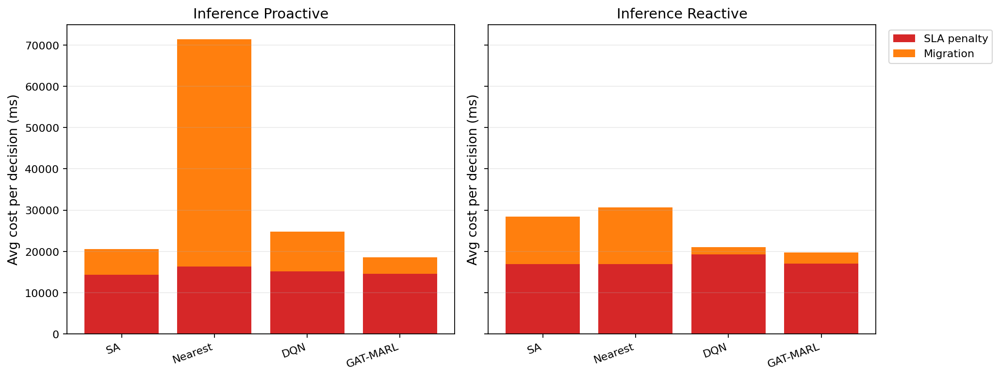

# 中等规模 cov50 数据验证报告

**生成时间**：2026-05-20 10:51:40  
**输出目录**：`experiments/medium_validation_20260519_1604_cov50_reactive_multi_entry`  
**数据文件**：`data\processed\taxi_cleaned_active100_min100_eps2h_cov50.csv`  
**数据规模**：Top-12 active taxis；train=37832 rows/9 taxis；test=11548 rows/3 taxis  
**切分方式**：balanced_by_nearest_server_exposure；test row ratio=0.234；test risk ratio=0.134  
**GAT-MARL epochs**：Proactive=8，Reactive=8

## 训练段

| Algorithm | Migrations | Violations | Proactive Decisions | Avg Decision Time (ms) | Avg Access Latency (ms) | Avg Total System Cost (ms) |
|-----------|------------|------------|---------------------|------------------------|-------------------------|----------------------------|
| SA | 1115 | 5600 | 293 | 5.98 | 2.11 | 21237.87 |
| Nearest | 1625 | 5312 | 288 | 0.05 | 2.11 | 36116.34 |
| DQN | 4150 | 6149 | 293 | 0.67 | 2.11 | 24733.41 |
| GAT-MARL | 738 | 7209 | 309 | 2.46 | 2.11 | 20716.80 |

| Algorithm | Migrations | Violations | Avg Decision Time (ms) | Avg Access Latency (ms) | Avg Total System Cost (ms) |
|-----------|------------|------------|------------------------|-------------------------|----------------------------|
| SA | 1115 | 6715 | 15.98 | 2.10 | 19331.10 |
| Nearest | 1349 | 5525 | 0.19 | 2.11 | 46143.46 |
| DQN | 4649 | 6905 | 1.22 | 2.11 | 23365.45 |
| GAT-MARL | 536 | 5332 | 2.12 | 2.11 | 20868.56 |

## 推理段

| Algorithm | Migrations | Violations | Proactive Decisions | Avg Decision Time (ms) | Avg Access Latency (ms) | Avg Total System Cost (ms) |
|-----------|------------|------------|---------------------|------------------------|-------------------------|----------------------------|
| SA | 452 | 974 | 171 | 19.70 | 2.09 | 20534.08 |
| Nearest | 783 | 864 | 124 | 0.16 | 2.09 | 71407.05 |
| DQN | 2390 | 4377 | 90 | 1.61 | 2.08 | 24885.40 |
| GAT-MARL | 244 | 816 | 155 | 2.90 | 2.09 | 18637.76 |

| Algorithm | Migrations | Violations | Avg Decision Time (ms) | Avg Access Latency (ms) | Avg Total System Cost (ms) |
|-----------|------------|------------|------------------------|-------------------------|----------------------------|
| SA | 465 | 991 | 14.43 | 2.09 | 28472.03 |
| Nearest | 513 | 956 | 0.17 | 2.09 | 30664.00 |
| DQN | 971 | 2241 | 1.20 | 2.10 | 21103.70 |
| GAT-MARL | 232 | 968 | 2.50 | 2.09 | 19755.16 |

## 成本分解堆叠图

## 推理阶段成本分解均值

| Algorithm | Proactive SLA Penalty (ms) | Proactive Migration (ms) | Reactive SLA Penalty (ms) | Reactive Migration (ms) |
|-----------|----------------------------|--------------------------|---------------------------|-------------------------|
| SA | 14375.55 | 6131.52 | 16912.21 | 11543.75 |
| Nearest | 16356.28 | 55048.65 | 16903.77 | 13758.14 |
| DQN | 15209.31 | 9625.23 | 19312.81 | 1748.40 |
| GAT-MARL | 14599.46 | 4015.52 | 17084.19 | 2651.52 |

## 本轮验证关注点

- 验证脚本显式使用 cov50 覆盖过滤数据，不再读取旧 cleaned CSV。
- train/test 按最近服务器距离风险暴露平衡切分，减少 proactive opportunity 偏斜。
- Avg Decision Time 是算法计算耗时；Avg Access Latency 是真实接入延迟；Avg Total System Cost 使用 `total_cost_ms_sum / decision_count`，包含 SLA penalty 和迁移等系统代价。

