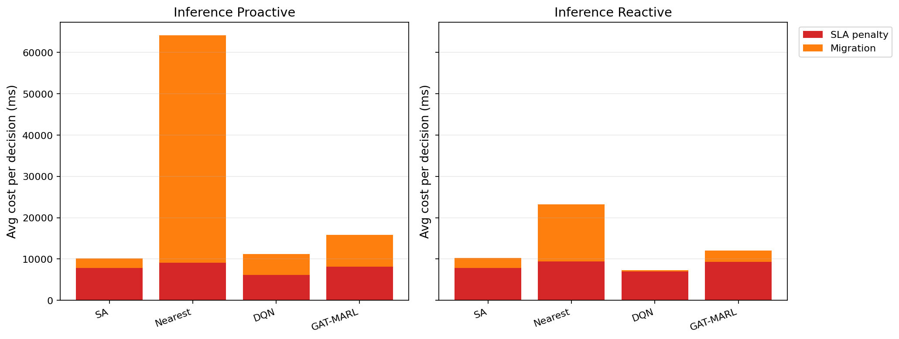

# 中等规模 cov50 数据验证报告

**生成时间**：2026-05-20 12:36:08  
**输出目录**：`experiments\medium_validation_20260520_1110_linear_sla`  
**数据文件**：`data\processed\taxi_cleaned_active100_min100_eps2h_cov50.csv`  
**数据规模**：Top-12 active taxis；train=37832 rows/9 taxis；test=11548 rows/3 taxis  
**切分方式**：balanced_by_nearest_server_exposure；test row ratio=0.234；test risk ratio=0.134  
**GAT-MARL epochs**：Proactive=8，Reactive=8

## 训练段

| Algorithm | Migrations | Violations | Proactive Decisions | Avg Decision Time (ms) | Avg Access Latency (ms) | Avg Total System Cost (ms) |
|-----------|------------|------------|---------------------|------------------------|-------------------------|----------------------------|
| SA | 617 | 10718 | 341 | 6.39 | 2.11 | 12088.64 |
| Nearest | 1463 | 5312 | 288 | 0.06 | 2.11 | 29603.54 |
| DQN | 4625 | 9555 | 289 | 0.76 | 2.11 | 15685.62 |
| GAT-MARL | 739 | 6179 | 311 | 1.11 | 2.11 | 14460.35 |

| Algorithm | Migrations | Violations | Avg Decision Time (ms) | Avg Access Latency (ms) | Avg Total System Cost (ms) |
|-----------|------------|------------|------------------------|-------------------------|----------------------------|
| SA | 664 | 8624 | 4.80 | 2.11 | 12463.66 |
| Nearest | 1273 | 5525 | 0.06 | 2.11 | 39541.82 |
| DQN | 2703 | 11366 | 0.48 | 2.10 | 11826.82 |
| GAT-MARL | 488 | 5502 | 2.26 | 2.11 | 13756.08 |

## 推理段

| Algorithm | Migrations | Violations | Proactive Decisions | Avg Decision Time (ms) | Avg Access Latency (ms) | Avg Total System Cost (ms) |
|-----------|------------|------------|---------------------|------------------------|-------------------------|----------------------------|
| SA | 246 | 1309 | 157 | 20.25 | 2.09 | 10177.92 |
| Nearest | 657 | 864 | 124 | 0.20 | 2.09 | 64157.11 |
| DQN | 1178 | 4239 | 122 | 1.95 | 2.08 | 11301.23 |
| GAT-MARL | 209 | 802 | 155 | 2.82 | 2.09 | 15870.93 |

| Algorithm | Migrations | Violations | Avg Decision Time (ms) | Avg Access Latency (ms) | Avg Total System Cost (ms) |
|-----------|------------|------------|------------------------|-------------------------|----------------------------|
| SA | 291 | 2596 | 14.88 | 2.09 | 10282.78 |
| Nearest | 399 | 956 | 0.22 | 2.09 | 23189.40 |
| DQN | 533 | 7253 | 1.20 | 2.09 | 7331.73 |
| GAT-MARL | 226 | 1083 | 1.93 | 2.09 | 12025.85 |

## 成本分解堆叠图

## 推理阶段成本分解均值

| Algorithm | Proactive SLA Penalty (ms) | Proactive Migration (ms) | Reactive SLA Penalty (ms) | Reactive Migration (ms) |
|-----------|----------------------------|--------------------------|---------------------------|-------------------------|
| SA | 7802.30 | 2346.20 | 7803.93 | 2432.96 |
| Nearest | 9104.83 | 55048.65 | 9409.59 | 13758.14 |
| DQN | 6142.04 | 5097.26 | 6937.53 | 326.91 |
| GAT-MARL | 8096.82 | 7751.37 | 9338.20 | 2668.13 |

## 本轮验证关注点

- 验证脚本显式使用 cov50 覆盖过滤数据，不再读取旧 cleaned CSV。
- train/test 按最近服务器距离风险暴露平衡切分，减少 proactive opportunity 偏斜。
- Avg Decision Time 是算法计算耗时；Avg Access Latency 是真实接入延迟；Avg Total System Cost 使用 `total_cost_ms_sum / decision_count`，包含 SLA penalty 和迁移等系统代价。

