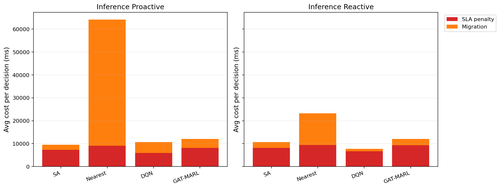

# 中等规模 cov50 数据验证报告

**生成时间**：2026-05-20 14:51:13  
**输出目录**：`experiments\medium_validation_20260520_1351_linear_sla_metricfix`  
**数据文件**：`data\processed\taxi_cleaned_active100_min100_eps2h_cov50.csv`  
**数据规模**：Top-12 active taxis；train=37832 rows/9 taxis；test=11548 rows/3 taxis  
**切分方式**：balanced_by_nearest_server_exposure；test row ratio=0.234；test risk ratio=0.134  
**GAT-MARL epochs**：Proactive=8，Reactive=8

## 训练段

| Algorithm | Migrations | Violations | Proactive Decisions | Avg Decision Time (ms) | Avg Access Latency (ms) | Avg Total System Cost (ms) |
|-----------|------------|------------|---------------------|------------------------|-------------------------|----------------------------|
| SA | 672 | 12455 | 324 | 6.32 | 2.11 | 12327.62 |
| Nearest | 1463 | 5312 | 288 | 0.06 | 2.11 | 29603.54 |
| DQN | 4278 | 11175 | 297 | 0.72 | 2.11 | 16472.58 |
| GAT-MARL | 695 | 9833 | 298 | 1.02 | 2.11 | 13910.06 |

| Algorithm | Migrations | Violations | Avg Decision Time (ms) | Avg Access Latency (ms) | Avg Total System Cost (ms) |
|-----------|------------|------------|------------------------|-------------------------|----------------------------|
| SA | 650 | 8546 | 4.50 | 2.10 | 11842.65 |
| Nearest | 1273 | 5525 | 0.05 | 2.11 | 39541.82 |
| DQN | 3013 | 10365 | 0.47 | 2.10 | 13864.45 |
| GAT-MARL | 522 | 6264 | 0.81 | 2.11 | 13847.26 |

## 推理段

| Algorithm | Migrations | Violations | Proactive Decisions | Avg Decision Time (ms) | Avg Access Latency (ms) | Avg Total System Cost (ms) |
|-----------|------------|------------|---------------------|------------------------|-------------------------|----------------------------|
| SA | 247 | 1260 | 187 | 5.98 | 2.08 | 9543.46 |
| Nearest | 657 | 864 | 124 | 0.06 | 2.09 | 64157.11 |
| DQN | 1088 | 6797 | 121 | 0.47 | 2.08 | 10759.00 |
| GAT-MARL | 245 | 1238 | 156 | 0.93 | 2.09 | 12093.49 |

| Algorithm | Migrations | Violations | Avg Decision Time (ms) | Avg Access Latency (ms) | Avg Total System Cost (ms) |
|-----------|------------|------------|------------------------|-------------------------|----------------------------|
| SA | 269 | 2040 | 4.38 | 2.09 | 10749.41 |
| Nearest | 399 | 956 | 0.06 | 2.09 | 23189.40 |
| DQN | 269 | 4262 | 0.33 | 2.08 | 7810.52 |
| GAT-MARL | 226 | 2600 | 0.77 | 2.09 | 12025.85 |

## 成本分解堆叠图

## 推理阶段成本分解均值

| Algorithm | Proactive SLA Penalty (ms) | Proactive Migration (ms) | Reactive SLA Penalty (ms) | Reactive Migration (ms) |
|-----------|----------------------------|--------------------------|---------------------------|-------------------------|
| SA | 7313.05 | 2179.73 | 8152.28 | 2548.62 |
| Nearest | 9104.83 | 55048.65 | 9409.59 | 13758.14 |
| DQN | 5898.90 | 4801.43 | 6705.99 | 1042.35 |
| GAT-MARL | 8109.11 | 3961.58 | 9338.20 | 2668.13 |

## 本轮验证关注点

- 验证脚本显式使用 cov50 覆盖过滤数据，不再读取旧 cleaned CSV。
- train/test 按最近服务器距离风险暴露平衡切分，减少 proactive opportunity 偏斜。
- Avg Decision Time 是算法计算耗时；Avg Access Latency 是真实接入延迟；Avg Total System Cost 使用 `total_cost_ms_sum / decision_count`，包含 SLA penalty 和迁移等系统代价。

