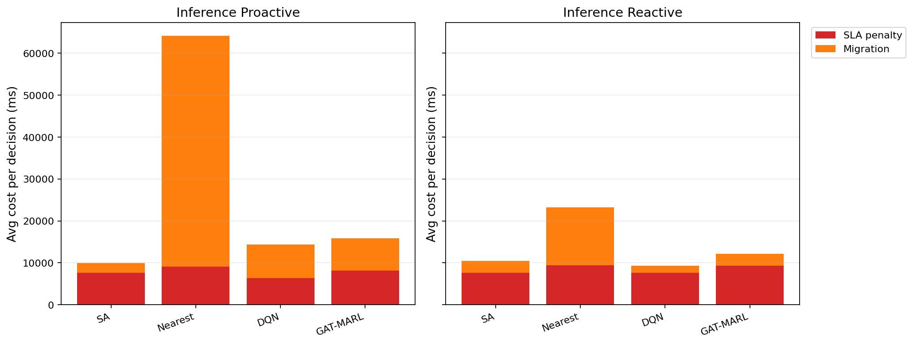

# 中等规模 cov50 数据验证报告

**生成时间**：2026-05-20 20:15:12  
**输出目录**：`experiments\medium_validation_20260520_1638_proactive_cost_guard`  
**数据文件**：`data\processed\taxi_cleaned_active100_min100_eps2h_cov50.csv`  
**数据规模**：Top-12 active taxis；train=37832 rows/9 taxis；test=11548 rows/3 taxis  
**切分方式**：balanced_by_nearest_server_exposure；test row ratio=0.234；test risk ratio=0.134  
**GAT-MARL epochs**：Proactive=8，Reactive=8

## 训练段

| Algorithm | Migrations | Violations | Proactive Decisions | Avg Decision Time (ms) | Avg Access Latency (ms) | Avg Total System Cost (ms) |
|-----------|------------|------------|---------------------|------------------------|-------------------------|----------------------------|
| SA | 651 | 6901 | 293 | 8.03 | 2.10 | 12115.45 |
| Nearest | 1463 | 5312 | 288 | 0.20 | 2.11 | 29603.54 |
| DQN | 4664 | 13398 | 280 | 2.01 | 2.11 | 13909.64 |
| GAT-MARL | 705 | 9967 | 309 | 2.40 | 2.11 | 14028.42 |

| Algorithm | Migrations | Violations | Avg Decision Time (ms) | Avg Access Latency (ms) | Avg Total System Cost (ms) |
|-----------|------------|------------|------------------------|-------------------------|----------------------------|
| SA | 629 | 9827 | 15.31 | 2.10 | 12104.89 |
| Nearest | 1273 | 5525 | 0.18 | 2.11 | 39541.82 |
| DQN | 3211 | 12143 | 1.20 | 2.10 | 12493.96 |
| GAT-MARL | 520 | 6272 | 1.86 | 2.11 | 13844.76 |

## 推理段

| Algorithm | Migrations | Violations | Proactive Decisions | Avg Decision Time (ms) | Avg Access Latency (ms) | Avg Total System Cost (ms) |
|-----------|------------|------------|---------------------|------------------------|-------------------------|----------------------------|
| SA | 238 | 1540 | 149 | 19.86 | 2.09 | 9926.64 |
| Nearest | 657 | 864 | 124 | 0.19 | 2.09 | 64157.11 |
| DQN | 1569 | 6053 | 121 | 1.85 | 2.08 | 14455.00 |
| GAT-MARL | 207 | 956 | 155 | 2.27 | 2.09 | 15851.85 |

| Algorithm | Migrations | Violations | Avg Decision Time (ms) | Avg Access Latency (ms) | Avg Total System Cost (ms) |
|-----------|------------|------------|------------------------|-------------------------|----------------------------|
| SA | 320 | 2282 | 14.42 | 2.09 | 10478.11 |
| Nearest | 399 | 956 | 0.18 | 2.09 | 23189.40 |
| DQN | 289 | 3607 | 1.18 | 2.09 | 9381.14 |
| GAT-MARL | 236 | 1291 | 1.95 | 2.09 | 12113.61 |

## 成本分解堆叠图

## 推理阶段成本分解均值

| Algorithm | Proactive SLA Penalty (ms) | Proactive Migration (ms) | Reactive SLA Penalty (ms) | Reactive Migration (ms) |
|-----------|----------------------------|--------------------------|---------------------------|-------------------------|
| SA | 7644.14 | 2230.96 | 7557.19 | 2885.20 |
| Nearest | 9104.83 | 55048.65 | 9409.59 | 13758.14 |
| DQN | 6322.48 | 8084.40 | 7637.07 | 1671.32 |
| GAT-MARL | 8100.15 | 7728.96 | 9276.08 | 2818.10 |

## 本轮验证关注点

- 验证脚本显式使用 cov50 覆盖过滤数据，不再读取旧 cleaned CSV。
- train/test 按最近服务器距离风险暴露平衡切分，减少 proactive opportunity 偏斜。
- Avg Decision Time 是算法计算耗时；Avg Access Latency 是真实接入延迟；Avg Total System Cost 使用 `total_cost_ms_sum / decision_count`，包含 SLA penalty 和迁移等系统代价。

