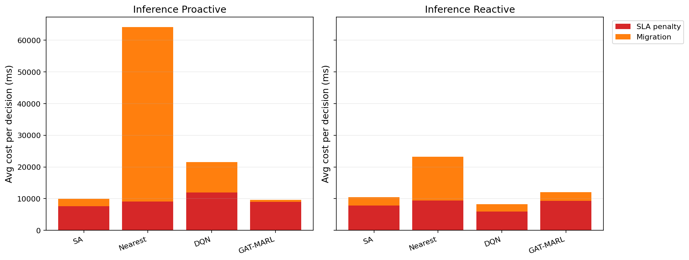

# 中等规模 cov50 数据验证报告

**生成时间**：2026-05-20 22:05:54  
**输出目录**：`experiments\medium_validation_20260520_2056_size_guard`  
**数据文件**：`data\processed\taxi_cleaned_active100_min100_eps2h_cov50.csv`  
**数据规模**：Top-12 active taxis；train=37832 rows/9 taxis；test=11548 rows/3 taxis  
**切分方式**：balanced_by_nearest_server_exposure；test row ratio=0.234；test risk ratio=0.134  
**GAT-MARL epochs**：Proactive=8，Reactive=8

## 训练段

| Algorithm | Migrations | Violations | Proactive Decisions | Avg Decision Time (ms) | Avg Access Latency (ms) | Avg Total System Cost (ms) |
|-----------|------------|------------|---------------------|------------------------|-------------------------|----------------------------|
| SA | 681 | 11361 | 311 | 6.02 | 2.11 | 12280.94 |
| Nearest | 1463 | 5312 | 288 | 0.05 | 2.11 | 29603.54 |
| DQN | 4835 | 9492 | 280 | 0.66 | 2.11 | 15076.74 |
| GAT-MARL | 603 | 16528 | 308 | 0.80 | 2.08 | 7228.51 |

| Algorithm | Migrations | Violations | Avg Decision Time (ms) | Avg Access Latency (ms) | Avg Total System Cost (ms) |
|-----------|------------|------------|------------------------|-------------------------|----------------------------|
| SA | 631 | 7786 | 4.43 | 2.10 | 12008.27 |
| Nearest | 1273 | 5525 | 0.05 | 2.11 | 39541.82 |
| DQN | 4482 | 10749 | 0.41 | 2.10 | 12656.13 |
| GAT-MARL | 488 | 6340 | 0.69 | 2.11 | 13756.08 |

## 推理段

| Algorithm | Migrations | Violations | Proactive Decisions | Avg Decision Time (ms) | Avg Access Latency (ms) | Avg Total System Cost (ms) |
|-----------|------------|------------|---------------------|------------------------|-------------------------|----------------------------|
| SA | 242 | 1144 | 171 | 5.71 | 2.09 | 9919.36 |
| Nearest | 657 | 864 | 124 | 0.06 | 2.09 | 64157.11 |
| DQN | 2984 | 6758 | 101 | 0.48 | 2.11 | 21531.64 |
| GAT-MARL | 95 | 1739 | 144 | 0.82 | 2.09 | 9566.91 |

| Algorithm | Migrations | Violations | Avg Decision Time (ms) | Avg Access Latency (ms) | Avg Total System Cost (ms) |
|-----------|------------|------------|------------------------|-------------------------|----------------------------|
| SA | 300 | 2066 | 4.26 | 2.09 | 10475.20 |
| Nearest | 399 | 956 | 0.06 | 2.09 | 23189.40 |
| DQN | 532 | 5326 | 0.30 | 2.08 | 8335.06 |
| GAT-MARL | 226 | 2600 | 0.64 | 2.09 | 12025.85 |

## 成本分解堆叠图

## 推理阶段成本分解均值

| Algorithm | Proactive SLA Penalty (ms) | Proactive Migration (ms) | Reactive SLA Penalty (ms) | Reactive Migration (ms) |
|-----------|----------------------------|--------------------------|---------------------------|-------------------------|
| SA | 7652.53 | 2224.96 | 7845.22 | 2603.01 |
| Nearest | 9104.83 | 55048.65 | 9409.59 | 13758.14 |
| DQN | 11959.37 | 9531.86 | 5867.40 | 2399.33 |
| GAT-MARL | 8988.18 | 573.26 | 9338.20 | 2668.13 |

## 本轮验证关注点

- 验证脚本显式使用 cov50 覆盖过滤数据，不再读取旧 cleaned CSV。
- train/test 按最近服务器距离风险暴露平衡切分，减少 proactive opportunity 偏斜。
- Avg Decision Time 是算法计算耗时；Avg Access Latency 是真实接入延迟；Avg Total System Cost 使用 `total_cost_ms_sum / decision_count`，包含 SLA penalty 和迁移等系统代价。

