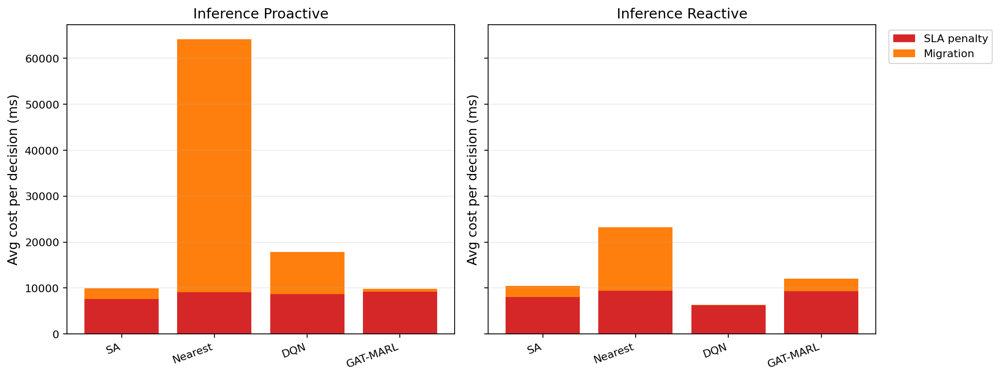

# 中等规模 cov50 数据验证报告

**生成时间**：2026-05-21 13:31:06  
**输出目录**：`experiments\medium_validation_20260521_1035_light_entry_repair`  
**数据文件**：`data\processed\taxi_cleaned_active100_min100_eps2h_cov50.csv`  
**数据规模**：Top-12 active taxis；train=37832 rows/9 taxis；test=11548 rows/3 taxis  
**切分方式**：balanced_by_nearest_server_exposure；test row ratio=0.234；test risk ratio=0.134  
**GAT-MARL epochs**：Proactive=8，Reactive=8

## 训练段

| Algorithm | Migrations | Violations | Proactive Decisions | Avg Decision Time (ms) | Avg Access Latency (ms) | Avg Total System Cost (ms) |
|-----------|------------|------------|---------------------|------------------------|-------------------------|----------------------------|
| SA | 646 | 10692 | 320 | 6.24 | 2.10 | 11809.00 |
| Nearest | 1463 | 5312 | 288 | 0.05 | 2.11 | 29603.54 |
| DQN | 3629 | 9508 | 302 | 0.65 | 2.11 | 15543.85 |
| GAT-MARL | 614 | 16140 | 290 | 1.56 | 2.08 | 7291.32 |

| Algorithm | Migrations | Violations | Avg Decision Time (ms) | Avg Access Latency (ms) | Avg Total System Cost (ms) |
|-----------|------------|------------|------------------------|-------------------------|----------------------------|
| SA | 652 | 8758 | 12.66 | 2.11 | 12348.03 |
| Nearest | 1273 | 5525 | 0.13 | 2.11 | 39541.82 |
| DQN | 3898 | 9753 | 0.76 | 2.11 | 14463.98 |
| GAT-MARL | 520 | 6272 | 1.33 | 2.11 | 13844.76 |

## 推理段

| Algorithm | Migrations | Violations | Proactive Decisions | Avg Decision Time (ms) | Avg Access Latency (ms) | Avg Total System Cost (ms) |
|-----------|------------|------------|---------------------|------------------------|-------------------------|----------------------------|
| SA | 238 | 1198 | 170 | 17.53 | 2.09 | 9958.18 |
| Nearest | 657 | 864 | 124 | 0.14 | 2.09 | 64157.11 |
| DQN | 368 | 2153 | 127 | 1.26 | 2.09 | 17842.05 |
| GAT-MARL | 149 | 1708 | 131 | 1.77 | 2.10 | 9839.31 |

| Algorithm | Migrations | Violations | Avg Decision Time (ms) | Avg Access Latency (ms) | Avg Total System Cost (ms) |
|-----------|------------|------------|------------------------|-------------------------|----------------------------|
| SA | 286 | 2222 | 13.19 | 2.09 | 10475.50 |
| Nearest | 399 | 956 | 0.15 | 2.09 | 23189.40 |
| DQN | 128 | 4569 | 0.88 | 2.08 | 6404.51 |
| GAT-MARL | 226 | 2600 | 1.33 | 2.09 | 12025.85 |

## 成本分解堆叠图

## 推理阶段成本分解均值

| Algorithm | Proactive SLA Penalty (ms) | Proactive Migration (ms) | Reactive SLA Penalty (ms) | Reactive Migration (ms) |
|-----------|----------------------------|--------------------------|---------------------------|-------------------------|
| SA | 7609.46 | 2298.10 | 8040.66 | 2417.42 |
| Nearest | 9104.83 | 55048.65 | 9409.59 | 13758.14 |
| DQN | 8633.52 | 9162.51 | 6214.72 | 166.56 |
| GAT-MARL | 9203.23 | 630.67 | 9338.20 | 2668.13 |

## 本轮验证关注点

- 验证脚本显式使用 cov50 覆盖过滤数据，不再读取旧 cleaned CSV。
- train/test 按最近服务器距离风险暴露平衡切分，减少 proactive opportunity 偏斜。
- Avg Decision Time 是算法计算耗时；Avg Access Latency 是真实接入延迟；Avg Total System Cost 使用 `total_cost_ms_sum / decision_count`，包含 SLA penalty 和迁移等系统代价。

