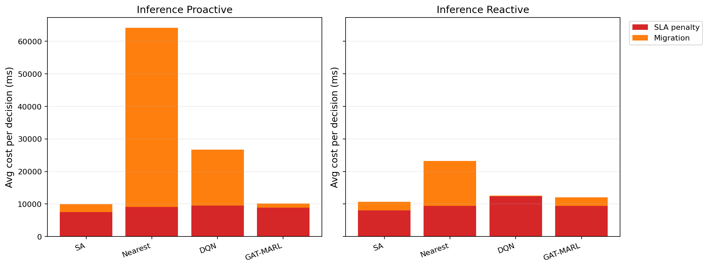

# 中等规模 cov50 数据验证报告

**生成时间**：2026-05-21 18:21:01  
**输出目录**：`experiments\medium_validation_20260521_1654_light_entry_fallback_tight`  
**数据文件**：`data\processed\taxi_cleaned_active100_min100_eps2h_cov50.csv`  
**数据规模**：Top-12 active taxis；train=37832 rows/9 taxis；test=11548 rows/3 taxis  
**切分方式**：balanced_by_nearest_server_exposure；test row ratio=0.234；test risk ratio=0.134  
**GAT-MARL epochs**：Proactive=8，Reactive=8

## 训练段

| Algorithm | Migrations | Violations | Proactive Decisions | Avg Decision Time (ms) | Avg Access Latency (ms) | Avg Total System Cost (ms) |
|-----------|------------|------------|---------------------|------------------------|-------------------------|----------------------------|
| SA | 669 | 7594 | 306 | 26.80 | 2.10 | 12086.84 |
| Nearest | 1463 | 5312 | 288 | 0.42 | 2.11 | 29603.54 |
| DQN | 4507 | 14204 | 303 | 1.39 | 2.11 | 15601.10 |
| GAT-MARL | 608 | 22453 | 273 | 0.66 | 2.09 | 8717.46 |

| Algorithm | Migrations | Violations | Avg Decision Time (ms) | Avg Access Latency (ms) | Avg Total System Cost (ms) |
|-----------|------------|------------|------------------------|-------------------------|----------------------------|
| SA | 666 | 8230 | 4.62 | 2.11 | 12597.18 |
| Nearest | 1273 | 5525 | 0.05 | 2.11 | 39541.82 |
| DQN | 2744 | 10941 | 0.38 | 2.10 | 13310.07 |
| GAT-MARL | 490 | 6332 | 0.62 | 2.11 | 13758.60 |

## 推理段

| Algorithm | Migrations | Violations | Proactive Decisions | Avg Decision Time (ms) | Avg Access Latency (ms) | Avg Total System Cost (ms) |
|-----------|------------|------------|---------------------|------------------------|-------------------------|----------------------------|
| SA | 256 | 1200 | 175 | 5.87 | 2.09 | 9956.73 |
| Nearest | 657 | 864 | 124 | 0.05 | 2.09 | 64157.11 |
| DQN | 557 | 4312 | 159 | 0.50 | 2.10 | 26734.11 |
| GAT-MARL | 195 | 2072 | 146 | 0.67 | 2.10 | 10197.88 |

| Algorithm | Migrations | Violations | Avg Decision Time (ms) | Avg Access Latency (ms) | Avg Total System Cost (ms) |
|-----------|------------|------------|------------------------|-------------------------|----------------------------|
| SA | 263 | 1980 | 4.42 | 2.09 | 10714.10 |
| Nearest | 399 | 956 | 0.05 | 2.09 | 23189.40 |
| DQN | 333 | 7936 | 0.29 | 2.11 | 12557.71 |
| GAT-MARL | 224 | 2635 | 0.61 | 2.09 | 12014.43 |

## 成本分解堆叠图

## 推理阶段成本分解均值

| Algorithm | Proactive SLA Penalty (ms) | Proactive Migration (ms) | Reactive SLA Penalty (ms) | Reactive Migration (ms) |
|-----------|----------------------------|--------------------------|---------------------------|-------------------------|
| SA | 7517.67 | 2388.50 | 8078.32 | 2587.75 |
| Nearest | 9104.83 | 55048.65 | 9409.59 | 13758.14 |
| DQN | 9476.26 | 17202.66 | 12321.88 | 192.95 |
| GAT-MARL | 8905.03 | 1277.71 | 9348.12 | 2646.79 |

## 本轮验证关注点

- 验证脚本显式使用 cov50 覆盖过滤数据，不再读取旧 cleaned CSV。
- train/test 按最近服务器距离风险暴露平衡切分，减少 proactive opportunity 偏斜。
- Avg Decision Time 是算法计算耗时；Avg Access Latency 是真实接入延迟；Avg Total System Cost 使用 `total_cost_ms_sum / decision_count`，包含 SLA penalty 和迁移等系统代价。

