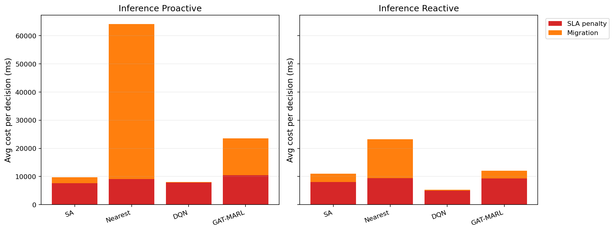

# 中等规模 cov50 数据验证报告

**生成时间**：2026-05-21 22:38:32  
**输出目录**：`experiments\medium_validation_20260521_2134_size_guard_recheck`  
**数据文件**：`data\processed\taxi_cleaned_active100_min100_eps2h_cov50.csv`  
**数据规模**：Top-12 active taxis；train=37832 rows/9 taxis；test=11548 rows/3 taxis  
**切分方式**：balanced_by_nearest_server_exposure；test row ratio=0.234；test risk ratio=0.134  
**GAT-MARL epochs**：Proactive=8，Reactive=8

## 训练段

| Algorithm | Migrations | Violations | Proactive Decisions | Avg Decision Time (ms) | Avg Access Latency (ms) | Avg Total System Cost (ms) |
|-----------|------------|------------|---------------------|------------------------|-------------------------|----------------------------|
| SA | 644 | 7248 | 306 | 6.16 | 2.10 | 12089.82 |
| Nearest | 1463 | 5312 | 288 | 0.05 | 2.11 | 29603.54 |
| DQN | 3950 | 11273 | 274 | 0.57 | 2.10 | 15263.47 |
| GAT-MARL | 762 | 14043 | 297 | 0.62 | 2.08 | 8233.19 |

| Algorithm | Migrations | Violations | Avg Decision Time (ms) | Avg Access Latency (ms) | Avg Total System Cost (ms) |
|-----------|------------|------------|------------------------|-------------------------|----------------------------|
| SA | 586 | 8776 | 4.51 | 2.10 | 11646.34 |
| Nearest | 1273 | 5525 | 0.05 | 2.11 | 39541.82 |
| DQN | 3199 | 11678 | 0.33 | 2.10 | 11084.47 |
| GAT-MARL | 488 | 6340 | 0.55 | 2.11 | 13756.08 |

## 推理段

| Algorithm | Migrations | Violations | Proactive Decisions | Avg Decision Time (ms) | Avg Access Latency (ms) | Avg Total System Cost (ms) |
|-----------|------------|------------|---------------------|------------------------|-------------------------|----------------------------|
| SA | 244 | 1122 | 167 | 5.88 | 2.09 | 9807.08 |
| Nearest | 657 | 864 | 124 | 0.05 | 2.09 | 64157.11 |
| DQN | 130 | 5900 | 95 | 0.45 | 2.09 | 8125.30 |
| GAT-MARL | 379 | 1532 | 138 | 0.67 | 2.10 | 23544.12 |

| Algorithm | Migrations | Violations | Avg Decision Time (ms) | Avg Access Latency (ms) | Avg Total System Cost (ms) |
|-----------|------------|------------|------------------------|-------------------------|----------------------------|
| SA | 271 | 1685 | 4.36 | 2.09 | 11036.29 |
| Nearest | 399 | 956 | 0.05 | 2.09 | 23189.40 |
| DQN | 263 | 6400 | 0.29 | 2.07 | 5326.42 |
| GAT-MARL | 232 | 2449 | 0.55 | 2.09 | 12102.50 |

## 成本分解堆叠图

## 推理阶段成本分解均值

| Algorithm | Proactive SLA Penalty (ms) | Proactive Migration (ms) | Reactive SLA Penalty (ms) | Reactive Migration (ms) |
|-----------|----------------------------|--------------------------|---------------------------|-------------------------|
| SA | 7564.19 | 2191.92 | 8013.67 | 2975.73 |
| Nearest | 9104.83 | 55048.65 | 9409.59 | 13758.14 |
| DQN | 7834.92 | 243.99 | 4958.46 | 319.52 |
| GAT-MARL | 10435.46 | 13091.32 | 9309.99 | 2773.05 |

## 本轮验证关注点

- 验证脚本显式使用 cov50 覆盖过滤数据，不再读取旧 cleaned CSV。
- train/test 按最近服务器距离风险暴露平衡切分，减少 proactive opportunity 偏斜。
- Avg Decision Time 是算法计算耗时；Avg Access Latency 是真实接入延迟；Avg Total System Cost 使用 `total_cost_ms_sum / decision_count`，包含 SLA penalty 和迁移等系统代价。

