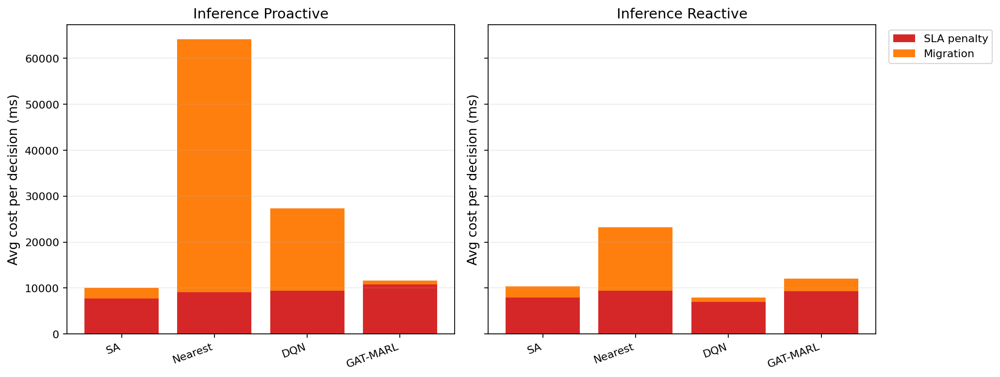

# 中等规模 cov50 数据验证报告

**生成时间**：2026-05-22 00:11:09  
**输出目录**：`experiments\medium_validation_20260521_2306_current_effect`  
**数据文件**：`data\processed\taxi_cleaned_active100_min100_eps2h_cov50.csv`  
**数据规模**：Top-12 active taxis；train=37832 rows/9 taxis；test=11548 rows/3 taxis  
**切分方式**：balanced_by_nearest_server_exposure；test row ratio=0.234；test risk ratio=0.134  
**GAT-MARL epochs**：Proactive=8，Reactive=8

## 训练段

| Algorithm | Migrations | Violations | Proactive Decisions | Avg Decision Time (ms) | Avg Access Latency (ms) | Avg Total System Cost (ms) |
|-----------|------------|------------|---------------------|------------------------|-------------------------|----------------------------|
| SA | 629 | 7116 | 303 | 6.11 | 2.11 | 12261.60 |
| Nearest | 1463 | 5312 | 288 | 0.05 | 2.11 | 29603.54 |
| DQN | 3576 | 12162 | 288 | 0.53 | 2.11 | 15645.41 |
| GAT-MARL | 679 | 14630 | 294 | 0.62 | 2.08 | 7601.21 |

| Algorithm | Migrations | Violations | Avg Decision Time (ms) | Avg Access Latency (ms) | Avg Total System Cost (ms) |
|-----------|------------|------------|------------------------|-------------------------|----------------------------|
| SA | 630 | 9521 | 4.51 | 2.10 | 12142.28 |
| Nearest | 1273 | 5525 | 0.05 | 2.11 | 39541.82 |
| DQN | 2418 | 12889 | 0.33 | 2.10 | 11624.51 |
| GAT-MARL | 520 | 6272 | 0.54 | 2.11 | 13844.76 |

## 推理段

| Algorithm | Migrations | Violations | Proactive Decisions | Avg Decision Time (ms) | Avg Access Latency (ms) | Avg Total System Cost (ms) |
|-----------|------------|------------|---------------------|------------------------|-------------------------|----------------------------|
| SA | 250 | 1220 | 160 | 5.83 | 2.09 | 10050.26 |
| Nearest | 657 | 864 | 124 | 0.05 | 2.09 | 64157.11 |
| DQN | 674 | 1995 | 142 | 0.49 | 2.10 | 27320.61 |
| GAT-MARL | 132 | 2554 | 137 | 0.59 | 2.10 | 11656.25 |

| Algorithm | Migrations | Violations | Avg Decision Time (ms) | Avg Access Latency (ms) | Avg Total System Cost (ms) |
|-----------|------------|------------|------------------------|-------------------------|----------------------------|
| SA | 275 | 2271 | 4.31 | 2.09 | 10344.41 |
| Nearest | 399 | 956 | 0.05 | 2.09 | 23189.40 |
| DQN | 621 | 3547 | 0.29 | 2.09 | 8000.52 |
| GAT-MARL | 226 | 2504 | 0.54 | 2.09 | 12058.09 |

## 成本分解堆叠图

## 推理阶段成本分解均值

| Algorithm | Proactive SLA Penalty (ms) | Proactive Migration (ms) | Reactive SLA Penalty (ms) | Reactive Migration (ms) |
|-----------|----------------------------|--------------------------|---------------------------|-------------------------|
| SA | 7718.29 | 2289.92 | 7902.80 | 2395.39 |
| Nearest | 9104.83 | 55048.65 | 9409.59 | 13758.14 |
| DQN | 9366.92 | 17921.36 | 6924.81 | 1022.90 |
| GAT-MARL | 10776.53 | 846.88 | 9335.77 | 2702.80 |

## 本轮验证关注点

- 验证脚本显式使用 cov50 覆盖过滤数据，不再读取旧 cleaned CSV。
- train/test 按最近服务器距离风险暴露平衡切分，减少 proactive opportunity 偏斜。
- Avg Decision Time 是算法计算耗时；Avg Access Latency 是真实接入延迟；Avg Total System Cost 使用 `total_cost_ms_sum / decision_count`，包含 SLA penalty 和迁移等系统代价。

