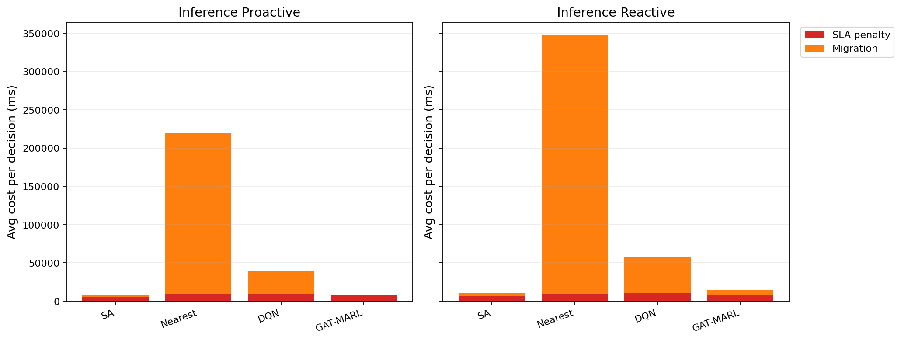

# 中等规模 cov50 数据验证报告

**生成时间**：2026-05-22 13:43:27  
**输出目录**：`experiments\medium_validation_20260522_1115_size_guard_post_filter`  
**数据文件**：`data\processed\taxi_cleaned_active100_min100_eps2h_cov50.csv`  
**数据规模**：Top-12 active taxis；train=37832 rows/9 taxis；test=11548 rows/3 taxis  
**切分方式**：balanced_by_nearest_server_exposure；test row ratio=0.234；test risk ratio=0.134  
**GAT-MARL epochs**：Proactive=8，Reactive=8

## 训练段

| Algorithm | Migrations | Violations | Proactive Decisions | Avg Decision Time (ms) | Avg Access Latency (ms) | Avg Total System Cost (ms) |
|-----------|------------|------------|---------------------|------------------------|-------------------------|----------------------------|
| SA | 492 | 10620 | 323 | 6.48 | 2.09 | 9786.25 |
| Nearest | 2434 | 5312 | 288 | 0.05 | 2.11 | 86560.60 |
| DQN | 3088 | 9436 | 346 | 0.76 | 2.11 | 27320.90 |
| GAT-MARL | 90 | 24062 | 207 | 0.89 | 2.11 | 11744.27 |

| Algorithm | Migrations | Violations | Avg Decision Time (ms) | Avg Access Latency (ms) | Avg Total System Cost (ms) |
|-----------|------------|------------|------------------------|-------------------------|----------------------------|
| SA | 356 | 15856 | 4.69 | 2.08 | 7879.42 |
| Nearest | 1934 | 5525 | 0.05 | 2.11 | 107727.31 |
| DQN | 3509 | 15784 | 0.44 | 2.11 | 30445.20 |
| GAT-MARL | 465 | 8212 | 0.79 | 2.11 | 14122.43 |

## 推理段

| Algorithm | Migrations | Violations | Proactive Decisions | Avg Decision Time (ms) | Avg Access Latency (ms) | Avg Total System Cost (ms) |
|-----------|------------|------------|---------------------|------------------------|-------------------------|----------------------------|
| SA | 133 | 2375 | 142 | 5.95 | 2.08 | 7851.76 |
| Nearest | 1165 | 864 | 124 | 0.05 | 2.09 | 219670.24 |
| DQN | 1030 | 2574 | 150 | 0.58 | 2.10 | 39303.99 |
| GAT-MARL | 318 | 5182 | 124 | 1.17 | 2.09 | 8851.06 |

| Algorithm | Migrations | Violations | Avg Decision Time (ms) | Avg Access Latency (ms) | Avg Total System Cost (ms) |
|-----------|------------|------------|------------------------|-------------------------|----------------------------|
| SA | 150 | 1609 | 4.38 | 2.08 | 10218.60 |
| Nearest | 950 | 956 | 0.05 | 2.09 | 347080.63 |
| DQN | 446 | 1275 | 0.30 | 2.10 | 57374.60 |
| GAT-MARL | 197 | 2382 | 0.63 | 2.09 | 14914.74 |

## 成本分解堆叠图

## 推理阶段成本分解均值

| Algorithm | Proactive SLA Penalty (ms) | Proactive Migration (ms) | Reactive SLA Penalty (ms) | Reactive Migration (ms) |
|-----------|----------------------------|--------------------------|---------------------------|-------------------------|
| SA | 5813.87 | 1925.56 | 6789.82 | 3309.71 |
| Nearest | 9104.83 | 210563.28 | 9409.59 | 337668.94 |
| DQN | 9793.87 | 29430.65 | 10827.95 | 46493.71 |
| GAT-MARL | 7732.67 | 1063.00 | 8302.48 | 6549.60 |

## 本轮验证关注点

- 验证脚本显式使用 cov50 覆盖过滤数据，不再读取旧 cleaned CSV。
- train/test 按最近服务器距离风险暴露平衡切分，减少 proactive opportunity 偏斜。
- Avg Decision Time 是算法计算耗时；Avg Access Latency 是真实接入延迟；Avg Total System Cost 使用 `total_cost_ms_sum / decision_count`，包含 SLA penalty 和迁移等系统代价。

