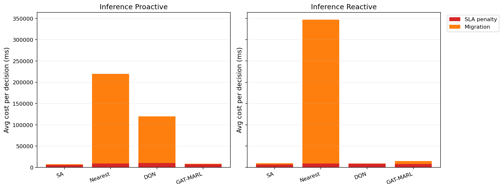

# 中等规模 cov50 数据验证报告

**生成时间**：2026-05-22 16:56:35  
**输出目录**：`experiments\medium_validation_20260522_1450_sla_severity_metrics`  
**数据文件**：`data\processed\taxi_cleaned_active100_min100_eps2h_cov50.csv`  
**数据规模**：Top-12 active taxis；train=37832 rows/9 taxis；test=11548 rows/3 taxis  
**切分方式**：balanced_by_nearest_server_exposure；test row ratio=0.234；test risk ratio=0.134  
**GAT-MARL epochs**：Proactive=8，Reactive=8

## 训练段

| Algorithm | Migrations | SLA Risk Count | Severe SLA Violations | Avg SLA Excess (km) | P95 SLA Excess (km) | Avg SLA Penalty (ms) | Proactive Decisions | Avg Decision Time (ms) | Avg Access Latency (ms) | Avg Total System Cost (ms) |
|-----------|------------|----------------|-----------------------|---------------------|---------------------|----------------------|---------------------|------------------------|-------------------------|----------------------------|
| SA | 461 | 10275 | 5575 | 1.51 | 11.52 | 9333.20 | 295 | 6.56 | 2.10 | 10743.62 |
| Nearest | 2434 | 5312 | 4986 | 1.22 | 11.51 | 12014.61 | 288 | 0.05 | 2.11 | 86560.60 |
| DQN | 3851 | 6681 | 5263 | 1.36 | 11.56 | 11672.95 | 301 | 0.81 | 2.11 | 43471.24 |
| GAT-MARL | 81 | 24043 | 8064 | 5.21 | 31.11 | 11686.38 | 207 | 0.82 | 2.11 | 11743.23 |

| Algorithm | Migrations | SLA Risk Count | Severe SLA Violations | Avg SLA Excess (km) | P95 SLA Excess (km) | Avg SLA Penalty (ms) | Avg Decision Time (ms) | Avg Access Latency (ms) | Avg Total System Cost (ms) |
|-----------|------------|----------------|-----------------------|---------------------|---------------------|----------------------|------------------------|-------------------------|----------------------------|
| SA | 364 | 16111 | 5424 | 1.58 | 12.28 | 6838.22 | 4.65 | 2.08 | 7922.60 |
| Nearest | 1934 | 5525 | 4987 | 1.22 | 11.51 | 12177.70 | 0.05 | 2.11 | 107727.31 |
| DQN | 4056 | 7642 | 5442 | 1.49 | 11.55 | 12035.91 | 0.41 | 2.11 | 37022.30 |
| GAT-MARL | 467 | 8202 | 5063 | 1.32 | 11.51 | 11011.05 | 0.66 | 2.11 | 14145.00 |

## 推理段

| Algorithm | Migrations | SLA Risk Count | Severe SLA Violations | Avg SLA Excess (km) | P95 SLA Excess (km) | Avg SLA Penalty (ms) | Proactive Decisions | Avg Decision Time (ms) | Avg Access Latency (ms) | Avg Total System Cost (ms) |
|-----------|------------|----------------|-----------------------|---------------------|---------------------|----------------------|---------------------|------------------------|-------------------------|----------------------------|
| SA | 120 | 2311 | 486 | 0.55 | 4.91 | 5581.86 | 161 | 5.91 | 2.08 | 7447.69 |
| Nearest | 1165 | 864 | 443 | 0.50 | 4.91 | 9104.83 | 124 | 0.05 | 2.09 | 219670.24 |
| DQN | 1063 | 1277 | 787 | 0.63 | 7.31 | 10535.58 | 130 | 0.61 | 2.10 | 120184.04 |
| GAT-MARL | 267 | 4830 | 796 | 1.25 | 7.25 | 7673.86 | 121 | 1.04 | 2.09 | 8508.18 |

| Algorithm | Migrations | SLA Risk Count | Severe SLA Violations | Avg SLA Excess (km) | P95 SLA Excess (km) | Avg SLA Penalty (ms) | Avg Decision Time (ms) | Avg Access Latency (ms) | Avg Total System Cost (ms) |
|-----------|------------|----------------|-----------------------|---------------------|---------------------|----------------------|------------------------|-------------------------|----------------------------|
| SA | 137 | 1649 | 449 | 0.51 | 4.91 | 6636.65 | 4.34 | 2.08 | 9876.80 |
| Nearest | 950 | 956 | 443 | 0.50 | 4.91 | 9409.59 | 0.05 | 2.09 | 347080.63 |
| DQN | 440 | 5271 | 1572 | 2.22 | 10.76 | 8764.93 | 0.34 | 2.10 | 9244.30 |
| GAT-MARL | 197 | 2382 | 487 | 0.60 | 4.91 | 8302.48 | 0.55 | 2.09 | 14914.74 |

## 成本分解堆叠图

## 推理阶段成本分解均值

| Algorithm | Proactive SLA Penalty (ms) | Proactive Migration (ms) | Reactive SLA Penalty (ms) | Reactive Migration (ms) |
|-----------|----------------------------|--------------------------|---------------------------|-------------------------|
| SA | 5581.86 | 1758.78 | 6636.65 | 3122.50 |
| Nearest | 9104.83 | 210563.28 | 9409.59 | 337668.94 |
| DQN | 10535.58 | 109569.63 | 8764.93 | 347.18 |
| GAT-MARL | 7673.86 | 778.72 | 8302.48 | 6549.60 |

## 本轮验证关注点

- 验证脚本显式使用 cov50 覆盖过滤数据，不再读取旧 cleaned CSV。
- train/test 按最近服务器距离风险暴露平衡切分，减少 proactive opportunity 偏斜。
- Avg Decision Time 是算法计算耗时；Avg Access Latency 是真实接入延迟；Avg Total System Cost 使用 `total_cost_ms_sum / decision_count`，包含 SLA penalty 和迁移等系统代价。
- SLA Risk Count 是 max-entry 风险次数；Severe SLA Violations 和 SLA Excess 用于区分轻微风险与严重服务质量退化。

