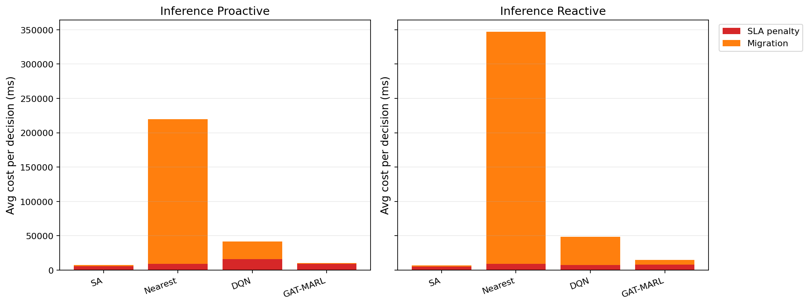

# 中等规模 cov50 数据验证报告

**生成时间**：2026-05-24 15:50:24  
**输出目录**：`experiments\medium_validation_20260522_1711_light_entry_rescue`  
**数据文件**：`data\processed\taxi_cleaned_active100_min100_eps2h_cov50.csv`  
**数据规模**：Top-12 active taxis；train=37832 rows/9 taxis；test=11548 rows/3 taxis  
**切分方式**：balanced_by_nearest_server_exposure；test row ratio=0.234；test risk ratio=0.134  
**GAT-MARL epochs**：Proactive=8，Reactive=8

## 训练段

| Algorithm | Migrations | SLA Risk Count | Severe SLA Violations | Avg SLA Excess (km) | P95 SLA Excess (km) | Avg SLA Penalty (ms) | Proactive Decisions | Avg Decision Time (ms) | Avg Access Latency (ms) | Avg Total System Cost (ms) |
|-----------|------------|----------------|-----------------------|---------------------|---------------------|----------------------|---------------------|------------------------|-------------------------|----------------------------|
| SA | 453 | 10691 | 5256 | 1.41 | 11.56 | 9193.89 | 277 | 6.64 | 2.10 | 10654.04 |
| Nearest | 2434 | 5312 | 4986 | 1.22 | 11.51 | 12014.61 | 288 | 0.05 | 2.11 | 86560.60 |
| DQN | 3922 | 9524 | 5403 | 1.47 | 12.25 | 11400.74 | 315 | 0.80 | 2.11 | 29614.29 |
| GAT-MARL | 230 | 23375 | 8048 | 5.19 | 31.11 | 16165.84 | 206 | 0.85 | 2.13 | 16280.83 |

| Algorithm | Migrations | SLA Risk Count | Severe SLA Violations | Avg SLA Excess (km) | P95 SLA Excess (km) | Avg SLA Penalty (ms) | Avg Decision Time (ms) | Avg Access Latency (ms) | Avg Total System Cost (ms) |
|-----------|------------|----------------|-----------------------|---------------------|---------------------|----------------------|------------------------|-------------------------|----------------------------|
| SA | 354 | 16545 | 5566 | 1.60 | 12.28 | 6761.79 | 4.74 | 2.08 | 7848.35 |
| Nearest | 1934 | 5525 | 4987 | 1.22 | 11.51 | 12177.70 | 0.05 | 2.11 | 107727.31 |
| DQN | 4451 | 14450 | 5458 | 1.43 | 11.54 | 10744.65 | 0.48 | 2.11 | 32206.68 |
| GAT-MARL | 452 | 8741 | 5108 | 1.35 | 11.51 | 11241.59 | 0.75 | 2.11 | 14274.80 |

## 推理段

| Algorithm | Migrations | SLA Risk Count | Severe SLA Violations | Avg SLA Excess (km) | P95 SLA Excess (km) | Avg SLA Penalty (ms) | Proactive Decisions | Avg Decision Time (ms) | Avg Access Latency (ms) | Avg Total System Cost (ms) |
|-----------|------------|----------------|-----------------------|---------------------|---------------------|----------------------|---------------------|------------------------|-------------------------|----------------------------|
| SA | 122 | 2355 | 481 | 0.55 | 4.91 | 5635.97 | 144 | 6.00 | 2.08 | 7510.26 |
| Nearest | 1165 | 864 | 443 | 0.50 | 4.91 | 9104.83 | 124 | 0.05 | 2.09 | 219670.24 |
| DQN | 3868 | 5614 | 1942 | 3.71 | 34.21 | 16299.60 | 120 | 0.62 | 2.13 | 42266.35 |
| GAT-MARL | 357 | 3431 | 656 | 1.14 | 5.91 | 9047.80 | 132 | 1.27 | 2.10 | 10411.90 |

| Algorithm | Migrations | SLA Risk Count | Severe SLA Violations | Avg SLA Excess (km) | P95 SLA Excess (km) | Avg SLA Penalty (ms) | Avg Decision Time (ms) | Avg Access Latency (ms) | Avg Total System Cost (ms) |
|-----------|------------|----------------|-----------------------|---------------------|---------------------|----------------------|------------------------|-------------------------|----------------------------|
| SA | 139 | 2636 | 447 | 0.51 | 4.91 | 4930.97 | 4.38 | 2.07 | 6936.40 |
| Nearest | 950 | 956 | 443 | 0.50 | 4.91 | 9409.59 | 0.05 | 2.09 | 347080.63 |
| DQN | 1596 | 2010 | 653 | 0.66 | 5.85 | 7297.99 | 0.37 | 2.09 | 48528.79 |
| GAT-MARL | 197 | 2382 | 487 | 0.60 | 4.91 | 8302.48 | 0.61 | 2.09 | 14914.74 |

## 成本分解堆叠图

## 推理阶段成本分解均值

| Algorithm | Proactive SLA Penalty (ms) | Proactive Migration (ms) | Reactive SLA Penalty (ms) | Reactive Migration (ms) |
|-----------|----------------------------|--------------------------|---------------------------|-------------------------|
| SA | 5635.97 | 1766.56 | 4930.97 | 1877.26 |
| Nearest | 9104.83 | 210563.28 | 9409.59 | 337668.94 |
| DQN | 16299.60 | 25691.46 | 7297.99 | 41107.03 |
| GAT-MARL | 9047.80 | 1277.05 | 8302.48 | 6549.60 |

## 本轮验证关注点

- 验证脚本显式使用 cov50 覆盖过滤数据，不再读取旧 cleaned CSV。
- train/test 按最近服务器距离风险暴露平衡切分，减少 proactive opportunity 偏斜。
- Avg Decision Time 是算法计算耗时；Avg Access Latency 是真实接入延迟；Avg Total System Cost 使用 `total_cost_ms_sum / decision_count`，包含 SLA penalty 和迁移等系统代价。
- SLA Risk Count 是 max-entry 风险次数；Severe SLA Violations 和 SLA Excess 用于区分轻微风险与严重服务质量退化。

