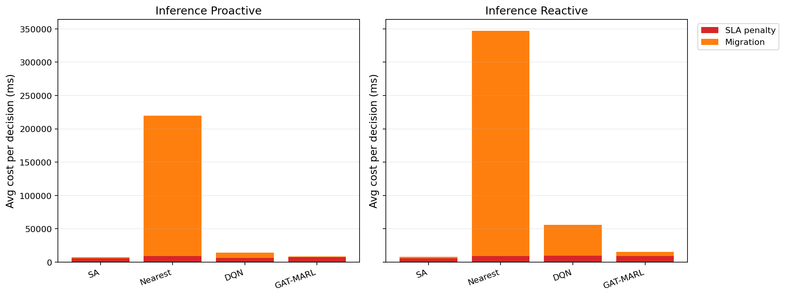

# 中等规模 cov50 数据验证报告

**生成时间**：2026-05-24 18:46:50  
**输出目录**：`experiments\medium_validation_20260524_1550_green_channel_tight`  
**数据文件**：`data\processed\taxi_cleaned_active100_min100_eps2h_cov50.csv`  
**数据规模**：Top-12 active taxis；train=37832 rows/9 taxis；test=11548 rows/3 taxis  
**切分方式**：balanced_by_nearest_server_exposure；test row ratio=0.234；test risk ratio=0.134  
**GAT-MARL epochs**：Proactive=8，Reactive=8

## 训练段

| Algorithm | Migrations | SLA Risk Count | Severe SLA Violations | Avg SLA Excess (km) | P95 SLA Excess (km) | Avg SLA Penalty (ms) | Proactive Decisions | Avg Decision Time (ms) | Avg Access Latency (ms) | Avg Total System Cost (ms) |
|-----------|------------|----------------|-----------------------|---------------------|---------------------|----------------------|---------------------|------------------------|-------------------------|----------------------------|
| SA | 451 | 11821 | 5304 | 1.40 | 11.55 | 8514.32 | 284 | 6.20 | 2.09 | 9799.81 |
| Nearest | 2434 | 5312 | 4986 | 1.22 | 11.51 | 12014.61 | 288 | 0.05 | 2.11 | 86560.60 |
| DQN | 3037 | 8421 | 5574 | 1.48 | 11.80 | 11271.68 | 296 | 0.72 | 2.11 | 31204.32 |
| GAT-MARL | 102 | 24104 | 8066 | 5.21 | 31.11 | 11686.34 | 207 | 0.90 | 2.11 | 11745.69 |

| Algorithm | Migrations | SLA Risk Count | Severe SLA Violations | Avg SLA Excess (km) | P95 SLA Excess (km) | Avg SLA Penalty (ms) | Avg Decision Time (ms) | Avg Access Latency (ms) | Avg Total System Cost (ms) |
|-----------|------------|----------------|-----------------------|---------------------|---------------------|----------------------|------------------------|-------------------------|----------------------------|
| SA | 373 | 17022 | 6056 | 1.73 | 12.29 | 6974.75 | 4.74 | 2.08 | 8102.89 |
| Nearest | 1934 | 5525 | 4987 | 1.22 | 11.51 | 12177.70 | 0.05 | 2.11 | 107727.31 |
| DQN | 3730 | 7768 | 5223 | 1.36 | 11.78 | 11996.57 | 0.44 | 2.11 | 38760.52 |
| GAT-MARL | 455 | 8832 | 5114 | 1.35 | 11.51 | 10997.66 | 0.72 | 2.11 | 14081.53 |

## 推理段

| Algorithm | Migrations | SLA Risk Count | Severe SLA Violations | Avg SLA Excess (km) | P95 SLA Excess (km) | Avg SLA Penalty (ms) | Proactive Decisions | Avg Decision Time (ms) | Avg Access Latency (ms) | Avg Total System Cost (ms) |
|-----------|------------|----------------|-----------------------|---------------------|---------------------|----------------------|---------------------|------------------------|-------------------------|----------------------------|
| SA | 118 | 2390 | 484 | 0.55 | 4.91 | 5535.78 | 148 | 5.93 | 2.08 | 7272.20 |
| Nearest | 1165 | 864 | 443 | 0.50 | 4.91 | 9104.83 | 124 | 0.05 | 2.09 | 219670.24 |
| DQN | 738 | 4726 | 1026 | 0.94 | 7.32 | 6395.49 | 150 | 0.52 | 2.08 | 14689.79 |
| GAT-MARL | 315 | 4312 | 699 | 1.18 | 6.02 | 7693.88 | 110 | 1.12 | 2.09 | 8765.67 |

| Algorithm | Migrations | SLA Risk Count | Severe SLA Violations | Avg SLA Excess (km) | P95 SLA Excess (km) | Avg SLA Penalty (ms) | Avg Decision Time (ms) | Avg Access Latency (ms) | Avg Total System Cost (ms) |
|-----------|------------|----------------|-----------------------|---------------------|---------------------|----------------------|------------------------|-------------------------|----------------------------|
| SA | 139 | 2016 | 459 | 0.51 | 4.91 | 5864.53 | 4.36 | 2.08 | 8425.83 |
| Nearest | 950 | 956 | 443 | 0.50 | 4.91 | 9409.59 | 0.05 | 2.09 | 347080.63 |
| DQN | 749 | 1171 | 792 | 0.64 | 7.31 | 9835.74 | 0.32 | 2.10 | 56013.59 |
| GAT-MARL | 195 | 2623 | 492 | 0.59 | 4.91 | 9392.08 | 0.63 | 2.10 | 15763.07 |

## 成本分解堆叠图

## 推理阶段成本分解均值

| Algorithm | Proactive SLA Penalty (ms) | Proactive Migration (ms) | Reactive SLA Penalty (ms) | Reactive Migration (ms) |
|-----------|----------------------------|--------------------------|---------------------------|-------------------------|
| SA | 5535.78 | 1652.20 | 5864.53 | 2436.34 |
| Nearest | 9104.83 | 210563.28 | 9409.59 | 337668.94 |
| DQN | 6395.49 | 8094.91 | 9835.74 | 46046.59 |
| GAT-MARL | 7693.88 | 984.52 | 9392.08 | 6314.03 |

## 本轮验证关注点

- 验证脚本显式使用 cov50 覆盖过滤数据，不再读取旧 cleaned CSV。
- train/test 按最近服务器距离风险暴露平衡切分，减少 proactive opportunity 偏斜。
- Avg Decision Time 是算法计算耗时；Avg Access Latency 是真实接入延迟；Avg Total System Cost 使用 `total_cost_ms_sum / decision_count`，包含 SLA penalty 和迁移等系统代价。
- SLA Risk Count 是 max-entry 风险次数；Severe SLA Violations 和 SLA Excess 用于区分轻微风险与严重服务质量退化。

