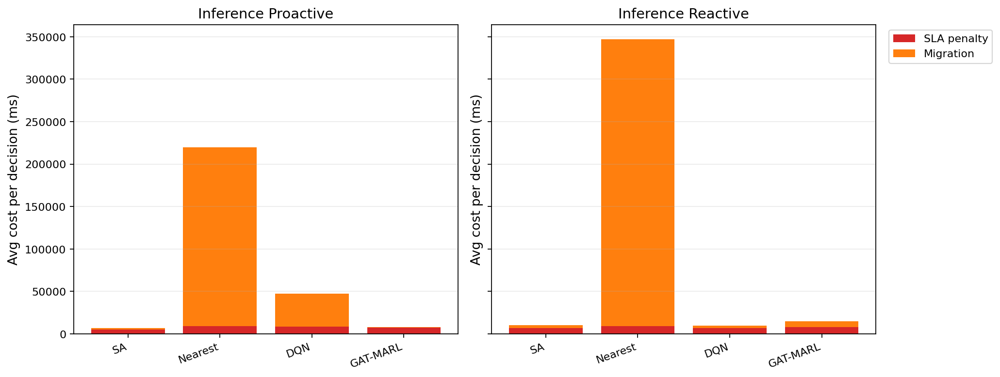

# 中等规模 cov50 数据验证报告

**生成时间**：2026-05-24 21:03:36  
**输出目录**：`experiments\medium_validation_20260524_1902_green_channel_mid`  
**数据文件**：`data\processed\taxi_cleaned_active100_min100_eps2h_cov50.csv`  
**数据规模**：Top-12 active taxis；train=37832 rows/9 taxis；test=11548 rows/3 taxis  
**切分方式**：balanced_by_nearest_server_exposure；test row ratio=0.234；test risk ratio=0.134  
**GAT-MARL epochs**：Proactive=8，Reactive=8

## 训练段

| Algorithm | Migrations | SLA Risk Count | Severe SLA Violations | Avg SLA Excess (km) | P95 SLA Excess (km) | Avg SLA Penalty (ms) | Proactive Decisions | Avg Decision Time (ms) | Avg Access Latency (ms) | Avg Total System Cost (ms) |
|-----------|------------|----------------|-----------------------|---------------------|---------------------|----------------------|---------------------|------------------------|-------------------------|----------------------------|
| SA | 438 | 10535 | 5429 | 1.53 | 11.80 | 9241.63 | 288 | 6.14 | 2.10 | 10611.45 |
| Nearest | 2434 | 5312 | 4986 | 1.22 | 11.51 | 12014.61 | 288 | 0.05 | 2.11 | 86560.60 |
| DQN | 3635 | 6875 | 5214 | 1.36 | 11.79 | 11710.35 | 301 | 0.72 | 2.11 | 38246.34 |
| GAT-MARL | 153 | 24038 | 8064 | 5.21 | 31.11 | 11686.38 | 207 | 0.80 | 2.11 | 11756.70 |

| Algorithm | Migrations | SLA Risk Count | Severe SLA Violations | Avg SLA Excess (km) | P95 SLA Excess (km) | Avg SLA Penalty (ms) | Avg Decision Time (ms) | Avg Access Latency (ms) | Avg Total System Cost (ms) |
|-----------|------------|----------------|-----------------------|---------------------|---------------------|----------------------|------------------------|-------------------------|----------------------------|
| SA | 351 | 17199 | 5701 | 1.57 | 12.28 | 6806.94 | 4.69 | 2.08 | 7823.99 |
| Nearest | 1934 | 5525 | 4987 | 1.22 | 11.51 | 12177.70 | 0.05 | 2.11 | 107727.31 |
| DQN | 4395 | 12930 | 8297 | 1.99 | 11.79 | 10630.35 | 0.42 | 2.11 | 27954.40 |
| GAT-MARL | 463 | 8366 | 5060 | 1.32 | 11.51 | 11023.92 | 0.72 | 2.11 | 14126.98 |

## 推理段

| Algorithm | Migrations | SLA Risk Count | Severe SLA Violations | Avg SLA Excess (km) | P95 SLA Excess (km) | Avg SLA Penalty (ms) | Proactive Decisions | Avg Decision Time (ms) | Avg Access Latency (ms) | Avg Total System Cost (ms) |
|-----------|------------|----------------|-----------------------|---------------------|---------------------|----------------------|---------------------|------------------------|-------------------------|----------------------------|
| SA | 124 | 2481 | 490 | 0.55 | 4.91 | 5365.19 | 149 | 5.94 | 2.08 | 7258.16 |
| Nearest | 1165 | 864 | 443 | 0.50 | 4.91 | 9104.83 | 124 | 0.05 | 2.09 | 219670.24 |
| DQN | 1224 | 2196 | 818 | 0.69 | 7.32 | 8785.50 | 148 | 0.59 | 2.09 | 47812.87 |
| GAT-MARL | 244 | 4838 | 740 | 1.30 | 6.22 | 7736.60 | 112 | 1.02 | 2.09 | 8271.78 |

| Algorithm | Migrations | SLA Risk Count | Severe SLA Violations | Avg SLA Excess (km) | P95 SLA Excess (km) | Avg SLA Penalty (ms) | Avg Decision Time (ms) | Avg Access Latency (ms) | Avg Total System Cost (ms) |
|-----------|------------|----------------|-----------------------|---------------------|---------------------|----------------------|------------------------|-------------------------|----------------------------|
| SA | 145 | 1626 | 459 | 0.51 | 4.91 | 6723.52 | 4.38 | 2.08 | 10171.16 |
| Nearest | 950 | 956 | 443 | 0.50 | 4.91 | 9409.59 | 0.06 | 2.09 | 347080.63 |
| DQN | 804 | 4590 | 1587 | 1.60 | 9.16 | 7079.45 | 0.33 | 2.09 | 10118.04 |
| GAT-MARL | 197 | 2382 | 487 | 0.60 | 4.91 | 8302.48 | 0.57 | 2.09 | 14914.74 |

## 成本分解堆叠图

## 推理阶段成本分解均值

| Algorithm | Proactive SLA Penalty (ms) | Proactive Migration (ms) | Reactive SLA Penalty (ms) | Reactive Migration (ms) |
|-----------|----------------------------|--------------------------|---------------------------|-------------------------|
| SA | 5365.19 | 1785.32 | 6723.52 | 3365.08 |
| Nearest | 9104.83 | 210563.28 | 9409.59 | 337668.94 |
| DQN | 8785.50 | 38781.31 | 7079.45 | 2922.61 |
| GAT-MARL | 7736.60 | 479.71 | 8302.48 | 6549.60 |

## 本轮验证关注点

- 验证脚本显式使用 cov50 覆盖过滤数据，不再读取旧 cleaned CSV。
- train/test 按最近服务器距离风险暴露平衡切分，减少 proactive opportunity 偏斜。
- Avg Decision Time 是算法计算耗时；Avg Access Latency 是真实接入延迟；Avg Total System Cost 使用 `total_cost_ms_sum / decision_count`，包含 SLA penalty 和迁移等系统代价。
- SLA Risk Count 是 max-entry 风险次数；Severe SLA Violations 和 SLA Excess 用于区分轻微风险与严重服务质量退化。

