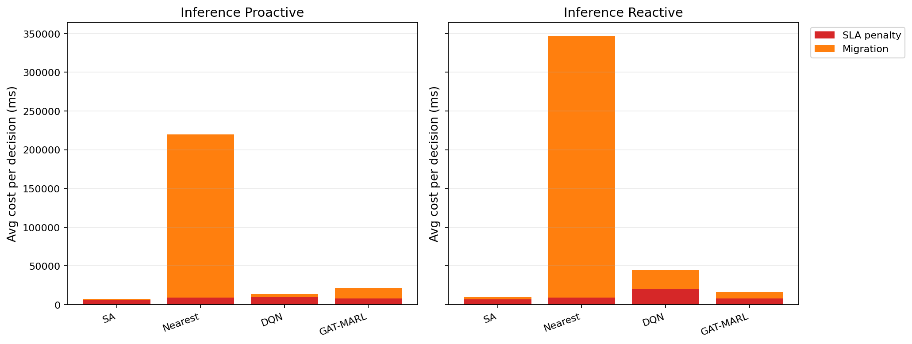

# 中等规模 cov50 数据验证报告

**生成时间**：2026-05-25 01:47:49  
**输出目录**：`experiments\medium_validation_20260524_2143_green_floor07_gain0`  
**数据文件**：`data\processed\taxi_cleaned_active100_min100_eps2h_cov50.csv`  
**数据规模**：Top-12 active taxis；train=37832 rows/9 taxis；test=11548 rows/3 taxis  
**切分方式**：balanced_by_nearest_server_exposure；test row ratio=0.234；test risk ratio=0.134  
**GAT-MARL epochs**：Proactive=8，Reactive=8

## 训练段

| Algorithm | Migrations | SLA Risk Count | Severe SLA Violations | Avg SLA Excess (km) | P95 SLA Excess (km) | Avg SLA Penalty (ms) | Proactive Decisions | Avg Decision Time (ms) | Avg Access Latency (ms) | Avg Total System Cost (ms) |
|-----------|------------|----------------|-----------------------|---------------------|---------------------|----------------------|---------------------|------------------------|-------------------------|----------------------------|
| SA | 463 | 12322 | 5276 | 1.43 | 11.55 | 8316.75 | 284 | 6.16 | 2.09 | 9607.03 |
| Nearest | 2434 | 5312 | 4986 | 1.22 | 11.51 | 12014.61 | 288 | 0.05 | 2.11 | 86560.60 |
| DQN | 3938 | 7505 | 5365 | 1.38 | 11.55 | 10954.57 | 302 | 0.71 | 2.11 | 33255.64 |
| GAT-MARL | 16441 | 23820 | 8056 | 5.20 | 31.11 | 11685.39 | 207 | 1.14 | 2.11 | 14266.07 |

| Algorithm | Migrations | SLA Risk Count | Severe SLA Violations | Avg SLA Excess (km) | P95 SLA Excess (km) | Avg SLA Penalty (ms) | Avg Decision Time (ms) | Avg Access Latency (ms) | Avg Total System Cost (ms) |
|-----------|------------|----------------|-----------------------|---------------------|---------------------|----------------------|------------------------|-------------------------|----------------------------|
| SA | 328 | 15885 | 5418 | 1.57 | 12.28 | 6840.71 | 6.71 | 2.08 | 7849.89 |
| Nearest | 1934 | 5525 | 4987 | 1.22 | 11.51 | 12177.70 | 0.07 | 2.11 | 107727.31 |
| DQN | 3777 | 15711 | 6667 | 1.98 | 11.80 | 12281.96 | 0.55 | 2.11 | 34206.53 |
| GAT-MARL | 11085 | 8199 | 5163 | 1.38 | 11.53 | 11404.20 | 1.02 | 2.11 | 19136.01 |

## 推理段

| Algorithm | Migrations | SLA Risk Count | Severe SLA Violations | Avg SLA Excess (km) | P95 SLA Excess (km) | Avg SLA Penalty (ms) | Proactive Decisions | Avg Decision Time (ms) | Avg Access Latency (ms) | Avg Total System Cost (ms) |
|-----------|------------|----------------|-----------------------|---------------------|---------------------|----------------------|---------------------|------------------------|-------------------------|----------------------------|
| SA | 143 | 2407 | 473 | 0.55 | 4.91 | 5568.93 | 154 | 8.29 | 2.08 | 7853.95 |
| Nearest | 1165 | 864 | 443 | 0.50 | 4.91 | 9104.83 | 124 | 0.07 | 2.09 | 219670.24 |
| DQN | 2862 | 7060 | 3526 | 3.48 | 13.34 | 9872.71 | 83 | 0.73 | 2.10 | 13948.51 |
| GAT-MARL | 6309 | 5117 | 861 | 1.42 | 7.32 | 7947.80 | 119 | 1.46 | 2.09 | 21977.62 |

| Algorithm | Migrations | SLA Risk Count | Severe SLA Violations | Avg SLA Excess (km) | P95 SLA Excess (km) | Avg SLA Penalty (ms) | Avg Decision Time (ms) | Avg Access Latency (ms) | Avg Total System Cost (ms) |
|-----------|------------|----------------|-----------------------|---------------------|---------------------|----------------------|------------------------|-------------------------|----------------------------|
| SA | 142 | 1637 | 454 | 0.52 | 4.91 | 6754.04 | 6.19 | 2.08 | 9903.01 |
| Nearest | 950 | 956 | 443 | 0.50 | 4.91 | 9409.59 | 0.07 | 2.09 | 347080.63 |
| DQN | 535 | 1917 | 800 | 2.12 | 8.37 | 19869.88 | 0.37 | 2.15 | 44770.34 |
| GAT-MARL | 317 | 1708 | 487 | 0.58 | 4.91 | 8176.83 | 0.87 | 2.09 | 16036.40 |

## 成本分解堆叠图

## 推理阶段成本分解均值

| Algorithm | Proactive SLA Penalty (ms) | Proactive Migration (ms) | Reactive SLA Penalty (ms) | Reactive Migration (ms) |
|-----------|----------------------------|--------------------------|---------------------------|-------------------------|
| SA | 5568.93 | 2179.15 | 6754.04 | 3035.76 |
| Nearest | 9104.83 | 210563.28 | 9409.59 | 337668.94 |
| DQN | 9872.71 | 3844.36 | 19869.88 | 24757.51 |
| GAT-MARL | 7947.80 | 13938.96 | 8176.83 | 7796.32 |

## 本轮验证关注点

- 验证脚本显式使用 cov50 覆盖过滤数据，不再读取旧 cleaned CSV。
- train/test 按最近服务器距离风险暴露平衡切分，减少 proactive opportunity 偏斜。
- Avg Decision Time 是算法计算耗时；Avg Access Latency 是真实接入延迟；Avg Total System Cost 使用 `total_cost_ms_sum / decision_count`，包含 SLA penalty 和迁移等系统代价。
- SLA Risk Count 是 max-entry 风险次数；Severe SLA Violations 和 SLA Excess 用于区分轻微风险与严重服务质量退化。

