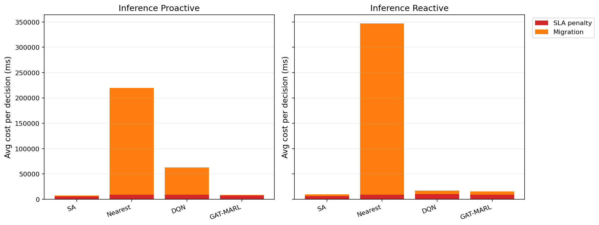

# 中等规模 cov50 数据验证报告

**生成时间**：2026-05-25 01:52:29  
**输出目录**：`experiments\medium_validation_20260524_2148_green_floor10_gain500`  
**数据文件**：`data\processed\taxi_cleaned_active100_min100_eps2h_cov50.csv`  
**数据规模**：Top-12 active taxis；train=37832 rows/9 taxis；test=11548 rows/3 taxis  
**切分方式**：balanced_by_nearest_server_exposure；test row ratio=0.234；test risk ratio=0.134  
**GAT-MARL epochs**：Proactive=8，Reactive=8

## 训练段

| Algorithm | Migrations | SLA Risk Count | Severe SLA Violations | Avg SLA Excess (km) | P95 SLA Excess (km) | Avg SLA Penalty (ms) | Proactive Decisions | Avg Decision Time (ms) | Avg Access Latency (ms) | Avg Total System Cost (ms) |
|-----------|------------|----------------|-----------------------|---------------------|---------------------|----------------------|---------------------|------------------------|-------------------------|----------------------------|
| SA | 458 | 11874 | 5253 | 1.38 | 11.56 | 8060.02 | 292 | 8.20 | 2.09 | 9288.05 |
| Nearest | 2434 | 5312 | 4986 | 1.22 | 11.51 | 12014.61 | 288 | 0.06 | 2.11 | 86560.60 |
| DQN | 3473 | 9397 | 5729 | 1.49 | 11.54 | 10695.93 | 290 | 0.96 | 2.11 | 25149.46 |
| GAT-MARL | 97 | 24063 | 8064 | 5.21 | 31.11 | 11686.38 | 207 | 1.17 | 2.11 | 11753.81 |

| Algorithm | Migrations | SLA Risk Count | Severe SLA Violations | Avg SLA Excess (km) | P95 SLA Excess (km) | Avg SLA Penalty (ms) | Avg Decision Time (ms) | Avg Access Latency (ms) | Avg Total System Cost (ms) |
|-----------|------------|----------------|-----------------------|---------------------|---------------------|----------------------|------------------------|-------------------------|----------------------------|
| SA | 359 | 17044 | 6250 | 1.75 | 12.28 | 7096.51 | 6.64 | 2.09 | 8072.83 |
| Nearest | 1934 | 5525 | 4987 | 1.22 | 11.51 | 12177.70 | 0.07 | 2.11 | 107727.31 |
| DQN | 3507 | 11114 | 5515 | 1.46 | 12.23 | 11761.26 | 0.58 | 2.11 | 30870.15 |
| GAT-MARL | 455 | 8832 | 5114 | 1.35 | 11.51 | 10997.66 | 0.71 | 2.11 | 14081.53 |

## 推理段

| Algorithm | Migrations | SLA Risk Count | Severe SLA Violations | Avg SLA Excess (km) | P95 SLA Excess (km) | Avg SLA Penalty (ms) | Proactive Decisions | Avg Decision Time (ms) | Avg Access Latency (ms) | Avg Total System Cost (ms) |
|-----------|------------|----------------|-----------------------|---------------------|---------------------|----------------------|---------------------|------------------------|-------------------------|----------------------------|
| SA | 135 | 2368 | 477 | 0.55 | 4.91 | 5483.10 | 146 | 5.93 | 2.08 | 7533.37 |
| Nearest | 1165 | 864 | 443 | 0.50 | 4.91 | 9104.83 | 124 | 0.05 | 2.09 | 219670.24 |
| DQN | 854 | 2916 | 1234 | 0.94 | 7.32 | 9014.19 | 162 | 0.56 | 2.09 | 63042.78 |
| GAT-MARL | 224 | 4534 | 726 | 1.26 | 6.07 | 7702.23 | 122 | 1.12 | 2.09 | 8434.37 |

| Algorithm | Migrations | SLA Risk Count | Severe SLA Violations | Avg SLA Excess (km) | P95 SLA Excess (km) | Avg SLA Penalty (ms) | Avg Decision Time (ms) | Avg Access Latency (ms) | Avg Total System Cost (ms) |
|-----------|------------|----------------|-----------------------|---------------------|---------------------|----------------------|------------------------|-------------------------|----------------------------|
| SA | 151 | 1672 | 450 | 0.51 | 4.91 | 6610.40 | 4.35 | 2.08 | 10019.57 |
| Nearest | 950 | 956 | 443 | 0.50 | 4.91 | 9409.59 | 0.05 | 2.09 | 347080.63 |
| DQN | 1287 | 3359 | 1076 | 1.51 | 9.27 | 10570.79 | 0.38 | 2.10 | 17305.34 |
| GAT-MARL | 195 | 2623 | 492 | 0.59 | 4.91 | 9392.08 | 0.60 | 2.10 | 15763.07 |

## 成本分解堆叠图

## 推理阶段成本分解均值

| Algorithm | Proactive SLA Penalty (ms) | Proactive Migration (ms) | Reactive SLA Penalty (ms) | Reactive Migration (ms) |
|-----------|----------------------------|--------------------------|---------------------------|-------------------------|
| SA | 5483.10 | 1940.43 | 6610.40 | 3305.59 |
| Nearest | 9104.83 | 210563.28 | 9409.59 | 337668.94 |
| DQN | 9014.19 | 53942.24 | 10570.79 | 6590.61 |
| GAT-MARL | 7702.23 | 645.02 | 9392.08 | 6314.03 |

## 本轮验证关注点

- 验证脚本显式使用 cov50 覆盖过滤数据，不再读取旧 cleaned CSV。
- train/test 按最近服务器距离风险暴露平衡切分，减少 proactive opportunity 偏斜。
- Avg Decision Time 是算法计算耗时；Avg Access Latency 是真实接入延迟；Avg Total System Cost 使用 `total_cost_ms_sum / decision_count`，包含 SLA penalty 和迁移等系统代价。
- SLA Risk Count 是 max-entry 风险次数；Severe SLA Violations 和 SLA Excess 用于区分轻微风险与严重服务质量退化。

