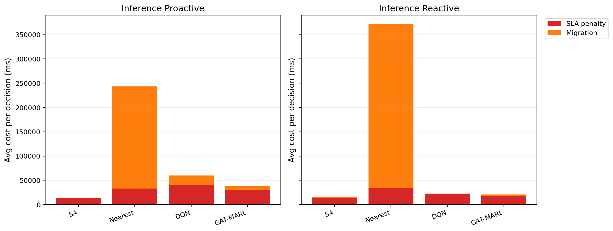

# 中等规模 cov50 数据验证报告

**生成时间**：2026-05-25 15:30:00  
**输出目录**：`experiments\medium_validation_20260525_1426_reward_refactor_cost_tuned`  
**数据文件**：`data\processed\taxi_cleaned_active100_min100_eps2h_cov50.csv`  
**数据规模**：Top-12 active taxis；train=37832 rows/9 taxis；test=11548 rows/3 taxis  
**切分方式**：balanced_by_nearest_server_exposure；test row ratio=0.234；test risk ratio=0.134  
**GAT-MARL epochs**：Proactive=8，Reactive=8

## 训练段

| Algorithm | Migrations | SLA Risk Count | Severe SLA Violations | Avg SLA Excess (km) | P95 SLA Excess (km) | Avg SLA Penalty (ms) | Proactive Decisions | Avg Decision Time (ms) | Avg Access Latency (ms) | Avg Total System Cost (ms) |
|-----------|------------|----------------|-----------------------|---------------------|---------------------|----------------------|---------------------|------------------------|-------------------------|----------------------------|
| SA | 388 | 14266 | 5704 | 1.47 | 11.51 | 25667.00 | 270 | 6.60 | 2.09 | 26629.68 |
| Nearest | 2434 | 5312 | 4986 | 1.22 | 11.51 | 50311.08 | 288 | 0.05 | 2.11 | 124857.06 |
| DQN | 5351 | 7603 | 5284 | 1.39 | 11.56 | 46786.43 | 310 | 0.73 | 2.11 | 74043.86 |
| GAT-MARL | 911 | 8791 | 4987 | 1.24 | 11.51 | 43839.17 | 284 | 0.88 | 2.10 | 55365.90 |

| Algorithm | Migrations | SLA Risk Count | Severe SLA Violations | Avg SLA Excess (km) | P95 SLA Excess (km) | Avg SLA Penalty (ms) | Avg Decision Time (ms) | Avg Access Latency (ms) | Avg Total System Cost (ms) |
|-----------|------------|----------------|-----------------------|---------------------|---------------------|----------------------|------------------------|-------------------------|----------------------------|
| SA | 317 | 17717 | 5456 | 1.51 | 11.80 | 21598.19 | 5.02 | 2.08 | 22990.97 |
| Nearest | 1934 | 5525 | 4987 | 1.22 | 11.51 | 50994.03 | 0.05 | 2.11 | 146543.64 |
| DQN | 4551 | 16438 | 6930 | 1.78 | 11.78 | 38265.74 | 0.42 | 2.10 | 50788.00 |
| GAT-MARL | 342 | 10625 | 5102 | 1.29 | 11.51 | 31874.00 | 0.69 | 2.09 | 33940.06 |

## 推理段

| Algorithm | Migrations | SLA Risk Count | Severe SLA Violations | Avg SLA Excess (km) | P95 SLA Excess (km) | Avg SLA Penalty (ms) | Proactive Decisions | Avg Decision Time (ms) | Avg Access Latency (ms) | Avg Total System Cost (ms) |
|-----------|------------|----------------|-----------------------|---------------------|---------------------|----------------------|---------------------|------------------------|-------------------------|----------------------------|
| SA | 97 | 3444 | 482 | 0.59 | 4.91 | 13020.06 | 129 | 6.38 | 2.08 | 14534.12 |
| Nearest | 1165 | 864 | 443 | 0.50 | 4.91 | 32956.28 | 124 | 0.06 | 2.09 | 243521.68 |
| DQN | 702 | 4485 | 1054 | 1.25 | 9.27 | 40172.76 | 137 | 0.67 | 2.10 | 59892.93 |
| GAT-MARL | 444 | 2361 | 471 | 0.57 | 4.91 | 30371.87 | 144 | 1.87 | 2.09 | 38004.37 |

| Algorithm | Migrations | SLA Risk Count | Severe SLA Violations | Avg SLA Excess (km) | P95 SLA Excess (km) | Avg SLA Penalty (ms) | Avg Decision Time (ms) | Avg Access Latency (ms) | Avg Total System Cost (ms) |
|-----------|------------|----------------|-----------------------|---------------------|---------------------|----------------------|------------------------|-------------------------|----------------------------|
| SA | 81 | 3012 | 460 | 0.57 | 4.91 | 14232.06 | 4.75 | 2.08 | 15671.82 |
| Nearest | 950 | 956 | 443 | 0.50 | 4.91 | 34059.42 | 0.06 | 2.09 | 371730.45 |
| DQN | 115 | 4865 | 829 | 1.28 | 6.70 | 22376.53 | 0.32 | 2.08 | 23037.39 |
| GAT-MARL | 155 | 2816 | 478 | 0.56 | 4.91 | 17966.15 | 0.57 | 2.08 | 21011.34 |

## 成本分解堆叠图

## 推理阶段成本分解均值

| Algorithm | Proactive SLA Penalty (ms) | Proactive Migration (ms) | Reactive SLA Penalty (ms) | Reactive Migration (ms) |
|-----------|----------------------------|--------------------------|---------------------------|-------------------------|
| SA | 13020.06 | 1397.92 | 14232.06 | 1351.56 |
| Nearest | 32956.28 | 210563.28 | 34059.42 | 337668.94 |
| DQN | 40172.76 | 19496.11 | 22376.53 | 598.65 |
| GAT-MARL | 30371.87 | 7503.43 | 17966.15 | 2978.43 |

## 本轮验证关注点

- 验证脚本显式使用 cov50 覆盖过滤数据，不再读取旧 cleaned CSV。
- train/test 按最近服务器距离风险暴露平衡切分，减少 proactive opportunity 偏斜。
- Avg Decision Time 是算法计算耗时；Avg Access Latency 是真实接入延迟；Avg Total System Cost 使用 `total_cost_ms_sum / decision_count`，包含 SLA penalty 和迁移等系统代价。
- SLA Risk Count 是 max-entry 风险次数；Severe SLA Violations 和 SLA Excess 用于区分轻微风险与严重服务质量退化。

