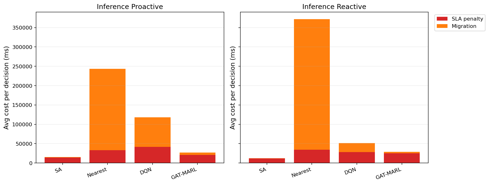

# 中等规模 cov50 数据验证报告

**生成时间**：2026-05-25 16:50:28  
**输出目录**：`experiments\medium_validation_20260525_1545_reward_refactor_budget`  
**数据文件**：`data\processed\taxi_cleaned_active100_min100_eps2h_cov50.csv`  
**数据规模**：Top-12 active taxis；train=37832 rows/9 taxis；test=11548 rows/3 taxis  
**切分方式**：balanced_by_nearest_server_exposure；test row ratio=0.234；test risk ratio=0.134  
**GAT-MARL epochs**：Proactive=8，Reactive=8

## 训练段

| Algorithm | Migrations | SLA Risk Count | Severe SLA Violations | Avg SLA Excess (km) | P95 SLA Excess (km) | Avg SLA Penalty (ms) | Proactive Decisions | Avg Decision Time (ms) | Avg Access Latency (ms) | Avg Total System Cost (ms) |
|-----------|------------|----------------|-----------------------|---------------------|---------------------|----------------------|---------------------|------------------------|-------------------------|----------------------------|
| SA | 388 | 15145 | 5468 | 1.41 | 11.51 | 23764.85 | 280 | 6.60 | 2.09 | 24525.25 |
| Nearest | 2434 | 5312 | 4986 | 1.22 | 11.51 | 50311.08 | 288 | 0.05 | 2.11 | 124857.06 |
| DQN | 4876 | 5854 | 5062 | 1.31 | 11.80 | 52548.06 | 290 | 0.80 | 2.11 | 96567.55 |
| GAT-MARL | 598 | 14122 | 5014 | 1.33 | 11.51 | 34180.52 | 318 | 0.85 | 2.10 | 41852.25 |

| Algorithm | Migrations | SLA Risk Count | Severe SLA Violations | Avg SLA Excess (km) | P95 SLA Excess (km) | Avg SLA Penalty (ms) | Avg Decision Time (ms) | Avg Access Latency (ms) | Avg Total System Cost (ms) |
|-----------|------------|----------------|-----------------------|---------------------|---------------------|----------------------|------------------------|-------------------------|----------------------------|
| SA | 311 | 19743 | 5631 | 1.62 | 11.56 | 20394.69 | 4.98 | 2.08 | 21524.86 |
| Nearest | 1934 | 5525 | 4987 | 1.22 | 11.51 | 50994.03 | 0.05 | 2.11 | 146543.64 |
| DQN | 4088 | 11076 | 5293 | 1.43 | 11.78 | 47450.63 | 0.41 | 2.11 | 67749.23 |
| GAT-MARL | 355 | 10667 | 5051 | 1.30 | 11.51 | 31622.45 | 0.77 | 2.09 | 34243.70 |

## 推理段

| Algorithm | Migrations | SLA Risk Count | Severe SLA Violations | Avg SLA Excess (km) | P95 SLA Excess (km) | Avg SLA Penalty (ms) | Proactive Decisions | Avg Decision Time (ms) | Avg Access Latency (ms) | Avg Total System Cost (ms) |
|-----------|------------|----------------|-----------------------|---------------------|---------------------|----------------------|---------------------|------------------------|-------------------------|----------------------------|
| SA | 92 | 3170 | 492 | 0.59 | 4.91 | 13896.89 | 134 | 6.25 | 2.08 | 15349.06 |
| Nearest | 1165 | 864 | 443 | 0.50 | 4.91 | 32956.28 | 124 | 0.05 | 2.09 | 243521.68 |
| DQN | 847 | 1879 | 852 | 0.75 | 6.72 | 41530.92 | 123 | 0.61 | 2.10 | 118151.98 |
| GAT-MARL | 355 | 4800 | 465 | 0.61 | 4.91 | 20612.13 | 141 | 1.53 | 2.08 | 27256.48 |

| Algorithm | Migrations | SLA Risk Count | Severe SLA Violations | Avg SLA Excess (km) | P95 SLA Excess (km) | Avg SLA Penalty (ms) | Avg Decision Time (ms) | Avg Access Latency (ms) | Avg Total System Cost (ms) |
|-----------|------------|----------------|-----------------------|---------------------|---------------------|----------------------|------------------------|-------------------------|----------------------------|
| SA | 90 | 4255 | 455 | 0.59 | 4.91 | 11532.21 | 4.67 | 2.08 | 12619.58 |
| Nearest | 950 | 956 | 443 | 0.50 | 4.91 | 34059.42 | 0.06 | 2.09 | 371730.45 |
| DQN | 2082 | 2959 | 1212 | 1.04 | 8.43 | 28120.10 | 0.33 | 2.09 | 51854.87 |
| GAT-MARL | 165 | 2634 | 478 | 0.56 | 4.91 | 24902.75 | 0.59 | 2.09 | 28714.77 |

## 成本分解堆叠图

## 推理阶段成本分解均值

| Algorithm | Proactive SLA Penalty (ms) | Proactive Migration (ms) | Reactive SLA Penalty (ms) | Reactive Migration (ms) |
|-----------|----------------------------|--------------------------|---------------------------|-------------------------|
| SA | 13896.89 | 1352.29 | 11532.21 | 974.73 |
| Nearest | 32956.28 | 210563.28 | 34059.42 | 337668.94 |
| DQN | 41530.92 | 76345.45 | 28120.10 | 23583.19 |
| GAT-MARL | 20612.13 | 6488.39 | 24902.75 | 3757.65 |

## 本轮验证关注点

- 验证脚本显式使用 cov50 覆盖过滤数据，不再读取旧 cleaned CSV。
- train/test 按最近服务器距离风险暴露平衡切分，减少 proactive opportunity 偏斜。
- Avg Decision Time 是算法计算耗时；Avg Access Latency 是真实接入延迟；Avg Total System Cost 使用 `total_cost_ms_sum / decision_count`，包含 SLA penalty 和迁移等系统代价。
- SLA Risk Count 是 max-entry 风险次数；Severe SLA Violations 和 SLA Excess 用于区分轻微风险与严重服务质量退化。

