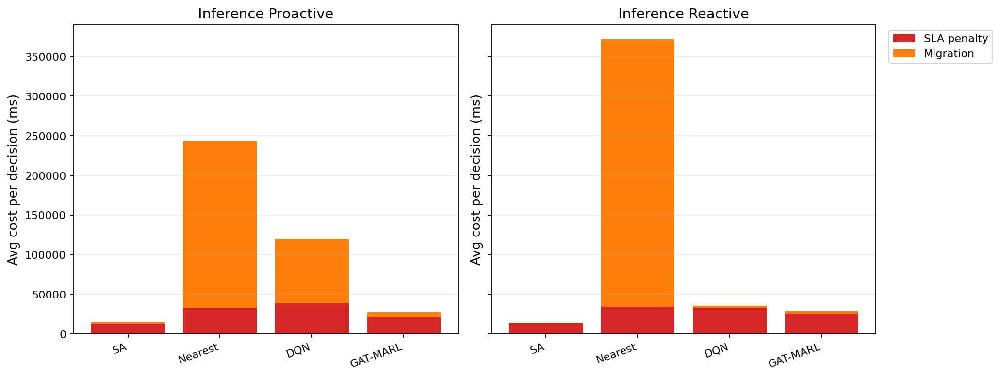

# 中等规模 cov50 数据验证报告

**生成时间**：2026-05-25 18:14:13  
**输出目录**：`experiments\medium_validation_20260525_1705_reward_refactor_cost_budget`  
**数据文件**：`data\processed\taxi_cleaned_active100_min100_eps2h_cov50.csv`  
**数据规模**：Top-12 active taxis；train=37832 rows/9 taxis；test=11548 rows/3 taxis  
**切分方式**：balanced_by_nearest_server_exposure；test row ratio=0.234；test risk ratio=0.134  
**GAT-MARL epochs**：Proactive=8，Reactive=8

## 训练段

| Algorithm | Migrations | SLA Risk Count | Severe SLA Violations | Avg SLA Excess (km) | P95 SLA Excess (km) | Avg SLA Penalty (ms) | Proactive Decisions | Avg Decision Time (ms) | Avg Access Latency (ms) | Avg Total System Cost (ms) |
|-----------|------------|----------------|-----------------------|---------------------|---------------------|----------------------|---------------------|------------------------|-------------------------|----------------------------|
| SA | 406 | 14296 | 5704 | 1.47 | 11.51 | 25633.44 | 271 | 6.62 | 2.09 | 26693.96 |
| Nearest | 2434 | 5312 | 4986 | 1.22 | 11.51 | 50311.08 | 288 | 0.05 | 2.11 | 124857.06 |
| DQN | 5063 | 7511 | 5545 | 1.45 | 11.80 | 49864.05 | 286 | 0.73 | 2.11 | 86257.32 |
| GAT-MARL | 575 | 12793 | 5000 | 1.32 | 11.51 | 33858.34 | 326 | 0.94 | 2.09 | 41612.14 |

| Algorithm | Migrations | SLA Risk Count | Severe SLA Violations | Avg SLA Excess (km) | P95 SLA Excess (km) | Avg SLA Penalty (ms) | Avg Decision Time (ms) | Avg Access Latency (ms) | Avg Total System Cost (ms) |
|-----------|------------|----------------|-----------------------|---------------------|---------------------|----------------------|------------------------|-------------------------|----------------------------|
| SA | 265 | 18095 | 5666 | 1.53 | 11.79 | 21081.86 | 5.08 | 2.08 | 22152.63 |
| Nearest | 1934 | 5525 | 4987 | 1.22 | 11.51 | 50994.03 | 0.05 | 2.11 | 146543.64 |
| DQN | 5477 | 18658 | 6701 | 1.83 | 11.80 | 37999.03 | 0.46 | 2.10 | 49525.31 |
| GAT-MARL | 355 | 10667 | 5051 | 1.30 | 11.51 | 31622.45 | 0.72 | 2.09 | 34243.70 |

## 推理段

| Algorithm | Migrations | SLA Risk Count | Severe SLA Violations | Avg SLA Excess (km) | P95 SLA Excess (km) | Avg SLA Penalty (ms) | Proactive Decisions | Avg Decision Time (ms) | Avg Access Latency (ms) | Avg Total System Cost (ms) |
|-----------|------------|----------------|-----------------------|---------------------|---------------------|----------------------|---------------------|------------------------|-------------------------|----------------------------|
| SA | 97 | 3273 | 482 | 0.59 | 4.91 | 13161.23 | 140 | 6.22 | 2.08 | 14660.34 |
| Nearest | 1165 | 864 | 443 | 0.50 | 4.91 | 32956.28 | 124 | 0.05 | 2.09 | 243521.68 |
| DQN | 1385 | 1480 | 776 | 0.76 | 7.31 | 38648.96 | 128 | 0.59 | 2.10 | 120171.65 |
| GAT-MARL | 364 | 4976 | 447 | 0.58 | 4.91 | 20825.24 | 135 | 1.64 | 2.08 | 27430.90 |

| Algorithm | Migrations | SLA Risk Count | Severe SLA Violations | Avg SLA Excess (km) | P95 SLA Excess (km) | Avg SLA Penalty (ms) | Avg Decision Time (ms) | Avg Access Latency (ms) | Avg Total System Cost (ms) |
|-----------|------------|----------------|-----------------------|---------------------|---------------------|----------------------|------------------------|-------------------------|----------------------------|
| SA | 80 | 3156 | 454 | 0.55 | 4.91 | 13301.04 | 4.60 | 2.08 | 14402.64 |
| Nearest | 950 | 956 | 443 | 0.50 | 4.91 | 34059.42 | 0.05 | 2.09 | 371730.45 |
| DQN | 481 | 5247 | 1318 | 1.51 | 8.73 | 32902.20 | 0.32 | 2.09 | 35342.04 |
| GAT-MARL | 165 | 2634 | 478 | 0.56 | 4.91 | 24902.75 | 0.63 | 2.09 | 28714.77 |

## 成本分解堆叠图

## 推理阶段成本分解均值

| Algorithm | Proactive SLA Penalty (ms) | Proactive Migration (ms) | Reactive SLA Penalty (ms) | Reactive Migration (ms) |
|-----------|----------------------------|--------------------------|---------------------------|-------------------------|
| SA | 13161.23 | 1380.45 | 13301.04 | 1011.65 |
| Nearest | 32956.28 | 210563.28 | 34059.42 | 337668.94 |
| DQN | 38648.96 | 81254.48 | 32902.20 | 2325.44 |
| GAT-MARL | 20825.24 | 6448.43 | 24902.75 | 3757.65 |

## 本轮验证关注点

- 验证脚本显式使用 cov50 覆盖过滤数据，不再读取旧 cleaned CSV。
- train/test 按最近服务器距离风险暴露平衡切分，减少 proactive opportunity 偏斜。
- Avg Decision Time 是算法计算耗时；Avg Access Latency 是真实接入延迟；Avg Total System Cost 使用 `total_cost_ms_sum / decision_count`，包含 SLA penalty 和迁移等系统代价。
- SLA Risk Count 是 max-entry 风险次数；Severe SLA Violations 和 SLA Excess 用于区分轻微风险与严重服务质量退化。

