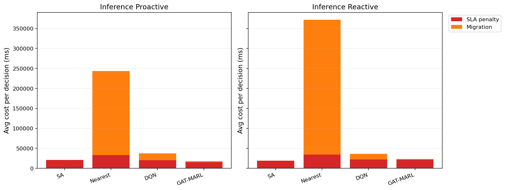

# 中等规模 cov50 数据验证报告

**生成时间**：2026-05-26 00:06:49  
**输出目录**：`experiments\medium_validation_20260525_2241_physical_wall_v1`  
**数据文件**：`data\processed\taxi_cleaned_active100_min100_eps2h_cov50.csv`  
**数据规模**：Top-12 active taxis；train=37832 rows/9 taxis；test=11548 rows/3 taxis  
**切分方式**：balanced_by_nearest_server_exposure；test row ratio=0.234；test risk ratio=0.134  
**GAT-MARL epochs**：Proactive=8，Reactive=8

## 训练段

| Algorithm | Migrations | SLA Risk Count | Severe SLA Violations | Avg SLA Excess (km) | P95 SLA Excess (km) | Avg SLA Penalty (ms) | Proactive Decisions | Avg Decision Time (ms) | Avg Access Latency (ms) | Avg Total System Cost (ms) |
|-----------|------------|----------------|-----------------------|---------------------|---------------------|----------------------|---------------------|------------------------|-------------------------|----------------------------|
| SA | 180 | 23381 | 7310 | 2.02 | 11.79 | 20131.02 | 220 | 6.49 | 2.08 | 20257.79 |
| Nearest | 2434 | 5312 | 4986 | 1.22 | 11.51 | 50311.08 | 288 | 0.05 | 2.11 | 124857.06 |
| DQN | 5030 | 9735 | 5664 | 1.52 | 11.80 | 42558.80 | 301 | 0.70 | 2.10 | 60760.71 |
| GAT-MARL | 311 | 18856 | 5079 | 1.34 | 11.51 | 18021.11 | 318 | 0.77 | 2.08 | 19810.24 |

| Algorithm | Migrations | SLA Risk Count | Severe SLA Violations | Avg SLA Excess (km) | P95 SLA Excess (km) | Avg SLA Penalty (ms) | Avg Decision Time (ms) | Avg Access Latency (ms) | Avg Total System Cost (ms) |
|-----------|------------|----------------|-----------------------|---------------------|---------------------|----------------------|------------------------|-------------------------|----------------------------|
| SA | 20 | 24311 | 9416 | 3.55 | 18.40 | 45309.18 | 4.99 | 2.10 | 45445.71 |
| Nearest | 1934 | 5525 | 4987 | 1.22 | 11.51 | 50994.03 | 0.05 | 2.11 | 146543.64 |
| DQN | 3710 | 14677 | 5868 | 1.58 | 11.79 | 41093.96 | 0.42 | 2.10 | 54556.78 |
| GAT-MARL | 285 | 10994 | 5048 | 1.34 | 11.53 | 31683.25 | 0.64 | 2.09 | 33447.24 |

## 推理段

| Algorithm | Migrations | SLA Risk Count | Severe SLA Violations | Avg SLA Excess (km) | P95 SLA Excess (km) | Avg SLA Penalty (ms) | Proactive Decisions | Avg Decision Time (ms) | Avg Access Latency (ms) | Avg Total System Cost (ms) |
|-----------|------------|----------------|-----------------------|---------------------|---------------------|----------------------|---------------------|------------------------|-------------------------|----------------------------|
| SA | 13 | 3445 | 794 | 0.92 | 6.30 | 21012.91 | 100 | 6.18 | 2.08 | 21124.63 |
| Nearest | 1165 | 864 | 443 | 0.50 | 4.91 | 32956.28 | 124 | 0.05 | 2.09 | 243521.68 |
| DQN | 2649 | 4900 | 1335 | 1.12 | 7.32 | 20083.61 | 156 | 0.50 | 2.08 | 37751.70 |
| GAT-MARL | 277 | 3960 | 481 | 0.58 | 4.91 | 15615.55 | 137 | 1.07 | 2.08 | 17750.74 |

| Algorithm | Migrations | SLA Risk Count | Severe SLA Violations | Avg SLA Excess (km) | P95 SLA Excess (km) | Avg SLA Penalty (ms) | Avg Decision Time (ms) | Avg Access Latency (ms) | Avg Total System Cost (ms) |
|-----------|------------|----------------|-----------------------|---------------------|---------------------|----------------------|------------------------|-------------------------|----------------------------|
| SA | 12 | 3418 | 810 | 0.88 | 6.63 | 18890.23 | 4.58 | 2.08 | 19021.32 |
| Nearest | 950 | 956 | 443 | 0.50 | 4.91 | 34059.42 | 0.05 | 2.09 | 371730.45 |
| DQN | 853 | 2811 | 857 | 0.76 | 7.31 | 22102.07 | 0.35 | 2.08 | 36495.42 |
| GAT-MARL | 139 | 2815 | 686 | 0.74 | 6.89 | 21307.91 | 0.53 | 2.08 | 23621.80 |

## 成本分解堆叠图

## 推理阶段成本分解均值

| Algorithm | Proactive SLA Penalty (ms) | Proactive Migration (ms) | Reactive SLA Penalty (ms) | Reactive Migration (ms) |
|-----------|----------------------------|--------------------------|---------------------------|-------------------------|
| SA | 21012.91 | 88.32 | 18890.23 | 73.67 |
| Nearest | 32956.28 | 210563.28 | 34059.42 | 337668.94 |
| DQN | 20083.61 | 17492.02 | 22102.07 | 14274.04 |
| GAT-MARL | 15615.55 | 2029.05 | 21307.91 | 2261.14 |

## 本轮验证关注点

- 验证脚本显式使用 cov50 覆盖过滤数据，不再读取旧 cleaned CSV。
- train/test 按最近服务器距离风险暴露平衡切分，减少 proactive opportunity 偏斜。
- Avg Decision Time 是算法计算耗时；Avg Access Latency 是真实接入延迟；Avg Total System Cost 使用 `total_cost_ms_sum / decision_count`，包含 SLA penalty 和迁移等系统代价。
- SLA Risk Count 是 max-entry 风险次数；Severe SLA Violations 和 SLA Excess 用于区分轻微风险与严重服务质量退化。

