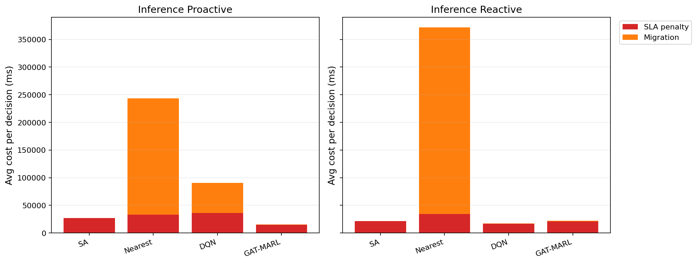

# 中等规模 cov50 数据验证报告

**生成时间**：2026-05-26 12:04:36  
**输出目录**：`experiments\medium_validation_20260526_phaseB2_reward_align_v1`  
**数据文件**：`data\processed\taxi_cleaned_active100_min100_eps2h_cov50.csv`  
**数据规模**：Top-12 active taxis；train=37832 rows/9 taxis；test=11548 rows/3 taxis  
**切分方式**：balanced_by_nearest_server_exposure；test row ratio=0.234；test risk ratio=0.134  
**GAT-MARL epochs**：Proactive=8，Reactive=8

## 训练段

| Algorithm | Migrations | SLA Risk Count | Severe SLA Violations | Avg SLA Excess (km) | P95 SLA Excess (km) | Avg SLA Penalty (ms) | Proactive Decisions | Avg Decision Time (ms) | Avg Access Latency (ms) | Avg Total System Cost (ms) |
|-----------|------------|----------------|-----------------------|---------------------|---------------------|----------------------|---------------------|------------------------|-------------------------|----------------------------|
| SA | 132 | 23189 | 7987 | 2.17 | 11.81 | 23896.15 | 232 | 6.73 | 2.08 | 23972.39 |
| Nearest | 2434 | 5312 | 4986 | 1.22 | 11.51 | 50311.08 | 288 | 0.05 | 2.11 | 124857.06 |
| DQN | 3630 | 10717 | 5772 | 1.52 | 11.54 | 39224.96 | 311 | 0.74 | 2.10 | 53947.39 |
| GAT-MARL | 198 | 20755 | 7044 | 2.06 | 13.15 | 22588.68 | 244 | 0.77 | 2.08 | 22894.35 |

| Algorithm | Migrations | SLA Risk Count | Severe SLA Violations | Avg SLA Excess (km) | P95 SLA Excess (km) | Avg SLA Penalty (ms) | Avg Decision Time (ms) | Avg Access Latency (ms) | Avg Total System Cost (ms) |
|-----------|------------|----------------|-----------------------|---------------------|---------------------|----------------------|------------------------|-------------------------|----------------------------|
| SA | 12 | 24292 | 9730 | 3.90 | 19.23 | 50768.72 | 5.05 | 2.10 | 50883.58 |
| Nearest | 1934 | 5525 | 4987 | 1.22 | 11.51 | 50994.03 | 0.05 | 2.11 | 146543.64 |
| DQN | 2734 | 13560 | 6424 | 1.68 | 11.79 | 45051.12 | 0.42 | 2.11 | 57084.65 |
| GAT-MARL | 236 | 19476 | 5486 | 1.63 | 12.77 | 21745.10 | 0.64 | 2.08 | 22337.38 |

## 推理段

| Algorithm | Migrations | SLA Risk Count | Severe SLA Violations | Avg SLA Excess (km) | P95 SLA Excess (km) | Avg SLA Penalty (ms) | Proactive Decisions | Avg Decision Time (ms) | Avg Access Latency (ms) | Avg Total System Cost (ms) |
|-----------|------------|----------------|-----------------------|---------------------|---------------------|----------------------|---------------------|------------------------|-------------------------|----------------------------|
| SA | 12 | 5124 | 1060 | 1.44 | 10.71 | 27140.29 | 97 | 6.25 | 2.09 | 27247.34 |
| Nearest | 1165 | 864 | 443 | 0.50 | 4.91 | 32956.28 | 124 | 0.05 | 2.09 | 243521.68 |
| DQN | 896 | 2560 | 894 | 0.77 | 7.32 | 35984.40 | 150 | 0.59 | 2.09 | 90421.47 |
| GAT-MARL | 217 | 4923 | 588 | 0.93 | 5.15 | 14833.37 | 140 | 0.98 | 2.08 | 15359.12 |

| Algorithm | Migrations | SLA Risk Count | Severe SLA Violations | Avg SLA Excess (km) | P95 SLA Excess (km) | Avg SLA Penalty (ms) | Avg Decision Time (ms) | Avg Access Latency (ms) | Avg Total System Cost (ms) |
|-----------|------------|----------------|-----------------------|---------------------|---------------------|----------------------|------------------------|-------------------------|----------------------------|
| SA | 8 | 4868 | 1263 | 1.24 | 9.07 | 21696.10 | 4.68 | 2.08 | 21770.31 |
| Nearest | 950 | 956 | 443 | 0.50 | 4.91 | 34059.42 | 0.05 | 2.09 | 371730.45 |
| DQN | 152 | 6406 | 1494 | 1.62 | 9.07 | 16719.51 | 0.32 | 2.08 | 17533.85 |
| GAT-MARL | 100 | 2731 | 592 | 0.62 | 5.15 | 20852.83 | 0.54 | 2.08 | 22092.18 |

## 成本分解堆叠图

## 推理阶段成本分解均值

| Algorithm | Proactive SLA Penalty (ms) | Proactive Migration (ms) | Reactive SLA Penalty (ms) | Reactive Migration (ms) |
|-----------|----------------------------|--------------------------|---------------------------|-------------------------|
| SA | 27140.29 | 30.81 | 21696.10 | 39.69 |
| Nearest | 32956.28 | 210563.28 | 34059.42 | 337668.94 |
| DQN | 35984.40 | 54342.22 | 16719.51 | 711.03 |
| GAT-MARL | 14833.37 | 429.85 | 20852.83 | 1189.00 |

## 本轮验证关注点

- 验证脚本显式使用 cov50 覆盖过滤数据，不再读取旧 cleaned CSV。
- train/test 按最近服务器距离风险暴露平衡切分，减少 proactive opportunity 偏斜。
- Avg Decision Time 是算法计算耗时；Avg Access Latency 是真实接入延迟；Avg Total System Cost 使用 `total_cost_ms_sum / decision_count`，包含 SLA penalty 和迁移等系统代价。
- SLA Risk Count 是 max-entry 风险次数；Severe SLA Violations 和 SLA Excess 用于区分轻微风险与严重服务质量退化。

