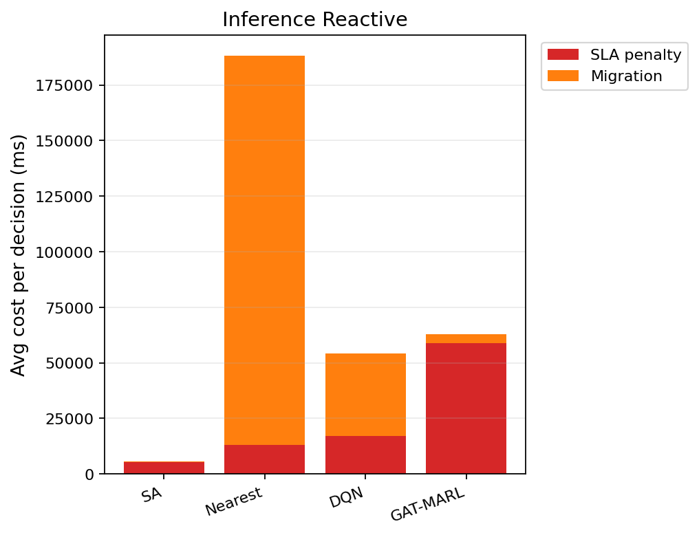

# 中等规模 cov50 数据验证报告（仅 Reactive）

**生成时间**：2026-06-05 15:22:32  
**输出目录**：`experiments\medium_validation_20260526_phaseB_reward_align_v1`  
**模式**：仅 Reactive（无轨迹预测 / 无 Proactive TTV）  
**GAT-MARL epochs**：2（reactive）

## 训练段（Reactive）

| Algorithm | Migrations | SLA Risk | Severe | P95 Excess (km) | Avg SLA Penalty (ms) | Avg Total Cost (ms) | stay_ratio |
|-----------|------------|----------|--------|-----------------|----------------------|---------------------|------------|
| SA | 113 | 23608 | 7019 | 12.28079281497639 | 8090.84 | 8340.481837316167 | — |
| Nearest | 1998 | 5525 | 4987 | 11.51333567241429 | 20054.39 | 102367.40022683913 | — |
| DQN | 2485 | 7238 | 5096 | 11.793861941039431 | 19776.50 | 50442.194114641854 | — |
| GAT-MARL | 5545 | 11639 | 7284 | 31.10785841521524 | 137333.31 | 144136.00871949422 | 0.8637 |

## 推理段（Reactive）

| Algorithm | Migrations | SLA Risk | Severe | P95 Excess (km) | Avg SLA Penalty (ms) | Avg Total Cost (ms) | stay_ratio |
|-----------|------------|----------|--------|-----------------|----------------------|---------------------|------------|
| SA | 7 | 3394 | 613 | 5.407628130286781 | 5427.18 | 5686.195904823701 | — |
| Nearest | 817 | 956 | 443 | 4.9088367564877515 | 12901.84 | 188219.46655715958 | — |
| DQN | 380 | 954 | 742 | 6.718531438767986 | 17069.75 | 54929.25069787511 | — |
| GAT-MARL | 1288 | 3499 | 1223 | 30.961036060217523 | 58859.18 | 63377.018485304754 | 0.9170 |

### train reactive — GAT-MARL per-epoch exploration
| Epoch | Phase | ε | Migrations | stay_ratio | act_1 | act_2 | act_3 | eps_greedy | migrate_opt_dec | mask_only_stay |
|-------|-------|---|------------|------------|-------|-------|-------|------------|-----------------|----------------|
| 0 | train | 0.020 | 7325 | 0.8096 | 3903 | 301 | 3121 | 1041 | 8139/8139 | 0.5663 |
| 1 | eval | 0.020 | 5545 | 0.8637 | 2948 | 0 | 2597 | 0 | 5938/5938 | 0.1926 |

### inference reactive — GAT-MARL per-epoch exploration
| Epoch | Phase | ε | Migrations | stay_ratio | act_1 | act_2 | act_3 | eps_greedy | migrate_opt_dec | mask_only_stay |
|-------|-------|---|------------|------------|-------|-------|-------|------------|-----------------|----------------|
| 0 | eval | 0.000 | 1288 | 0.9170 | 704 | 0 | 584 | 0 | 2677/2677 | 0.4737 |

### inference reactive — GAT-MARL by DAG type
| DAG type | migrations | decisions | avg_total_cost_ms |
|----------|------------|-----------|-------------------|
| Compute_Heavy_DAG_1 | 132 | 1521 | 8539.16 |
| Diamond_DAG_3 | 57 | 57 | 41388.57 |
| FanIn_Aggregator_1 | 1099 | 1099 | 140412.26 |

## 成本分解堆叠图（Reactive）

## 本轮验证关注点

- 仅 Reactive：无轨迹预测器、无 Proactive TTV。
- `stay_action_ratio` 接近 1.0 表示策略几乎不迁移；`candidate_action_counts` 中迁移动作计数应逐步上升。
- `migrations_by_dag_type` / `cost_by_dag_type` 用于观察反撕裂（Data_Heavy / FanOut 少迁、Simple 可拆）。
- SA 为 GAT-MARL 锚点（D0 后 L_internal 计入总成本，SA 应倾向少拆图）。

