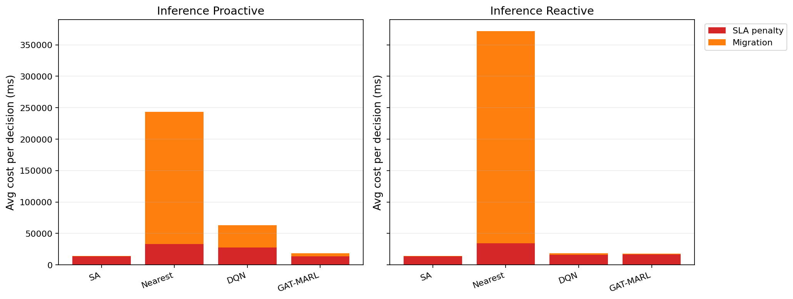

# 中等规模 cov50 数据验证报告

**生成时间**：2026-05-26 14:05:12  
**输出目录**：`experiments\medium_validation_20260526_phaseC_softguard_v1`  
**数据文件**：`data\processed\taxi_cleaned_active100_min100_eps2h_cov50.csv`  
**数据规模**：Top-12 active taxis；train=37832 rows/9 taxis；test=11548 rows/3 taxis  
**切分方式**：balanced_by_nearest_server_exposure；test row ratio=0.234；test risk ratio=0.134  
**GAT-MARL epochs**：Proactive=8，Reactive=8

## 训练段

| Algorithm | Migrations | SLA Risk Count | Severe SLA Violations | Avg SLA Excess (km) | P95 SLA Excess (km) | Avg SLA Penalty (ms) | Proactive Decisions | Avg Decision Time (ms) | Avg Access Latency (ms) | Avg Total System Cost (ms) |
|-----------|------------|----------------|-----------------------|---------------------|---------------------|----------------------|---------------------|------------------------|-------------------------|----------------------------|
| SA | 160 | 22422 | 7033 | 1.86 | 11.52 | 19533.64 | 269 | 46.28 | 2.08 | 19638.85 |
| Nearest | 2434 | 5312 | 4986 | 1.22 | 11.51 | 50311.08 | 288 | 0.05 | 2.11 | 124857.06 |
| DQN | 4065 | 6424 | 5147 | 1.33 | 11.56 | 52503.44 | 277 | 0.72 | 2.11 | 89229.35 |
| GAT-MARL | 240 | 19275 | 6252 | 1.67 | 11.53 | 21591.33 | 242 | 0.82 | 2.08 | 22969.52 |

| Algorithm | Migrations | SLA Risk Count | Severe SLA Violations | Avg SLA Excess (km) | P95 SLA Excess (km) | Avg SLA Penalty (ms) | Avg Decision Time (ms) | Avg Access Latency (ms) | Avg Total System Cost (ms) |
|-----------|------------|----------------|-----------------------|---------------------|---------------------|----------------------|------------------------|-------------------------|----------------------------|
| SA | 125 | 25090 | 6610 | 1.92 | 12.31 | 19810.61 | 29.71 | 2.08 | 20019.86 |
| Nearest | 1934 | 5525 | 4987 | 1.22 | 11.51 | 50994.03 | 0.05 | 2.11 | 146543.64 |
| DQN | 4382 | 7332 | 5376 | 1.41 | 11.77 | 49745.89 | 0.40 | 2.11 | 84286.48 |
| GAT-MARL | 254 | 19423 | 5175 | 1.48 | 11.52 | 20723.69 | 0.62 | 2.08 | 21523.46 |

## 推理段

| Algorithm | Migrations | SLA Risk Count | Severe SLA Violations | Avg SLA Excess (km) | P95 SLA Excess (km) | Avg SLA Penalty (ms) | Proactive Decisions | Avg Decision Time (ms) | Avg Access Latency (ms) | Avg Total System Cost (ms) |
|-----------|------------|----------------|-----------------------|---------------------|---------------------|----------------------|---------------------|------------------------|-------------------------|----------------------------|
| SA | 50 | 4516 | 665 | 0.84 | 6.35 | 13602.47 | 112 | 37.08 | 2.08 | 13875.90 |
| Nearest | 1165 | 864 | 443 | 0.50 | 4.91 | 32956.28 | 124 | 0.05 | 2.09 | 243521.68 |
| DQN | 1814 | 2221 | 813 | 0.68 | 7.32 | 27705.90 | 149 | 0.55 | 2.09 | 63511.40 |
| GAT-MARL | 300 | 3607 | 479 | 0.60 | 4.91 | 13524.68 | 149 | 1.23 | 2.08 | 18583.57 |

| Algorithm | Migrations | SLA Risk Count | Severe SLA Violations | Avg SLA Excess (km) | P95 SLA Excess (km) | Avg SLA Penalty (ms) | Avg Decision Time (ms) | Avg Access Latency (ms) | Avg Total System Cost (ms) |
|-----------|------------|----------------|-----------------------|---------------------|---------------------|----------------------|------------------------|-------------------------|----------------------------|
| SA | 41 | 4184 | 594 | 0.77 | 5.19 | 13611.83 | 27.79 | 2.08 | 13902.01 |
| Nearest | 950 | 956 | 443 | 0.50 | 4.91 | 34059.42 | 0.06 | 2.09 | 371730.45 |
| DQN | 891 | 3822 | 950 | 0.79 | 6.72 | 15926.26 | 0.33 | 2.08 | 18541.89 |
| GAT-MARL | 72 | 3885 | 759 | 0.80 | 6.63 | 16648.28 | 0.56 | 2.08 | 17674.07 |

## 成本分解堆叠图

## 推理阶段成本分解均值

| Algorithm | Proactive SLA Penalty (ms) | Proactive Migration (ms) | Reactive SLA Penalty (ms) | Reactive Migration (ms) |
|-----------|----------------------------|--------------------------|---------------------------|-------------------------|
| SA | 13602.47 | 213.16 | 13611.83 | 216.06 |
| Nearest | 32956.28 | 210563.28 | 34059.42 | 337668.94 |
| DQN | 27705.90 | 35595.32 | 15926.26 | 2542.62 |
| GAT-MARL | 13524.68 | 4960.57 | 16648.28 | 984.19 |

## 推理阶段迁移效率指标

> **Cost/Node** = `total_migration_cost / total_migrations`（每次迁移节点的平均线性物理时延）  
> **Cost/Mig Decision** = `total_migration_cost / migration_decision_count`（仅 `migration_cost > 0` 的决策）  
> **Migration Share** = `total_migration_cost / total_cost_ms_sum`（迁移在总系统成本中的占比）

| Algorithm | Pro: Cost/Node (ms) | Pro: Cost/Mig Decision (ms) | Pro: Migration Share | Rea: Cost/Node (ms) | Rea: Cost/Mig Decision (ms) | Rea: Migration Share |
|-----------|---------------------|-----------------------------|----------------------|---------------------|-----------------------------|----------------------|
| SA | 18204.19 | 28444.04 | 1.54% | 22048.26 | 32284.95 | 1.55% |
| Nearest | 178572.12 | 1149373.05 | 86.47% | 339801.59 | 2123759.93 | 90.84% |
| DQN | 32436.09 | 79297.93 | 56.05% | 10906.72 | 14613.37 | 13.71% |
| GAT-MARL | 52681.27 | 181659.55 | 26.69% | 35622.23 | 39458.47 | 5.57% |

## 本轮验证关注点

- 验证脚本显式使用 cov50 覆盖过滤数据，不再读取旧 cleaned CSV。
- train/test 按最近服务器距离风险暴露平衡切分，减少 proactive opportunity 偏斜。
- Avg Decision Time 是算法计算耗时；Avg Access Latency 是真实接入延迟；Avg Total System Cost 使用 `total_cost_ms_sum / decision_count`，包含 SLA penalty 和迁移等系统代价。
- 迁移对比优先看「迁移效率指标」表（按节点 / 按有迁解决策 / 占比），而非 `total_migration_cost / decision_count`（会被大量无迁解决策稀释）。
- SLA Risk Count 是 max-entry 风险次数；Severe SLA Violations 和 SLA Excess 用于区分轻微风险与严重服务质量退化。

