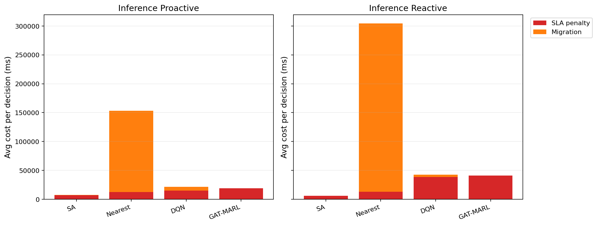

# 中等规模 cov50 数据验证报告

**生成时间**：2026-05-27 01:14:35  
**输出目录**：`experiments\medium_validation_20260526_reward_v2_scale10000_v1`  
**数据文件**：`data\processed\taxi_cleaned_active100_min100_eps2h_cov50.csv`  
**数据规模**：Top-12 active taxis；train=37832 rows/9 taxis；test=11548 rows/3 taxis  
**切分方式**：balanced_by_nearest_server_exposure；test row ratio=0.234；test risk ratio=0.134  
**GAT-MARL epochs**：Proactive=2，Reactive=2

## 训练段

| Algorithm | Migrations | SLA Risk Count | Severe SLA Violations | Avg SLA Excess (km) | P95 SLA Excess (km) | Avg SLA Penalty (ms) | Proactive Decisions | Avg Decision Time (ms) | Avg Access Latency (ms) | Avg Total System Cost (ms) |
|-----------|------------|----------------|-----------------------|---------------------|---------------------|----------------------|---------------------|------------------------|-------------------------|----------------------------|
| SA | 91 | 22540 | 6588 | 1.91 | 12.28 | 7862.51 | 245 | 38.17 | 2.08 | 7919.15 |
| Nearest | 2434 | 5312 | 4986 | 1.22 | 11.51 | 19785.80 | 288 | 0.05 | 2.11 | 94331.79 |
| DQN | 1861 | 9677 | 5773 | 1.51 | 11.54 | 16419.81 | 298 | 0.74 | 2.10 | 28147.31 |
| GAT-MARL | 66 | 20480 | 7215 | 4.91 | 31.11 | 44269.51 | 285 | 0.90 | 2.11 | 44509.57 |

| Algorithm | Migrations | SLA Risk Count | Severe SLA Violations | Avg SLA Excess (km) | P95 SLA Excess (km) | Avg SLA Penalty (ms) | Avg Decision Time (ms) | Avg Access Latency (ms) | Avg Total System Cost (ms) |
|-----------|------------|----------------|-----------------------|---------------------|---------------------|----------------------|------------------------|-------------------------|----------------------------|
| SA | 100 | 23398 | 6811 | 1.96 | 11.52 | 7567.75 | 27.95 | 2.08 | 7697.89 |
| Nearest | 2118 | 5525 | 4987 | 1.22 | 11.51 | 20054.39 | 0.05 | 2.11 | 133760.37 |
| DQN | 2595 | 9704 | 6579 | 1.94 | 11.94 | 21736.73 | 0.51 | 2.11 | 39850.37 |
| GAT-MARL | 117 | 15680 | 5190 | 1.33 | 11.52 | 7972.18 | 0.66 | 2.09 | 8398.77 |

## 推理段

| Algorithm | Migrations | SLA Risk Count | Severe SLA Violations | Avg SLA Excess (km) | P95 SLA Excess (km) | Avg SLA Penalty (ms) | Proactive Decisions | Avg Decision Time (ms) | Avg Access Latency (ms) | Avg Total System Cost (ms) |
|-----------|------------|----------------|-----------------------|---------------------|---------------------|----------------------|---------------------|------------------------|-------------------------|----------------------------|
| SA | 33 | 5136 | 1093 | 1.36 | 7.88 | 7236.97 | 99 | 37.82 | 2.08 | 7474.45 |
| Nearest | 842 | 864 | 443 | 0.50 | 4.91 | 12483.97 | 124 | 0.05 | 2.09 | 153119.48 |
| DQN | 264 | 4090 | 2958 | 3.66 | 13.41 | 15096.55 | 140 | 0.61 | 2.09 | 21597.27 |
| GAT-MARL | 13 | 3392 | 632 | 1.11 | 5.91 | 19148.87 | 104 | 1.38 | 2.09 | 19315.68 |

| Algorithm | Migrations | SLA Risk Count | Severe SLA Violations | Avg SLA Excess (km) | P95 SLA Excess (km) | Avg SLA Penalty (ms) | Avg Decision Time (ms) | Avg Access Latency (ms) | Avg Total System Cost (ms) |
|-----------|------------|----------------|-----------------------|---------------------|---------------------|----------------------|------------------------|-------------------------|----------------------------|
| SA | 18 | 3496 | 740 | 0.85 | 6.08 | 6148.18 | 27.70 | 2.08 | 6281.83 |
| Nearest | 988 | 956 | 443 | 0.50 | 4.91 | 12901.84 | 0.06 | 2.09 | 304434.47 |
| DQN | 451 | 1736 | 833 | 1.07 | 6.72 | 38501.09 | 0.44 | 2.10 | 42791.08 |
| GAT-MARL | 16 | 3519 | 947 | 2.26 | 30.96 | 41135.37 | 0.89 | 2.11 | 41341.90 |

## 成本分解堆叠图

## 推理阶段成本分解均值

| Algorithm | Proactive SLA Penalty (ms) | Proactive Migration (ms) | Reactive SLA Penalty (ms) | Reactive Migration (ms) |
|-----------|----------------------------|--------------------------|---------------------------|-------------------------|
| SA | 7236.97 | 128.94 | 6148.18 | 78.50 |
| Nearest | 12483.97 | 140633.39 | 12901.84 | 291530.53 |
| DQN | 15096.55 | 6255.30 | 38501.09 | 4012.02 |
| GAT-MARL | 19148.87 | 142.24 | 41135.37 | 192.42 |

## 推理阶段迁移效率指标

> **Cost/Node** = `total_migration_cost / total_migrations`（每次迁移节点的平均线性物理时延）  
> **Cost/Mig Decision** = `total_migration_cost / migration_decision_count`（仅 `migration_cost > 0` 的决策）  
> **Migration Share** = `total_migration_cost / total_cost_ms_sum`（迁移在总系统成本中的占比）

| Algorithm | Pro: Cost/Node (ms) | Pro: Cost/Mig Decision (ms) | Pro: Migration Share | Rea: Cost/Node (ms) | Rea: Cost/Mig Decision (ms) | Rea: Migration Share |
|-----------|---------------------|-----------------------------|----------------------|---------------------|-----------------------------|----------------------|
| SA | 19626.89 | 53973.96 | 1.73% | 15247.01 | 30494.02 | 1.25% |
| Nearest | 165018.75 | 767656.27 | 91.85% | 282088.25 | 1833573.60 | 95.76% |
| DQN | 28741.19 | 45435.18 | 28.96% | 15443.16 | 15443.16 | 9.38% |
| GAT-MARL | 38250.83 | 38250.83 | 0.74% | 42319.97 | 42319.97 | 0.47% |

## 本轮验证关注点

- 验证脚本显式使用 cov50 覆盖过滤数据，不再读取旧 cleaned CSV。
- train/test 按最近服务器距离风险暴露平衡切分，减少 proactive opportunity 偏斜。
- Avg Decision Time 是算法计算耗时；Avg Access Latency 是真实接入延迟；Avg Total System Cost 使用 `total_cost_ms_sum / decision_count`，包含 SLA penalty 和迁移等系统代价。
- 迁移对比优先看「迁移效率指标」表（按节点 / 按有迁解决策 / 占比），而非 `total_migration_cost / decision_count`（会被大量无迁解决策稀释）。
- SLA Risk Count 是 max-entry 风险次数；Severe SLA Violations 和 SLA Excess 用于区分轻微风险与严重服务质量退化。

