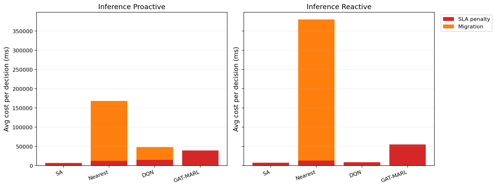

# 中等规模 cov50 数据验证报告

**生成时间**：2026-05-26 17:09:33  
**输出目录**：`experiments\medium_validation_20260526_reward_v2_scale5000_v1`  
**数据文件**：`data\processed\taxi_cleaned_active100_min100_eps2h_cov50.csv`  
**数据规模**：Top-12 active taxis；train=37832 rows/9 taxis；test=11548 rows/3 taxis  
**切分方式**：balanced_by_nearest_server_exposure；test row ratio=0.234；test risk ratio=0.134  
**GAT-MARL epochs**：Proactive=2，Reactive=2

## 训练段

| Algorithm | Migrations | SLA Risk Count | Severe SLA Violations | Avg SLA Excess (km) | P95 SLA Excess (km) | Avg SLA Penalty (ms) | Proactive Decisions | Avg Decision Time (ms) | Avg Access Latency (ms) | Avg Total System Cost (ms) |
|-----------|------------|----------------|-----------------------|---------------------|---------------------|----------------------|---------------------|------------------------|-------------------------|----------------------------|
| SA | 92 | 22337 | 6497 | 1.89 | 12.28 | 7702.16 | 241 | 39.80 | 2.08 | 7764.13 |
| Nearest | 2434 | 5312 | 4986 | 1.22 | 11.51 | 19785.80 | 288 | 0.05 | 2.11 | 94331.79 |
| DQN | 1569 | 12464 | 7385 | 1.90 | 11.55 | 15191.45 | 281 | 0.83 | 2.10 | 24775.47 |
| GAT-MARL | 47 | 22001 | 7217 | 4.93 | 31.11 | 41427.37 | 275 | 0.96 | 2.11 | 41627.89 |

| Algorithm | Migrations | SLA Risk Count | Severe SLA Violations | Avg SLA Excess (km) | P95 SLA Excess (km) | Avg SLA Penalty (ms) | Avg Decision Time (ms) | Avg Access Latency (ms) | Avg Total System Cost (ms) |
|-----------|------------|----------------|-----------------------|---------------------|---------------------|----------------------|------------------------|-------------------------|----------------------------|
| SA | 100 | 23789 | 6887 | 1.92 | 11.55 | 7417.32 | 30.27 | 2.08 | 7465.58 |
| Nearest | 1998 | 5525 | 4987 | 1.22 | 11.51 | 20054.39 | 0.07 | 2.11 | 102367.40 |
| DQN | 1603 | 10115 | 5822 | 1.62 | 11.81 | 16740.41 | 0.89 | 2.10 | 25985.88 |
| GAT-MARL | 59 | 21468 | 7217 | 4.91 | 31.11 | 42947.33 | 0.92 | 2.11 | 43170.35 |

## 推理段

| Algorithm | Migrations | SLA Risk Count | Severe SLA Violations | Avg SLA Excess (km) | P95 SLA Excess (km) | Avg SLA Penalty (ms) | Proactive Decisions | Avg Decision Time (ms) | Avg Access Latency (ms) | Avg Total System Cost (ms) |
|-----------|------------|----------------|-----------------------|---------------------|---------------------|----------------------|---------------------|------------------------|-------------------------|----------------------------|
| SA | 20 | 3718 | 912 | 1.02 | 8.48 | 6725.63 | 111 | 40.30 | 2.08 | 6892.79 |
| Nearest | 976 | 864 | 443 | 0.50 | 4.91 | 12483.97 | 124 | 0.06 | 2.09 | 168237.20 |
| DQN | 411 | 907 | 772 | 0.59 | 6.72 | 15356.68 | 129 | 0.53 | 2.10 | 48475.04 |
| GAT-MARL | 23 | 3552 | 822 | 2.18 | 30.96 | 39131.59 | 98 | 1.03 | 2.10 | 39399.36 |

| Algorithm | Migrations | SLA Risk Count | Severe SLA Violations | Avg SLA Excess (km) | P95 SLA Excess (km) | Avg SLA Penalty (ms) | Avg Decision Time (ms) | Avg Access Latency (ms) | Avg Total System Cost (ms) |
|-----------|------------|----------------|-----------------------|---------------------|---------------------|----------------------|------------------------|-------------------------|----------------------------|
| SA | 14 | 3493 | 767 | 1.02 | 7.08 | 7763.14 | 31.56 | 2.08 | 7891.79 |
| Nearest | 988 | 956 | 443 | 0.50 | 4.91 | 12901.84 | 0.06 | 2.09 | 380154.29 |
| DQN | 56 | 4390 | 1529 | 1.40 | 9.06 | 8853.14 | 0.40 | 2.09 | 9084.49 |
| GAT-MARL | 0 | 3533 | 1000 | 2.71 | 30.96 | 55275.03 | 1.00 | 2.11 | 55277.14 |

## 成本分解堆叠图

## 推理阶段成本分解均值

| Algorithm | Proactive SLA Penalty (ms) | Proactive Migration (ms) | Reactive SLA Penalty (ms) | Reactive Migration (ms) |
|-----------|----------------------------|--------------------------|---------------------------|-------------------------|
| SA | 6725.63 | 96.90 | 7763.14 | 74.41 |
| Nearest | 12483.97 | 155751.11 | 12901.84 | 367250.35 |
| DQN | 15356.68 | 32980.27 | 8853.14 | 118.72 |
| GAT-MARL | 39131.59 | 247.12 | 55275.03 | 0.00 |

## 推理阶段迁移效率指标

> **Cost/Node** = `total_migration_cost / total_migrations`（每次迁移节点的平均线性物理时延）  
> **Cost/Mig Decision** = `total_migration_cost / migration_decision_count`（仅 `migration_cost > 0` 的决策）  
> **Migration Share** = `total_migration_cost / total_cost_ms_sum`（迁移在总系统成本中的占比）

| Algorithm | Pro: Cost/Node (ms) | Pro: Cost/Mig Decision (ms) | Pro: Migration Share | Rea: Cost/Node (ms) | Rea: Cost/Mig Decision (ms) | Rea: Migration Share |
|-----------|---------------------|-----------------------------|----------------------|---------------------|-----------------------------|----------------------|
| SA | 18552.27 | 30920.45 | 1.41% | 18357.53 | 42834.24 | 0.94% |
| Nearest | 157666.08 | 850177.31 | 92.58% | 355355.60 | 2309811.43 | 96.61% |
| DQN | 81848.85 | 157195.69 | 68.04% | 9306.53 | 10218.94 | 1.31% |
| GAT-MARL | 39216.40 | 39216.40 | 0.63% | — | — | 0.00% |

## 本轮验证关注点

- 验证脚本显式使用 cov50 覆盖过滤数据，不再读取旧 cleaned CSV。
- train/test 按最近服务器距离风险暴露平衡切分，减少 proactive opportunity 偏斜。
- Avg Decision Time 是算法计算耗时；Avg Access Latency 是真实接入延迟；Avg Total System Cost 使用 `total_cost_ms_sum / decision_count`，包含 SLA penalty 和迁移等系统代价。
- 迁移对比优先看「迁移效率指标」表（按节点 / 按有迁解决策 / 占比），而非 `total_migration_cost / decision_count`（会被大量无迁解决策稀释）。
- SLA Risk Count 是 max-entry 风险次数；Severe SLA Violations 和 SLA Excess 用于区分轻微风险与严重服务质量退化。

