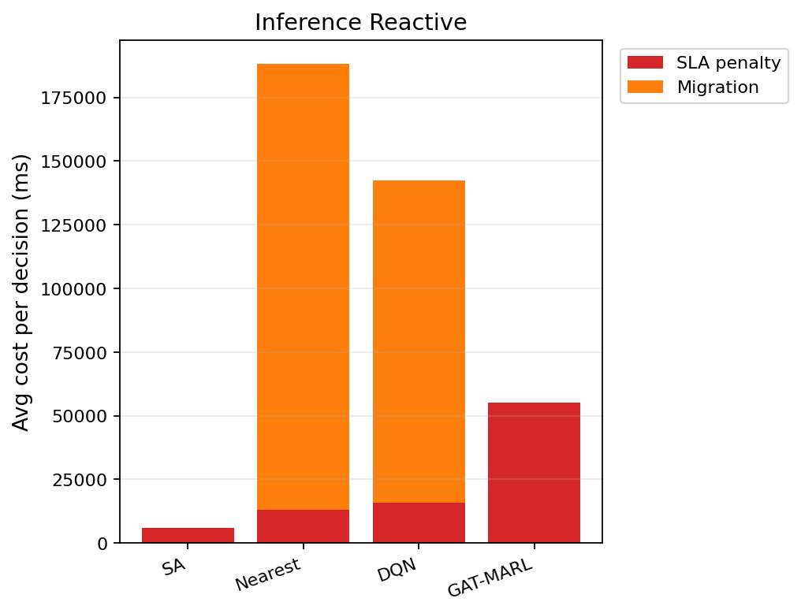

# 中等规模 cov50 数据验证报告（仅 Reactive）

**生成时间**：2026-05-27 17:29:31  
**输出目录**：`experiments\medium_validation_20260527_reward_v21_softguard_s100k_v1`  
**模式**：仅 Reactive（无轨迹预测 / 无 Proactive TTV）  
**GAT-MARL epochs**：2（reactive）

## 训练段（Reactive）

| Algorithm | Migrations | SLA Risk | Severe | P95 Excess (km) | Avg SLA Penalty (ms) | Avg Total Cost (ms) | stay_ratio |
|-----------|------------|----------|--------|-----------------|----------------------|---------------------|------------|
| SA | 90 | 23564 | 6789 | 11.555916442144866 | 7860.19 | 8085.1590330542795 | — |
| Nearest | 1998 | 5525 | 4987 | 11.51333567241429 | 20054.39 | 102367.40022683913 | — |
| DQN | 2424 | 6334 | 5196 | 11.546734792327534 | 20656.96 | 53544.401284264204 | — |
| GAT-MARL | 0 | 23349 | 7995 | 31.107717888895294 | 40432.87 | 40434.97963100718 | 1.0000 |

## 推理段（Reactive）

| Algorithm | Migrations | SLA Risk | Severe | P95 Excess (km) | Avg SLA Penalty (ms) | Avg Total Cost (ms) | stay_ratio |
|-----------|------------|----------|--------|-----------------|----------------------|---------------------|------------|
| SA | 17 | 3629 | 733 | 6.2408837161011625 | 5942.47 | 6395.990849303088 | — |
| Nearest | 817 | 956 | 443 | 4.9088367564877515 | 12901.84 | 188219.46655715958 | — |
| DQN | 1006 | 959 | 537 | 4.91116681296737 | 15792.32 | 143017.09669122155 | — |
| GAT-MARL | 0 | 3533 | 1000 | 30.963522824082816 | 55209.57 | 55211.68626982672 | 1.0000 |

### inference reactive — GAT-MARL by DAG type
| DAG type | migrations | decisions | avg_total_cost_ms |
|----------|------------|-----------|-------------------|
| Compute_Heavy_DAG_1 | 0 | 948 | 55778.41 |
| Diamond_DAG_3 | 0 | 1051 | 2570.86 |
| FanIn_Aggregator_1 | 0 | 1534 | 90927.63 |

## 成本分解堆叠图（Reactive）

## 本轮验证关注点

- 仅 Reactive：无轨迹预测器、无 Proactive TTV。
- `stay_action_ratio` 接近 1.0 表示策略几乎不迁移；`candidate_action_counts` 中迁移动作计数应逐步上升。
- `migrations_by_dag_type` / `cost_by_dag_type` 用于观察反撕裂（Data_Heavy / FanOut 少迁、Simple 可拆）。
- SA 为 GAT-MARL 锚点（D0 后 L_internal 计入总成本，SA 应倾向少拆图）。

