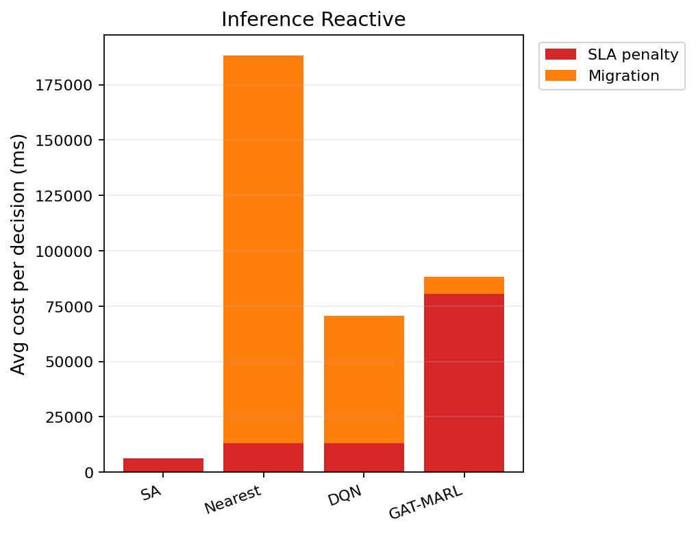

# 中等规模 cov50 数据验证报告（仅 Reactive）

**生成时间**：2026-06-05 15:33:19  
**输出目录**：`experiments\medium_validation_20260605_145403_reward_v21_p1_v1`  
**模式**：仅 Reactive（无轨迹预测 / 无 Proactive TTV）  
**GAT-MARL epochs**：2（reactive）

## 训练段（Reactive）

| Algorithm | Migrations | SLA Risk | Severe | P95 Excess (km) | Avg SLA Penalty (ms) | Avg Total Cost (ms) | stay_ratio |
|-----------|------------|----------|--------|-----------------|----------------------|---------------------|------------|
| SA | 108 | 23394 | 7008 | 11.93741259385471 | 7992.61 | 8229.41833153479 | — |
| Nearest | 1998 | 5525 | 4987 | 11.51333567241429 | 20054.39 | 102367.40022683913 | — |
| DQN | 2046 | 6488 | 5031 | 11.516122399242587 | 19346.78 | 50695.479767006436 | — |
| GAT-MARL | 10987 | 12072 | 7331 | 31.107717888895294 | 83343.12 | 89895.61963675647 | 0.8568 |

## 推理段（Reactive）

| Algorithm | Migrations | SLA Risk | Severe | P95 Excess (km) | Avg SLA Penalty (ms) | Avg Total Cost (ms) | stay_ratio |
|-----------|------------|----------|--------|-----------------|----------------------|---------------------|------------|
| SA | 15 | 3832 | 848 | 7.495305496795918 | 6256.87 | 6660.026558087186 | — |
| Nearest | 817 | 956 | 443 | 4.9088367564877515 | 12901.84 | 188219.46655715958 | — |
| DQN | 1295 | 973 | 505 | 4.910129492612576 | 13135.91 | 71274.23280387263 | — |
| GAT-MARL | 1758 | 3814 | 824 | 30.96013532679492 | 80466.69 | 88890.66023804639 | 0.8511 |

### train reactive — GAT-MARL per-epoch exploration
| Epoch | Phase | ε | Migrations | stay_ratio | act_1 | act_2 | act_3 | eps_greedy | migrate_opt_dec | mask_only_stay |
|-------|-------|---|------------|------------|-------|-------|-------|------------|-----------------|----------------|
| 0 | train | 0.020 | 7127 | 0.7945 | 2808 | 3635 | 684 | 997 | 7562/7562 | 0.5473 |
| 1 | eval | 0.020 | 10987 | 0.8568 | 4666 | 6321 | 0 | 0 | 10987/10987 | 0.1532 |

### inference reactive — GAT-MARL per-epoch exploration
| Epoch | Phase | ε | Migrations | stay_ratio | act_1 | act_2 | act_3 | eps_greedy | migrate_opt_dec | mask_only_stay |
|-------|-------|---|------------|------------|-------|-------|-------|------------|-----------------|----------------|
| 0 | eval | 0.000 | 1758 | 0.8511 | 671 | 1087 | 0 | 0 | 1758/1758 | 0.2012 |

### inference reactive — GAT-MARL by DAG type
| DAG type | migrations | decisions | avg_total_cost_ms |
|----------|------------|-----------|-------------------|
| Compute_Heavy_DAG_1 | 169 | 169 | 31182.05 |
| Diamond_DAG_3 | 55 | 55 | 37472.43 |
| FanIn_Aggregator_1 | 1534 | 1534 | 97091.94 |

## 成本分解堆叠图（Reactive）

## 本轮验证关注点

- 仅 Reactive：无轨迹预测器、无 Proactive TTV。
- `stay_action_ratio` 接近 1.0 表示策略几乎不迁移；`candidate_action_counts` 中迁移动作计数应逐步上升。
- `migrations_by_dag_type` / `cost_by_dag_type` 用于观察反撕裂（Data_Heavy / FanOut 少迁、Simple 可拆）。
- SA 为 GAT-MARL 锚点（D0 后 L_internal 计入总成本，SA 应倾向少拆图）。

