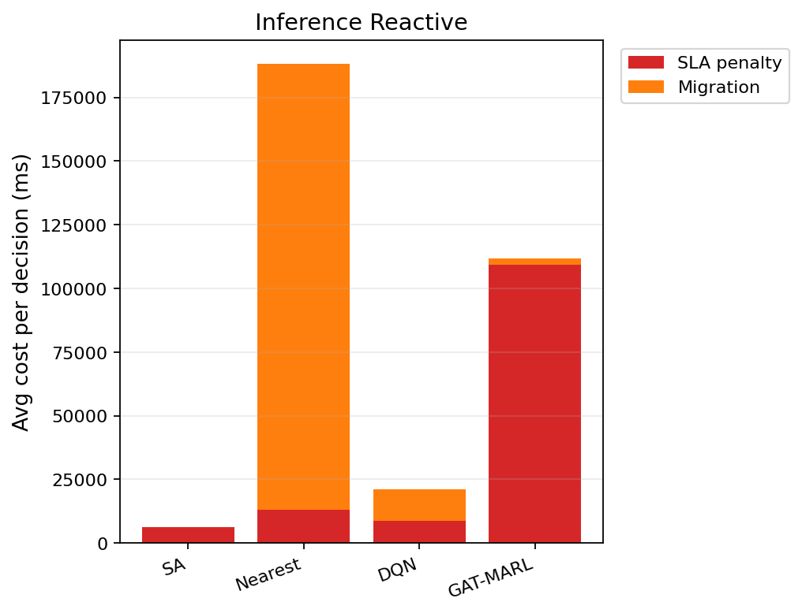

# 中等规模 cov50 数据验证报告（仅 Reactive）

**生成时间**：2026-06-05 16:29:16  
**输出目录**：`experiments\medium_validation_20260605_160615_reward_v21_p1_v1`  
**模式**：仅 Reactive（无轨迹预测 / 无 Proactive TTV）  
**GAT-MARL epochs**：2（reactive）

## 训练段（Reactive）

| Algorithm | Migrations | SLA Risk | Severe | P95 Excess (km) | Avg SLA Penalty (ms) | Avg Total Cost (ms) | stay_ratio |
|-----------|------------|----------|--------|-----------------|----------------------|---------------------|------------|
| SA | 103 | 23350 | 6872 | 11.78576159110765 | 7901.00 | 8086.528737220168 | — |
| Nearest | 1998 | 5525 | 4987 | 11.51333567241429 | 20054.39 | 102367.40022683913 | — |
| DQN | 2295 | 8418 | 5304 | 11.797928044612025 | 18637.79 | 38603.625994418646 | — |
| GAT-MARL | 5686 | 14911 | 11322 | 54.63665634539808 | 264009.33 | 268365.0913494265 | 0.9207 |

## 推理段（Reactive）

| Algorithm | Migrations | SLA Risk | Severe | P95 Excess (km) | Avg SLA Penalty (ms) | Avg Total Cost (ms) | stay_ratio |
|-----------|------------|----------|--------|-----------------|----------------------|---------------------|------------|
| SA | 19 | 3629 | 808 | 6.299211027830921 | 6075.89 | 6539.666411382361 | — |
| Nearest | 817 | 956 | 443 | 4.9088367564877515 | 12901.84 | 188219.46655715958 | — |
| DQN | 396 | 2596 | 869 | 6.719317642235744 | 8815.15 | 21882.336950300836 | — |
| GAT-MARL | 959 | 4203 | 3383 | 48.75222588081294 | 109220.61 | 112657.13779661481 | 0.9590 |

### train reactive — GAT-MARL per-epoch exploration
| Epoch | Phase | ε | Migrations | stay_ratio | act_1 | act_2 | act_3 | eps_greedy | migrate_opt_dec | mask_only_stay |
|-------|-------|---|------------|------------|-------|-------|-------|------------|-----------------|----------------|
| 0 | train | 0.020 | 8627 | 0.8014 | 3653 | 4926 | 48 | 1199 | 8759/8759 | 0.4895 |
| 1 | eval | 0.020 | 5686 | 0.9207 | 2672 | 3014 | 0 | 0 | 10263/10263 | 0.1539 |

### inference reactive — GAT-MARL per-epoch exploration
| Epoch | Phase | ε | Migrations | stay_ratio | act_1 | act_2 | act_3 | eps_greedy | migrate_opt_dec | mask_only_stay |
|-------|-------|---|------------|------------|-------|-------|-------|------------|-----------------|----------------|
| 0 | eval | 0.000 | 959 | 0.9590 | 404 | 555 | 0 | 0 | 3413/3413 | 0.1723 |

### inference reactive — GAT-MARL by DAG type
| DAG type | migrations | decisions | avg_total_cost_ms |
|----------|------------|-----------|-------------------|
| Compute_Heavy_DAG_1 | 169 | 169 | 31182.05 |
| Diamond_DAG_3 | 55 | 55 | 37472.43 |
| FanIn_Aggregator_1 | 735 | 3189 | 118271.58 |

### Phase C 历史对照（迁移学习基线）
来源：`experiments\medium_validation_20260526_phaseC_softguard_v1\results.json`

| 指标 | Phase C GAT | 说明 |
|------|-------------|------|
| 推理迁移 | 72 | v1 + softguard |
| Avg Total Cost (ms) | 17674.067271669766 | |
| P95 Excess (km) | 6.628608057966705 | |
| stay_ratio | 0.9936736666373781 | |

## 成本分解堆叠图（Reactive）

## 本轮验证关注点

- 仅 Reactive：无轨迹预测器、无 Proactive TTV。
- `stay_action_ratio` 接近 1.0 表示策略几乎不迁移；`candidate_action_counts` 中迁移动作计数应逐步上升。
- `migrations_by_dag_type` / `cost_by_dag_type` 用于观察反撕裂（Data_Heavy / FanOut 少迁、Simple 可拆）。
- SA 为 GAT-MARL 锚点（D0 后 L_internal 计入总成本，SA 应倾向少拆图）。

