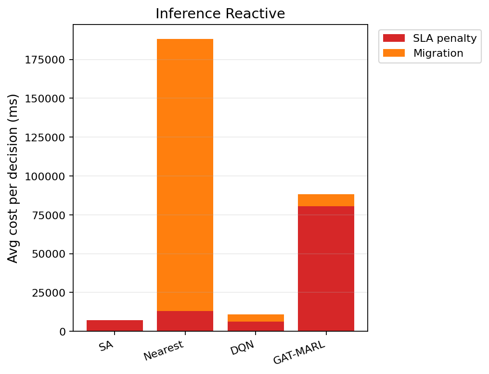

# 中等规模 cov50 数据验证报告（仅 Reactive）

**生成时间**：2026-06-05 16:53:31  
**输出目录**：`experiments\medium_validation_20260605_162655_reward_v21_p2_2ep`  
**模式**：仅 Reactive（无轨迹预测 / 无 Proactive TTV）  
**GAT-MARL epochs**：2（reactive）

## 训练段（Reactive）

| Algorithm | Migrations | SLA Risk | Severe | P95 Excess (km) | Avg SLA Penalty (ms) | Avg Total Cost (ms) | stay_ratio |
|-----------|------------|----------|--------|-----------------|----------------------|---------------------|------------|
| SA | 92 | 23858 | 6982 | 11.778725248323205 | 7598.65 | 7804.509030283425 | — |
| Nearest | 1998 | 5525 | 4987 | 11.51333567241429 | 20054.39 | 102367.40022683913 | — |
| DQN | 2163 | 6599 | 5135 | 11.808792726170896 | 20777.46 | 47496.603741150066 | — |
| GAT-MARL | 10987 | 12072 | 7331 | 31.107717888895294 | 83343.12 | 89895.61963675647 | 0.8568 |

## 推理段（Reactive）

| Algorithm | Migrations | SLA Risk | Severe | P95 Excess (km) | Avg SLA Penalty (ms) | Avg Total Cost (ms) | stay_ratio |
|-----------|------------|----------|--------|-----------------|----------------------|---------------------|------------|
| SA | 13 | 3716 | 945 | 8.607166737683066 | 7114.68 | 7527.100913292146 | — |
| Nearest | 817 | 956 | 443 | 4.9088367564877515 | 12901.84 | 188219.46655715958 | — |
| DQN | 231 | 2663 | 718 | 7.313062780680973 | 6088.00 | 11413.89928435037 | — |
| GAT-MARL | 1758 | 3814 | 824 | 30.96013532679492 | 80466.69 | 88890.66023804639 | 0.8511 |

### train reactive — GAT-MARL per-epoch exploration
| Epoch | Phase | ε | Migrations | stay_ratio | act_1 | act_2 | act_3 | eps_greedy | migrate_opt_dec | mask_only_stay |
|-------|-------|---|------------|------------|-------|-------|-------|------------|-----------------|----------------|
| 0 | train | 0.020 | 10711 | 0.8012 | 4361 | 6307 | 43 | 1368 | 10766/10766 | 0.4763 |
| 1 | eval | 0.020 | 10987 | 0.8568 | 4666 | 6321 | 0 | 0 | 10987/10987 | 0.1532 |

### inference reactive — GAT-MARL per-epoch exploration
| Epoch | Phase | ε | Migrations | stay_ratio | act_1 | act_2 | act_3 | eps_greedy | migrate_opt_dec | mask_only_stay |
|-------|-------|---|------------|------------|-------|-------|-------|------------|-----------------|----------------|
| 0 | eval | 0.000 | 1758 | 0.8511 | 671 | 1087 | 0 | 0 | 1758/1758 | 0.2012 |

### inference reactive — GAT-MARL by DAG type
| DAG type | migrations | decisions | avg_total_cost_ms |
|----------|------------|-----------|-------------------|
| Compute_Heavy_DAG_1 | 169 | 169 | 31182.05 |
| Diamond_DAG_3 | 55 | 55 | 37472.43 |
| FanIn_Aggregator_1 | 1534 | 1534 | 97091.94 |

### Phase C 历史对照（迁移学习基线）
来源：`experiments\medium_validation_20260526_phaseC_softguard_v1\results.json`

| 指标 | Phase C GAT | 说明 |
|------|-------------|------|
| 推理迁移 | 72 | v1 + softguard |
| Avg Total Cost (ms) | 17674.067271669766 | |
| P95 Excess (km) | 6.628608057966705 | |
| stay_ratio | 0.9936736666373781 | |

## 成本分解堆叠图（Reactive）

## 本轮验证关注点

- 仅 Reactive：无轨迹预测器、无 Proactive TTV。
- `stay_action_ratio` 接近 1.0 表示策略几乎不迁移；`candidate_action_counts` 中迁移动作计数应逐步上升。
- `migrations_by_dag_type` / `cost_by_dag_type` 用于观察反撕裂（Data_Heavy / FanOut 少迁、Simple 可拆）。
- SA 为 GAT-MARL 锚点（D0 后 L_internal 计入总成本，SA 应倾向少拆图）。

