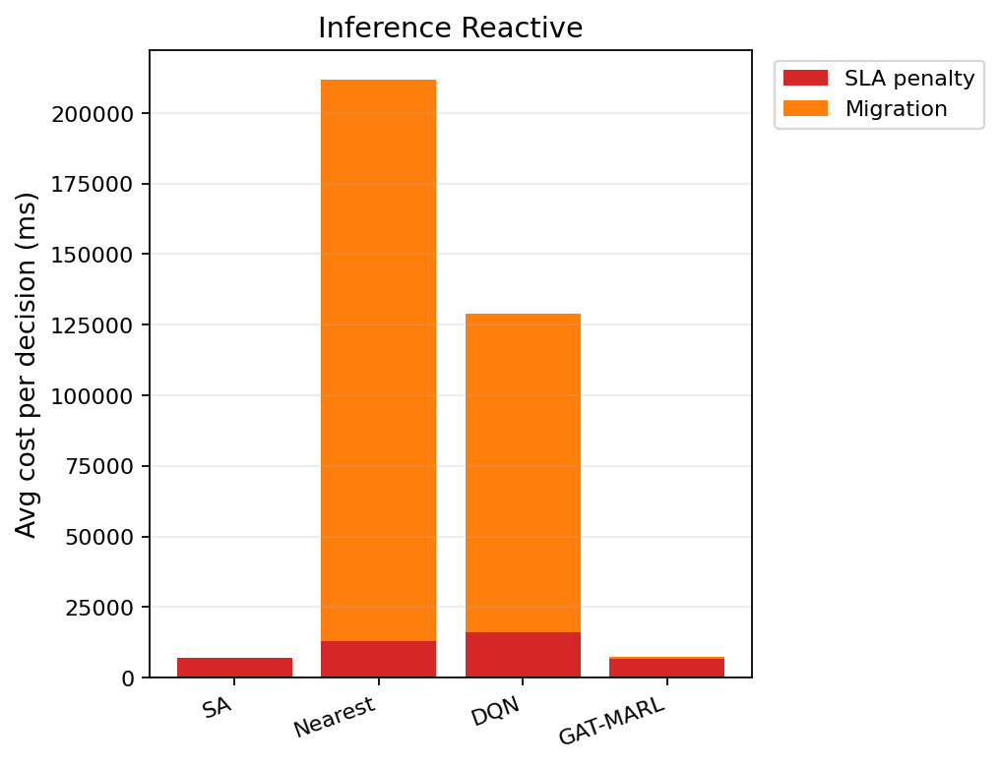

# 中等规模 cov50 数据验证报告（仅 Reactive）

**生成时间**：2026-06-07 17:49:06  
**输出目录**：`experiments\medium_validation_20260605_170422_reward_v21_p3_8ep`  
**模式**：仅 Reactive（无轨迹预测 / 无 Proactive TTV）  
**GAT-MARL epochs**：8（reactive）

## 训练段（Reactive）

| Algorithm | Migrations | SLA Risk | Severe | P95 Excess (km) | Avg SLA Penalty (ms) | Avg Total Cost (ms) | stay_ratio |
|-----------|------------|----------|--------|-----------------|----------------------|---------------------|------------|
| SA | 94 | 23381 | 6566 | 11.875515414167218 | 8038.69 | 8314.566273226128 | — |
| Nearest | 1998 | 5525 | 4987 | 11.51333567241429 | 20054.39 | 102367.40022683913 | — |
| DQN | 2360 | 6993 | 5141 | 11.793015121513385 | 18538.49 | 51416.697584960166 | — |
| GAT-MARL | 18209 | 20034 | 7617 | 31.10785841521524 | 50827.10 | 58027.30524541565 | 0.8303 |

## 推理段（Reactive）

| Algorithm | Migrations | SLA Risk | Severe | P95 Excess (km) | Avg SLA Penalty (ms) | Avg Total Cost (ms) | stay_ratio |
|-----------|------------|----------|--------|-----------------|----------------------|---------------------|------------|
| SA | 49 | 5300 | 1218 | 8.032119955386051 | 7019.82 | 7403.246070565772 | — |
| Nearest | 893 | 956 | 443 | 4.9088367564877515 | 12901.84 | 211769.69750205523 | — |
| DQN | 728 | 982 | 761 | 6.717319305055103 | 15909.18 | 129400.83162241279 | — |
| GAT-MARL | 225 | 6301 | 875 | 8.054887789699197 | 6479.36 | 7821.373478570696 | 0.9814 |

### train reactive — GAT-MARL per-epoch exploration
| Epoch | Phase | ε | Migrations | stay_ratio | act_1 | act_2 | act_3 | eps_greedy | migrate_opt_dec | mask_only_stay |
|-------|-------|---|------------|------------|-------|-------|-------|------------|-----------------|----------------|
| 0 | train | 0.020 | 5650 | 0.8040 | 2019 | 2196 | 1435 | 827 | 6567/6567 | 0.6414 |
| 1 | train | 0.020 | 10987 | 0.8568 | 4653 | 6334 | 0 | 1466 | 10987/10987 | 0.1532 |
| 2 | train | 0.020 | 8080 | 0.8472 | 3403 | 4640 | 37 | 1088 | 8124/8124 | 0.6882 |
| 3 | train | 0.020 | 10514 | 0.8238 | 4460 | 6012 | 42 | 1166 | 10580/10580 | 0.4638 |
| 4 | train | 0.020 | 12417 | 0.8430 | 5329 | 7033 | 55 | 1552 | 12606/12606 | 0.5149 |
| 5 | train | 0.020 | 18793 | 0.8212 | 7949 | 10823 | 21 | 2001 | 18806/18806 | 0.1966 |
| 6 | train | 0.020 | 6229 | 0.8552 | 2836 | 3361 | 37 | 846 | 6256/6256 | 0.7743 |
| 7 | eval | 0.020 | 18209 | 0.8303 | 8137 | 10072 | 0 | 0 | 18209/18209 | 0.1736 |

### inference reactive — GAT-MARL per-epoch exploration
| Epoch | Phase | ε | Migrations | stay_ratio | act_1 | act_2 | act_3 | eps_greedy | migrate_opt_dec | mask_only_stay |
|-------|-------|---|------------|------------|-------|-------|-------|------------|-----------------|----------------|
| 0 | eval | 0.000 | 225 | 0.9814 | 225 | 0 | 0 | 0 | 225/2205 | 0.9629 |

### inference reactive — GAT-MARL by DAG type
| DAG type | migrations | decisions | avg_total_cost_ms |
|----------|------------|-----------|-------------------|
| Compute_Heavy_DAG_2 | 34 | 961 | 11786.19 |
| Data_Heavy_DAG_1 | 79 | 699 | 2802.31 |
| FanIn_Aggregator_1 | 112 | 545 | 7267.50 |

### Phase C 历史对照（迁移学习基线）
来源：`experiments\medium_validation_20260526_phaseC_softguard_v1\results.json`

| 指标 | Phase C GAT | 说明 |
|------|-------------|------|
| 推理迁移 | 72 | v1 + softguard |
| Avg Total Cost (ms) | 17674.067271669766 | |
| P95 Excess (km) | 6.628608057966705 | |
| stay_ratio | 0.9936736666373781 | |

## 成本分解堆叠图（Reactive）

## 本轮验证关注点

- 仅 Reactive：无轨迹预测器、无 Proactive TTV。
- `stay_action_ratio` 接近 1.0 表示策略几乎不迁移；`candidate_action_counts` 中迁移动作计数应逐步上升。
- `migrations_by_dag_type` / `cost_by_dag_type` 用于观察反撕裂（Data_Heavy / FanOut 少迁、Simple 可拆）。
- SA 为 GAT-MARL 锚点（D0 后 L_internal 计入总成本，SA 应倾向少拆图）。

