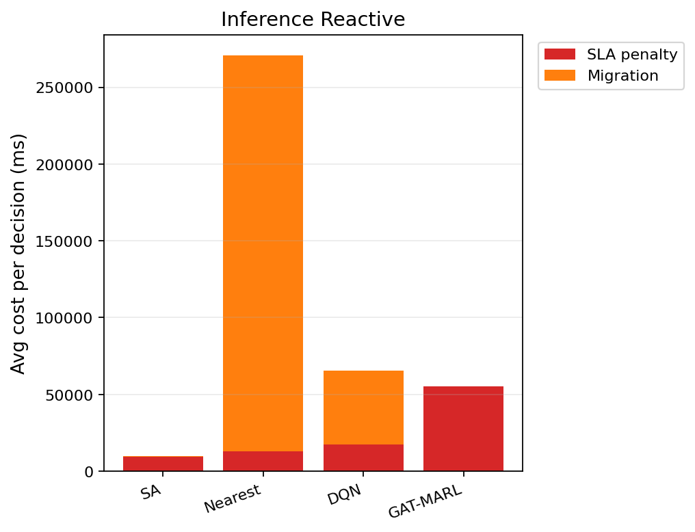

# 中等规模 cov50 数据验证报告（仅 Reactive）

**生成时间**：2026-06-05 13:40:25  
**输出目录**：`experiments\medium_validation_20260605_reward_v21_softguard_reactive_8ep_v1`  
**模式**：仅 Reactive（无轨迹预测 / 无 Proactive TTV）  
**GAT-MARL epochs**：8（reactive）

## 训练段（Reactive）

| Algorithm | Migrations | SLA Risk | Severe | P95 Excess (km) | Avg SLA Penalty (ms) | Avg Total Cost (ms) | stay_ratio |
|-----------|------------|----------|--------|-----------------|----------------------|---------------------|------------|
| SA | 90 | 23564 | 6789 | 11.555916442144866 | 7860.19 | 8085.1590330542795 | — |
| Nearest | 1998 | 5525 | 4987 | 11.51333567241429 | 20054.39 | 102367.40022683913 | — |
| DQN | 2539 | 7602 | 5174 | 11.784451930344805 | 18739.49 | 44808.22459274548 | — |
| GAT-MARL | 0 | 23349 | 7995 | 31.107717888895294 | 40432.87 | 40434.97963100718 | 1.0000 |

## 推理段（Reactive）

| Algorithm | Migrations | SLA Risk | Severe | P95 Excess (km) | Avg SLA Penalty (ms) | Avg Total Cost (ms) | stay_ratio |
|-----------|------------|----------|--------|-----------------|----------------------|---------------------|------------|
| SA | 13 | 3521 | 751 | 6.631693201196356 | 9599.44 | 9813.760336846059 | — |
| Nearest | 874 | 956 | 443 | 4.9088367564877515 | 12901.84 | 270718.8318535106 | — |
| DQN | 735 | 969 | 784 | 7.314833146262451 | 17407.84 | 66173.48363702354 | — |
| GAT-MARL | 0 | 3533 | 1000 | 30.963522824082816 | 55209.57 | 55211.68626982672 | 1.0000 |

### train reactive — GAT-MARL per-epoch exploration
| Epoch | Phase | ε | Migrations | stay_ratio | act_1 | act_2 | act_3 | eps_greedy | migrate_opt_dec | mask_only_stay |
|-------|-------|---|------------|------------|-------|-------|-------|------------|-----------------|----------------|
| 0 | train | 0.020 | 4181 | 0.8930 | 2145 | 757 | 1279 | 1002 | 8706/8706 | 0.0000 |
| 1 | train | 0.020 | 1908 | 0.9757 | 810 | 384 | 714 | 1566 | 11720/11720 | 0.0000 |
| 2 | train | 0.020 | 995 | 0.9859 | 367 | 311 | 317 | 1462 | 11526/11526 | 0.0000 |
| 3 | train | 0.020 | 2461 | 0.9557 | 1217 | 263 | 981 | 1092 | 9908/9908 | 0.0000 |
| 4 | train | 0.020 | 1000 | 0.9865 | 338 | 325 | 337 | 1396 | 11547/11547 | 0.0000 |
| 5 | train | 0.020 | 936 | 0.9853 | 307 | 326 | 303 | 1282 | 11757/11757 | 0.0000 |
| 6 | train | 0.020 | 1069 | 0.9858 | 381 | 331 | 357 | 1520 | 11663/11663 | 0.0000 |
| 7 | eval | 0.020 | 0 | 1.0000 | 0 | 0 | 0 | 0 | 23349/23349 | 0.0000 |

### inference reactive — GAT-MARL per-epoch exploration
| Epoch | Phase | ε | Migrations | stay_ratio | act_1 | act_2 | act_3 | eps_greedy | migrate_opt_dec | mask_only_stay |
|-------|-------|---|------------|------------|-------|-------|-------|------------|-----------------|----------------|
| 0 | eval | 0.000 | 0 | 1.0000 | 0 | 0 | 0 | 0 | 3533/3533 | 0.0000 |

### inference reactive — GAT-MARL by DAG type
| DAG type | migrations | decisions | avg_total_cost_ms |
|----------|------------|-----------|-------------------|
| FanIn_Aggregator_1 | 0 | 948 | 55778.41 |
| FanOut_Broadcaster_1 | 0 | 2585 | 55003.85 |

## 成本分解堆叠图（Reactive）

## 本轮验证关注点

- 仅 Reactive：无轨迹预测器、无 Proactive TTV。
- `stay_action_ratio` 接近 1.0 表示策略几乎不迁移；`candidate_action_counts` 中迁移动作计数应逐步上升。
- `migrations_by_dag_type` / `cost_by_dag_type` 用于观察反撕裂（Data_Heavy / FanOut 少迁、Simple 可拆）。
- SA 为 GAT-MARL 锚点（D0 后 L_internal 计入总成本，SA 应倾向少拆图）。

