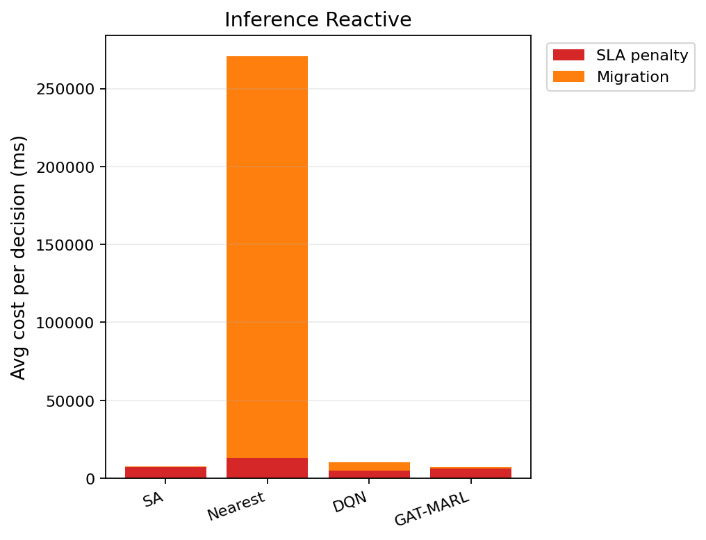

# 中等规模 cov50 数据验证报告（仅 Reactive）

**生成时间**：2026-06-07 18:52:51  
**输出目录**：`experiments\medium_validation_20260607_175355_reward_v21_p3_b11b_8ep`  
**模式**：仅 Reactive（无轨迹预测 / 无 Proactive TTV）  
**GAT-MARL epochs**：8（reactive）

## 训练段（Reactive）

| Algorithm | Migrations | SLA Risk | Severe | P95 Excess (km) | Avg SLA Penalty (ms) | Avg Total Cost (ms) | stay_ratio |
|-----------|------------|----------|--------|-----------------|----------------------|---------------------|------------|
| SA | 90 | 23564 | 6789 | 11.555916442144866 | 7860.19 | 8085.1590330542795 | — |
| Nearest | 1998 | 5525 | 4987 | 11.51333567241429 | 20054.39 | 102367.40022683913 | — |
| DQN | 2309 | 7414 | 5143 | 11.793382940171252 | 18200.80 | 46627.33920429719 | — |
| GAT-MARL | 419 | 20843 | 7272 | 11.52462026995773 | 12089.75 | 13469.332057566642 | 0.9918 |

## 推理段（Reactive）

| Algorithm | Migrations | SLA Risk | Severe | P95 Excess (km) | Avg SLA Penalty (ms) | Avg Total Cost (ms) | stay_ratio |
|-----------|------------|----------|--------|-----------------|----------------------|---------------------|------------|
| SA | 18 | 3609 | 706 | 6.020229804289421 | 7317.74 | 7576.0211592084015 | — |
| Nearest | 874 | 956 | 443 | 4.9088367564877515 | 12901.84 | 270718.8318535106 | — |
| DQN | 889 | 4024 | 1250 | 9.483489759462238 | 5114.03 | 11201.485942490059 | — |
| GAT-MARL | 150 | 3486 | 568 | 4.913174242648797 | 6129.39 | 8068.513875600159 | 0.9908 |

### train reactive — GAT-MARL per-epoch exploration
| Epoch | Phase | ε | Migrations | stay_ratio | act_1 | act_2 | act_3 | eps_greedy | migrate_opt_dec | mask_only_stay |
|-------|-------|---|------------|------------|-------|-------|-------|------------|-----------------|----------------|
| 0 | train | 0.020 | 372 | 0.9916 | 371 | 0 | 1 | 1128 | 373/9601 | 0.9837 |
| 1 | train | 0.020 | 427 | 0.9935 | 420 | 4 | 3 | 1309 | 433/9890 | 0.9864 |
| 2 | train | 0.020 | 292 | 0.9952 | 285 | 4 | 3 | 1224 | 292/10107 | 0.9925 |
| 3 | train | 0.020 | 456 | 0.9913 | 452 | 0 | 4 | 1051 | 457/9645 | 0.9829 |
| 4 | train | 0.020 | 477 | 0.9923 | 476 | 1 | 0 | 1265 | 478/9499 | 0.9844 |
| 5 | train | 0.020 | 524 | 0.9903 | 520 | 0 | 4 | 1083 | 524/9728 | 0.9815 |
| 6 | train | 0.020 | 258 | 0.9958 | 247 | 4 | 7 | 1187 | 259/9772 | 0.9938 |
| 7 | eval | 0.020 | 419 | 0.9918 | 414 | 0 | 5 | 0 | 419/9406 | 0.9853 |

### inference reactive — GAT-MARL per-epoch exploration
| Epoch | Phase | ε | Migrations | stay_ratio | act_1 | act_2 | act_3 | eps_greedy | migrate_opt_dec | mask_only_stay |
|-------|-------|---|------------|------------|-------|-------|-------|------------|-----------------|----------------|
| 0 | eval | 0.000 | 150 | 0.9908 | 147 | 3 | 0 | 0 | 150/2324 | 0.9836 |

### inference reactive — GAT-MARL by DAG type
| DAG type | migrations | decisions | avg_total_cost_ms |
|----------|------------|-----------|-------------------|
| FanIn_Aggregator_1 | 101 | 695 | 6741.88 |
| FanOut_Broadcaster_1 | 49 | 1629 | 8634.51 |

### Phase C 历史对照（迁移学习基线）
来源：`experiments\medium_validation_20260526_phaseC_softguard_v1\results.json`

| 指标 | Phase C GAT | 说明 |
|------|-------------|------|
| 推理迁移 | 72 | v1 + softguard |
| Avg Total Cost (ms) | 17674.067271669766 | |
| P95 Excess (km) | 6.628608057966705 | |
| stay_ratio | 0.9936736666373781 | |

## 成本分解堆叠图（Reactive）

## 本轮验证关注点

- 仅 Reactive：无轨迹预测器、无 Proactive TTV。
- `stay_action_ratio` 接近 1.0 表示策略几乎不迁移；`candidate_action_counts` 中迁移动作计数应逐步上升。
- `migrations_by_dag_type` / `cost_by_dag_type` 用于观察反撕裂（Data_Heavy / FanOut 少迁、Simple 可拆）。
- SA 为 GAT-MARL 锚点（D0 后 L_internal 计入总成本，SA 应倾向少拆图）。

