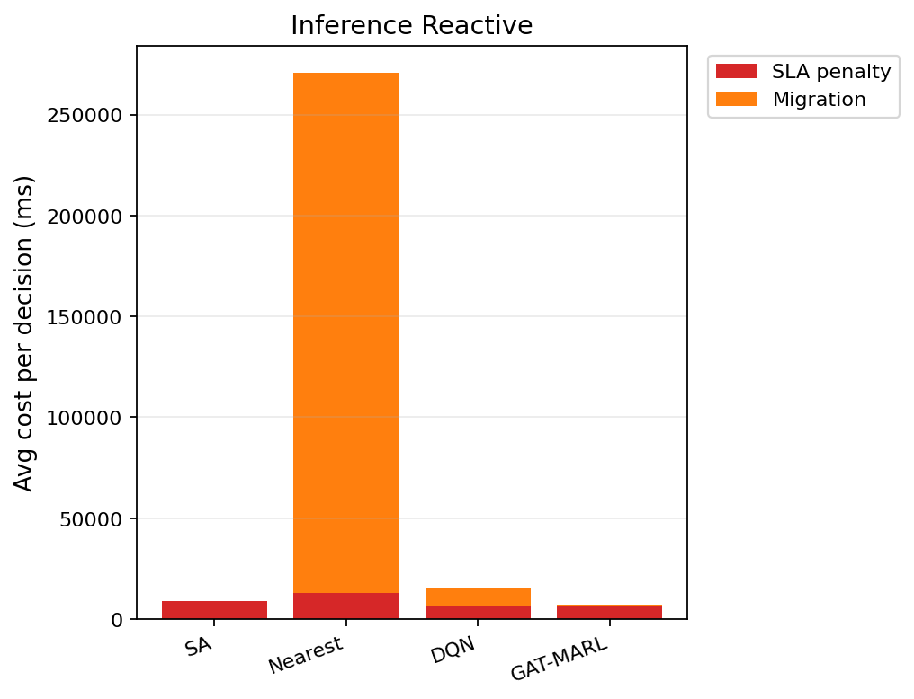

# 中等规模 cov50 数据验证报告（仅 Reactive）

**生成时间**：2026-06-08 16:20:00  
**输出目录**：`experiments\medium_validation_20260608_142708_reward_v21_p3_b11b_a_8ep`  
**模式**：仅 Reactive（无轨迹预测 / 无 Proactive TTV）  
**GAT-MARL epochs**：8（reactive）

## 训练段（Reactive）

| Algorithm | Migrations | SLA Risk | Severe | P95 Excess (km) | Avg SLA Penalty (ms) | Avg Total Cost (ms) | stay_ratio |
|-----------|------------|----------|--------|-----------------|----------------------|---------------------|------------|
| SA | 108 | 23230 | 6703 | 11.551518315224104 | 7586.56 | 7752.5394346196235 | — |
| Nearest | 1998 | 5525 | 4987 | 11.51333567241429 | 20054.39 | 102367.40022683913 | — |
| DQN | 3503 | 7883 | 5154 | 11.552504541105538 | 16760.92 | 36025.66980449846 | — |
| GAT-MARL | 343 | 21700 | 7554 | 11.530196337376076 | 11440.68 | 12715.335380980336 | 0.9936 |

## 推理段（Reactive）

| Algorithm | Migrations | SLA Risk | Severe | P95 Excess (km) | Avg SLA Penalty (ms) | Avg Total Cost (ms) | stay_ratio |
|-----------|------------|----------|--------|-----------------|----------------------|---------------------|------------|
| SA | 16 | 3722 | 748 | 6.633109235811386 | 9006.01 | 9216.628592100475 | — |
| Nearest | 874 | 956 | 443 | 4.9088367564877515 | 12901.84 | 270718.8318535106 | — |
| DQN | 431 | 2721 | 712 | 6.715746891801853 | 6934.70 | 15784.969398694435 | — |
| GAT-MARL | 154 | 3599 | 703 | 7.745762990550325 | 6145.21 | 8060.7454906810235 | 0.9905 |

### 推理段 — 成本分解（单次决策均值）

| Algorithm | Migrations | Avg SLA (ms) | Avg Migration (ms) | Avg Tearing (ms) | Avg L_internal (ms) | Avg Total (ms) |
|-----------|------------|--------------|--------------------|------------------|---------------------|---------------|
| SA | 16 | 9006.01 | 73.04 | 29.70 | 105.80 | 9216.63 |
| Nearest | 874 | 12901.84 | 257814.89 | 0.00 | 0.00 | 270718.83 |
| DQN | 431 | 6934.70 | 8123.58 | 189.40 | 535.21 | 15784.97 |
| GAT-MARL | 154 | 6145.21 | 1118.81 | 237.66 | 556.99 | 8060.75 |

### train reactive — GAT-MARL per-epoch exploration
| Epoch | Phase | ε | Migrations | stay_ratio | act_1 | act_2 | act_3 | eps_greedy | migrate_opt_dec | mask_only_stay |
|-------|-------|---|------------|------------|-------|-------|-------|------------|-----------------|----------------|
| 0 | train | 0.020 | 362 | 0.9913 | 361 | 0 | 1 | 1120 | 363/9195 | 0.9839 |
| 1 | train | 0.020 | 413 | 0.9936 | 413 | 0 | 0 | 1338 | 487/9761 | 0.9857 |
| 2 | train | 0.020 | 280 | 0.9953 | 280 | 0 | 0 | 1170 | 355/9832 | 0.9917 |
| 3 | train | 0.020 | 417 | 0.9921 | 416 | 0 | 1 | 1105 | 429/9693 | 0.9845 |
| 4 | train | 0.020 | 425 | 0.9936 | 425 | 0 | 0 | 1349 | 427/10417 | 0.9868 |
| 5 | train | 0.020 | 426 | 0.9925 | 426 | 0 | 0 | 1103 | 487/10225 | 0.9845 |
| 6 | train | 0.020 | 229 | 0.9963 | 229 | 0 | 0 | 1242 | 333/9722 | 0.9929 |
| 7 | eval | 0.020 | 343 | 0.9936 | 343 | 0 | 0 | 0 | 383/9964 | 0.9880 |

### inference reactive — GAT-MARL per-epoch exploration
| Epoch | Phase | ε | Migrations | stay_ratio | act_1 | act_2 | act_3 | eps_greedy | migrate_opt_dec | mask_only_stay |
|-------|-------|---|------------|------------|-------|-------|-------|------------|-----------------|----------------|
| 0 | eval | 0.000 | 154 | 0.9905 | 154 | 0 | 0 | 0 | 156/2328 | 0.9819 |

### inference reactive — GAT-MARL by DAG type
| DAG type | migrations | decisions | avg_total_cost_ms |
|----------|------------|-----------|-------------------|
| FanIn_Aggregator_1 | 106 | 668 | 7047.41 |
| FanOut_Broadcaster_1 | 48 | 1660 | 8468.52 |

### Phase C 历史对照（迁移学习基线）
来源：`experiments\medium_validation_20260526_phaseC_softguard_v1\results.json`

| 指标 | Phase C GAT | 说明 |
|------|-------------|------|
| 推理迁移 | 72 | v1 + softguard |
| Avg Total Cost (ms) | 17674.067271669766 | |
| P95 Excess (km) | 6.628608057966705 | |
| stay_ratio | 0.9936736666373781 | |

## 成本分解堆叠图（Reactive）

## 本轮验证关注点

- 仅 Reactive：无轨迹预测器、无 Proactive TTV。
- `stay_action_ratio` 接近 1.0 表示策略几乎不迁移；`candidate_action_counts` 中迁移动作计数应逐步上升。
- `migrations_by_dag_type` / `cost_by_dag_type` 用于观察反撕裂（Data_Heavy / FanOut 少迁、Simple 可拆）。
- SA 为 GAT-MARL 锚点（D0 后 L_internal 计入总成本，SA 应倾向少拆图）。

