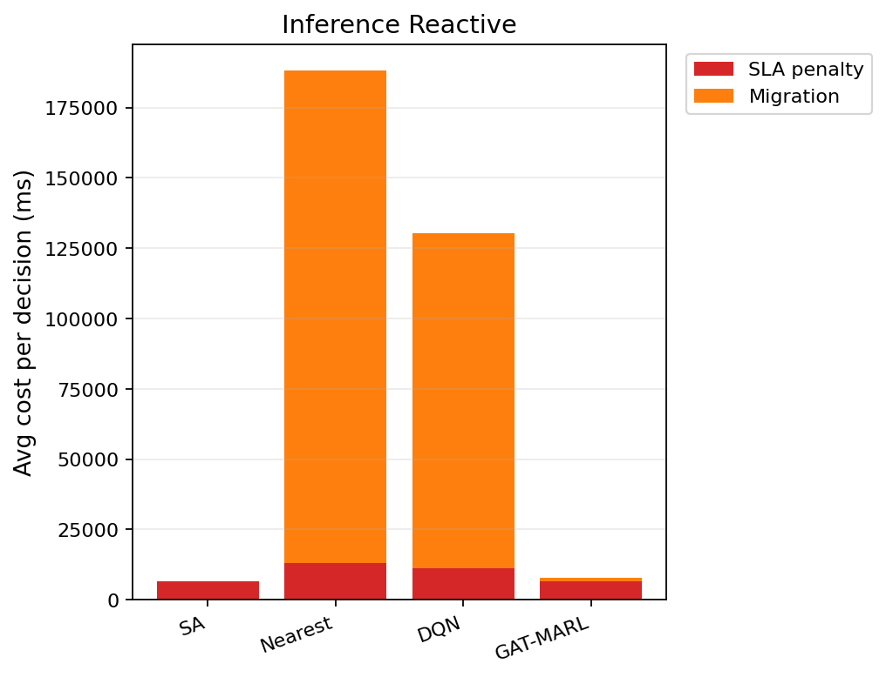

# 中等规模 cov50 数据验证报告（仅 Reactive）

**生成时间**：2026-06-08 17:23:31  
**输出目录**：`experiments\medium_validation_20260608_165512_reward_v21_p3_b11b_eba_2ep`  
**模式**：仅 Reactive（无轨迹预测 / 无 Proactive TTV）  
**GAT-MARL epochs**：2（reactive）

## 训练段（Reactive）

| Algorithm | Migrations | SLA Risk | Severe | P95 Excess (km) | Avg SLA Penalty (ms) | Avg Total Cost (ms) | stay_ratio |
|-----------|------------|----------|--------|-----------------|----------------------|---------------------|------------|
| SA | 94 | 23909 | 6973 | 11.55044028274693 | 7565.43 | 7770.375383097527 | — |
| Nearest | 1998 | 5525 | 4987 | 11.51333567241429 | 20054.39 | 102367.40022683913 | — |
| DQN | 3462 | 7447 | 5270 | 11.57234955628535 | 21581.33 | 85957.89526806404 | — |
| GAT-MARL | 348 | 15809 | 6344 | 11.534035187412812 | 11544.27 | 12883.154355669589 | 0.9947 |

## 推理段（Reactive）

| Algorithm | Migrations | SLA Risk | Severe | P95 Excess (km) | Avg SLA Penalty (ms) | Avg Total Cost (ms) | stay_ratio |
|-----------|------------|----------|--------|-----------------|----------------------|---------------------|------------|
| SA | 18 | 3636 | 869 | 6.956413065394322 | 6538.49 | 7006.295541151412 | — |
| Nearest | 817 | 956 | 443 | 4.9088367564877515 | 12901.84 | 188219.46655715958 | — |
| DQN | 675 | 1306 | 463 | 4.909321076599134 | 11132.02 | 130454.7592749515 | — |
| GAT-MARL | 132 | 4505 | 714 | 8.365308016161453 | 6630.43 | 8441.230669073035 | 0.9895 |

### 推理段 — 成本分解（单次决策均值）

| Algorithm | Migrations | Avg SLA (ms) | Avg Migration (ms) | Avg Tearing (ms) | Avg L_internal (ms) | Avg Total (ms) |
|-----------|------------|--------------|--------------------|------------------|---------------------|---------------|
| SA | 18 | 6538.49 | 71.26 | 79.95 | 314.51 | 7006.30 |
| Nearest | 817 | 12901.84 | 175315.53 | 0.00 | 0.00 | 188219.47 |
| DQN | 675 | 11132.02 | 119094.91 | 45.98 | 179.77 | 130454.76 |
| GAT-MARL | 132 | 6630.43 | 1169.56 | 138.83 | 500.33 | 8441.23 |

### train reactive — GAT-MARL per-epoch exploration
| Epoch | Phase | ε | Migrations | stay_ratio | act_1 | act_2 | act_3 | eps_greedy | migrate_opt_dec | mask_only_stay |
|-------|-------|---|------------|------------|-------|-------|-------|------------|-----------------|----------------|
| 0 | train | 0.020 | 330 | 0.9926 | 329 | 0 | 1 | 1192 | 331/9741 | 0.9861 |
| 1 | eval | 0.020 | 348 | 0.9947 | 348 | 0 | 0 | 0 | 422/9959 | 0.9880 |

### inference reactive — GAT-MARL per-epoch exploration
| Epoch | Phase | ε | Migrations | stay_ratio | act_1 | act_2 | act_3 | eps_greedy | migrate_opt_dec | mask_only_stay |
|-------|-------|---|------------|------------|-------|-------|-------|------------|-----------------|----------------|
| 0 | eval | 0.000 | 132 | 0.9895 | 132 | 0 | 0 | 0 | 137/2266 | 0.9789 |

### inference reactive — GAT-MARL by DAG type
| DAG type | migrations | decisions | avg_total_cost_ms |
|----------|------------|-----------|-------------------|
| Compute_Heavy_DAG_1 | 26 | 606 | 5708.91 |
| Diamond_DAG_3 | 28 | 699 | 2452.26 |
| FanIn_Aggregator_1 | 78 | 961 | 14520.39 |

### Phase C 历史对照（迁移学习基线）
来源：`experiments\medium_validation_20260526_phaseC_softguard_v1\results.json`

| 指标 | Phase C GAT | 说明 |
|------|-------------|------|
| 推理迁移 | 72 | v1 + softguard |
| Avg Total Cost (ms) | 17674.067271669766 | |
| P95 Excess (km) | 6.628608057966705 | |
| stay_ratio | 0.9936736666373781 | |

## 成本分解堆叠图（Reactive）

## 本轮验证关注点

- 仅 Reactive：无轨迹预测器、无 Proactive TTV。
- `stay_action_ratio` 接近 1.0 表示策略几乎不迁移；`candidate_action_counts` 中迁移动作计数应逐步上升。
- `migrations_by_dag_type` / `cost_by_dag_type` 用于观察反撕裂（Data_Heavy / FanOut 少迁、Simple 可拆）。
- SA 为 GAT-MARL 锚点（D0 后 L_internal 计入总成本，SA 应倾向少拆图）。

