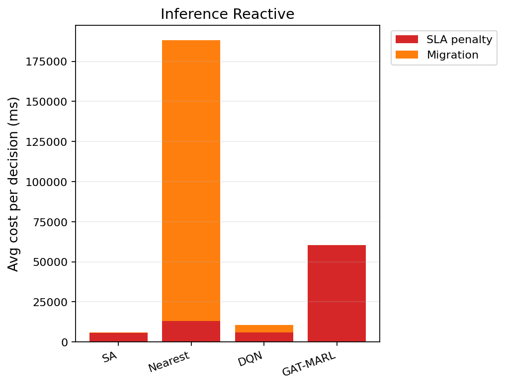

# 中等规模 cov50 数据验证报告（仅 Reactive）

**生成时间**：2026-06-09 17:15:42  
**输出目录**：`experiments\medium_validation_20260609_163745_reward_v21_p4_colocate_a_nstep_2ep`  
**模式**：仅 Reactive（无轨迹预测 / 无 Proactive TTV）  
**GAT-MARL epochs**：2（reactive）

## 训练段（Reactive）

| Algorithm | Migrations | SLA Risk | Severe | P95 Excess (km) | Avg SLA Penalty (ms) | Avg Total Cost (ms) | stay_ratio |
|-----------|------------|----------|--------|-----------------|----------------------|---------------------|------------|
| SA | 98 | 22794 | 6906 | 12.304727359628163 | 8408.77 | 8583.519384340892 | — |
| Nearest | 1998 | 5525 | 4987 | 11.51333567241429 | 20054.39 | 102367.40022683913 | — |
| DQN | 1911 | 8483 | 5657 | 11.564640705494362 | 19350.62 | 43157.08847101041 | — |
| GAT-MARL | 11 | 25334 | 11021 | 55.18965019197948 | 118633.73 | 118907.30923039788 | 0.9999 |

## 推理段（Reactive）

| Algorithm | Migrations | SLA Risk | Severe | P95 Excess (km) | Avg SLA Penalty (ms) | Avg Total Cost (ms) | stay_ratio |
|-----------|------------|----------|--------|-----------------|----------------------|---------------------|------------|
| SA | 15 | 3456 | 656 | 5.91101353934846 | 5681.44 | 6139.438231134642 | — |
| Nearest | 817 | 956 | 443 | 4.9088367564877515 | 12901.84 | 188219.46655715958 | — |
| DQN | 282 | 3930 | 931 | 6.719383424095582 | 5971.10 | 11326.954548898118 | — |
| GAT-MARL | 3 | 5276 | 2925 | 30.963522824082816 | 60378.56 | 60473.239921022505 | 0.9998 |

### 推理段 — 成本分解（单次决策均值）

| Algorithm | Migrations | Avg SLA (ms) | Avg Migration (ms) | Avg Tearing (ms) | Avg L_internal (ms) | Avg Total (ms) |
|-----------|------------|--------------|--------------------|------------------|---------------------|---------------|
| SA | 15 | 5681.44 | 85.81 | 70.41 | 299.70 | 6139.44 |
| Nearest | 817 | 12901.84 | 175315.53 | 0.00 | 0.00 | 188219.47 |
| DQN | 282 | 5971.10 | 4681.02 | 154.33 | 518.43 | 11326.95 |
| GAT-MARL | 3 | 60378.56 | 2.30 | 17.23 | 73.04 | 60473.24 |

### train reactive — GAT-MARL per-epoch exploration
| Epoch | Phase | ε | Migrations | stay_ratio | act_1 | act_2 | act_3 | eps_greedy | migrate_opt_dec | mask_only_stay |
|-------|-------|---|------------|------------|-------|-------|-------|------------|-----------------|----------------|
| 0 | train | 0.020 | 305 | 0.9976 | 68 | 71 | 67 | 1969 | 9256/17724 | 0.8530 |
| 1 | eval | 0.020 | 11 | 0.9999 | 11 | 0 | 0 | 0 | 11794/22941 | 0.6697 |

### inference reactive — GAT-MARL per-epoch exploration
| Epoch | Phase | ε | Migrations | stay_ratio | act_1 | act_2 | act_3 | eps_greedy | migrate_opt_dec | mask_only_stay |
|-------|-------|---|------------|------------|-------|-------|-------|------------|-----------------|----------------|
| 0 | eval | 0.000 | 3 | 0.9998 | 3 | 0 | 0 | 0 | 1729/3528 | 0.6574 |

### inference reactive — GAT-MARL by DAG type
| DAG type | migrations | decisions | avg_total_cost_ms |
|----------|------------|-----------|-------------------|
| Compute_Heavy_DAG_1 | 0 | 948 | 55778.41 |
| Diamond_DAG_3 | 0 | 1051 | 2570.86 |
| FanIn_Aggregator_1 | 3 | 1529 | 103184.88 |

### Phase C 历史对照（迁移学习基线）
来源：`experiments\medium_validation_20260526_phaseC_softguard_v1\results.json`

| 指标 | Phase C GAT | 说明 |
|------|-------------|------|
| 推理迁移 | 72 | v1 + softguard |
| Avg Total Cost (ms) | 17674.067271669766 | |
| P95 Excess (km) | 6.628608057966705 | |
| stay_ratio | 0.9936736666373781 | |

## 成本分解堆叠图（Reactive）

## 本轮验证关注点

- 仅 Reactive：无轨迹预测器、无 Proactive TTV。
- `stay_action_ratio` 接近 1.0 表示策略几乎不迁移；`candidate_action_counts` 中迁移动作计数应逐步上升。
- `migrations_by_dag_type` / `cost_by_dag_type` 用于观察反撕裂（Data_Heavy / FanOut 少迁、Simple 可拆）。
- SA 为 GAT-MARL 锚点（D0 后 L_internal 计入总成本，SA 应倾向少拆图）。

