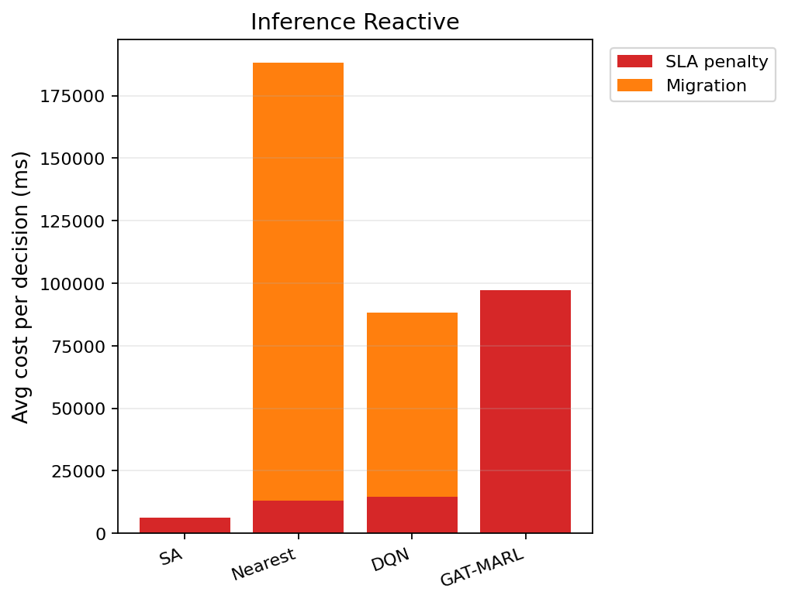

# 中等规模 cov50 数据验证报告（仅 Reactive）

**生成时间**：2026-06-10 14:13:53  
**输出目录**：`experiments\medium_validation_20260610_113415_reward_v21_p4_colocate_aH100_nstep_2ep`  
**模式**：仅 Reactive（无轨迹预测 / 无 Proactive TTV）  
**GAT-MARL epochs**：2（reactive）

## 训练段（Reactive）

| Algorithm | Migrations | SLA Risk | Severe | P95 Excess (km) | Avg SLA Penalty (ms) | Avg Total Cost (ms) | stay_ratio |
|-----------|------------|----------|--------|-----------------|----------------------|---------------------|------------|
| SA | 91 | 22804 | 6929 | 11.836671028139946 | 7988.23 | 8119.213875005747 | — |
| Nearest | 1998 | 5525 | 4987 | 11.51333567241429 | 20054.39 | 102367.40022683913 | — |
| DQN | 3137 | 7703 | 5096 | 11.783225526924628 | 17536.88 | 46065.4237821146 | — |
| GAT-MARL | 6 | 27281 | 9851 | 43.869936950074376 | 81000.07 | 81120.45418446754 | 1.0000 |

## 推理段（Reactive）

| Algorithm | Migrations | SLA Risk | Severe | P95 Excess (km) | Avg SLA Penalty (ms) | Avg Total Cost (ms) | stay_ratio |
|-----------|------------|----------|--------|-----------------|----------------------|---------------------|------------|
| SA | 16 | 3686 | 832 | 6.9769753712030464 | 6075.74 | 6553.212046437839 | — |
| Nearest | 817 | 956 | 443 | 4.9088367564877515 | 12901.84 | 188219.46655715958 | — |
| DQN | 1572 | 975 | 733 | 6.716598871810898 | 14492.88 | 88919.69930054998 | — |
| GAT-MARL | 2 | 5745 | 1574 | 45.893371243687476 | 97299.33 | 97412.16167984928 | 0.9999 |

### 推理段 — 成本分解（单次决策均值）

| Algorithm | Migrations | Avg SLA (ms) | Avg Migration (ms) | Avg Tearing (ms) | Avg L_internal (ms) | Avg Total (ms) |
|-----------|------------|--------------|--------------------|------------------|---------------------|---------------|
| SA | 16 | 6075.74 | 64.05 | 85.33 | 326.01 | 6553.21 |
| Nearest | 817 | 12901.84 | 175315.53 | 0.00 | 0.00 | 188219.47 |
| DQN | 1572 | 14492.88 | 73675.26 | 127.96 | 621.51 | 88919.70 |
| GAT-MARL | 2 | 97299.33 | 0.85 | 34.49 | 75.36 | 97412.16 |

### train reactive — GAT-MARL per-epoch exploration
| Epoch | Phase | ε | Migrations | stay_ratio | act_1 | act_2 | act_3 | eps_greedy | migrate_opt_dec | mask_only_stay |
|-------|-------|---|------------|------------|-------|-------|-------|------------|-----------------|----------------|
| 0 | train | 0.020 | 307 | 0.9963 | 70 | 70 | 64 | 1423 | 9251/11704 | 0.7636 |
| 1 | eval | 0.020 | 6 | 1.0000 | 0 | 6 | 0 | 0 | 12169/23349 | 0.6467 |

### inference reactive — GAT-MARL per-epoch exploration
| Epoch | Phase | ε | Migrations | stay_ratio | act_1 | act_2 | act_3 | eps_greedy | migrate_opt_dec | mask_only_stay |
|-------|-------|---|------------|------------|-------|-------|-------|------------|-----------------|----------------|
| 0 | eval | 0.000 | 2 | 0.9999 | 0 | 2 | 0 | 0 | 1672/3533 | 0.6745 |

### inference reactive — GAT-MARL by DAG type
| DAG type | migrations | decisions | avg_total_cost_ms |
|----------|------------|-----------|-------------------|
| Compute_Heavy_DAG_1 | 0 | 948 | 55778.41 |
| Diamond_DAG_3 | 0 | 1051 | 2570.86 |
| FanIn_Aggregator_1 | 2 | 1534 | 188120.77 |

### Phase C 历史对照（迁移学习基线）
来源：`experiments\medium_validation_20260526_phaseC_softguard_v1\results.json`

| 指标 | Phase C GAT | 说明 |
|------|-------------|------|
| 推理迁移 | 72 | v1 + softguard |
| Avg Total Cost (ms) | 17674.067271669766 | |
| P95 Excess (km) | 6.628608057966705 | |
| stay_ratio | 0.9936736666373781 | |

## 成本分解堆叠图（Reactive）

## 本轮验证关注点

- 仅 Reactive：无轨迹预测器、无 Proactive TTV。
- `stay_action_ratio` 接近 1.0 表示策略几乎不迁移；`candidate_action_counts` 中迁移动作计数应逐步上升。
- `migrations_by_dag_type` / `cost_by_dag_type` 用于观察反撕裂（Data_Heavy / FanOut 少迁、Simple 可拆）。
- SA 为 GAT-MARL 锚点（D0 后 L_internal 计入总成本，SA 应倾向少拆图）。

