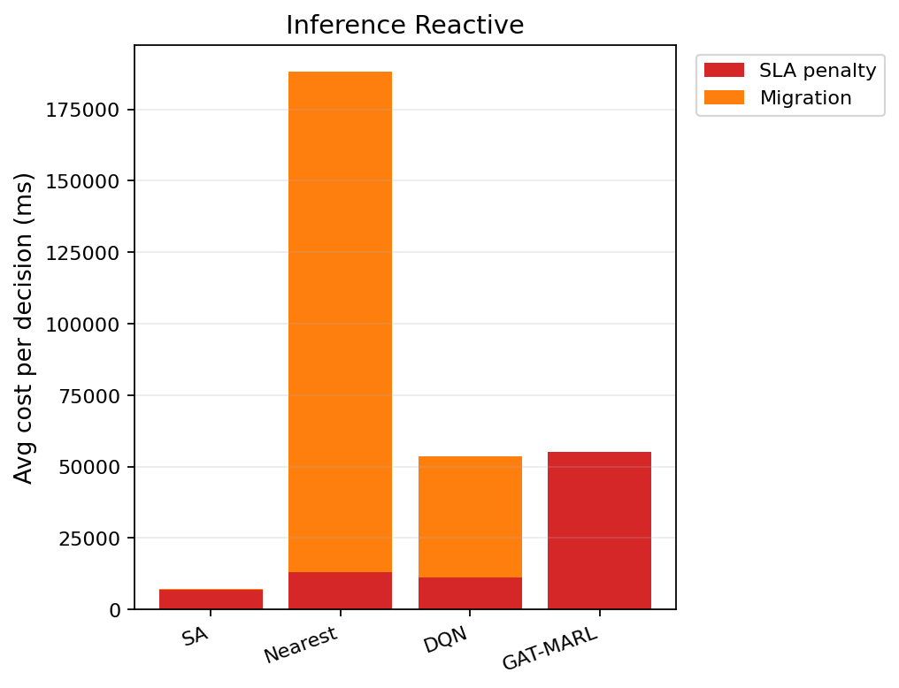

# 中等规模 cov50 数据验证报告（仅 Reactive）

**生成时间**：2026-06-10 16:31:58  
**输出目录**：`experiments\medium_validation_20260610_154800_reward_v21_p4_colocate_aH100_2ep`  
**模式**：仅 Reactive（无轨迹预测 / 无 Proactive TTV）  
**GAT-MARL epochs**：2（reactive）

## 训练段（Reactive）

| Algorithm | Migrations | SLA Risk | Severe | P95 Excess (km) | Avg SLA Penalty (ms) | Avg Total Cost (ms) | stay_ratio |
|-----------|------------|----------|--------|-----------------|----------------------|---------------------|------------|
| SA | 100 | 23552 | 6369 | 12.273810369008732 | 7573.06 | 7792.723517412127 | — |
| Nearest | 1998 | 5525 | 4987 | 11.51333567241429 | 20054.39 | 102367.40022683913 | — |
| DQN | 2665 | 5848 | 5049 | 11.548596457858437 | 20740.19 | 73288.04605094266 | — |
| GAT-MARL | 0 | 23349 | 7995 | 31.107717888895294 | 40432.87 | 40434.97963100718 | 1.0000 |

## 推理段（Reactive）

| Algorithm | Migrations | SLA Risk | Severe | P95 Excess (km) | Avg SLA Penalty (ms) | Avg Total Cost (ms) | stay_ratio |
|-----------|------------|----------|--------|-----------------|----------------------|---------------------|------------|
| SA | 14 | 3669 | 950 | 8.315122784135564 | 6946.68 | 7311.52472908421 | — |
| Nearest | 817 | 956 | 443 | 4.9088367564877515 | 12901.84 | 188219.46655715958 | — |
| DQN | 479 | 1222 | 471 | 4.909482638223015 | 11176.52 | 54084.795204369206 | — |
| GAT-MARL | 0 | 3533 | 1000 | 30.963522824082816 | 55209.57 | 55211.68626982672 | 1.0000 |

### 推理段 — 成本分解（单次决策均值）

| Algorithm | Migrations | Avg SLA (ms) | Avg Migration (ms) | Avg Tearing (ms) | Avg L_internal (ms) | Avg Total (ms) |
|-----------|------------|--------------|--------------------|------------------|---------------------|---------------|
| SA | 14 | 6946.68 | 64.94 | 57.83 | 239.98 | 7311.52 |
| Nearest | 817 | 12901.84 | 175315.53 | 0.00 | 0.00 | 188219.47 |
| DQN | 479 | 11176.52 | 42550.55 | 76.35 | 279.28 | 54084.80 |
| GAT-MARL | 0 | 55209.57 | 0.00 | 0.00 | 0.00 | 55211.69 |

### train reactive — GAT-MARL per-epoch exploration
| Epoch | Phase | ε | Migrations | stay_ratio | act_1 | act_2 | act_3 | eps_greedy | migrate_opt_dec | mask_only_stay |
|-------|-------|---|------------|------------|-------|-------|-------|------------|-----------------|----------------|
| 0 | train | 0.020 | 753 | 0.9915 | 99 | 140 | 192 | 1237 | 7526/10927 | 0.8016 |
| 1 | eval | 0.020 | 0 | 1.0000 | 0 | 0 | 0 | 0 | 11846/23349 | 0.6253 |

### inference reactive — GAT-MARL per-epoch exploration
| Epoch | Phase | ε | Migrations | stay_ratio | act_1 | act_2 | act_3 | eps_greedy | migrate_opt_dec | mask_only_stay |
|-------|-------|---|------------|------------|-------|-------|-------|------------|-----------------|----------------|
| 0 | eval | 0.000 | 0 | 1.0000 | 0 | 0 | 0 | 0 | 1561/3533 | 0.6631 |

### inference reactive — GAT-MARL by DAG type
| DAG type | migrations | decisions | avg_total_cost_ms |
|----------|------------|-----------|-------------------|
| Compute_Heavy_DAG_1 | 0 | 948 | 55778.41 |
| Diamond_DAG_3 | 0 | 1051 | 2570.86 |
| FanIn_Aggregator_1 | 0 | 1534 | 90927.63 |

### Phase C 历史对照（迁移学习基线）
来源：`experiments\medium_validation_20260526_phaseC_softguard_v1\results.json`

| 指标 | Phase C GAT | 说明 |
|------|-------------|------|
| 推理迁移 | 72 | v1 + softguard |
| Avg Total Cost (ms) | 17674.067271669766 | |
| P95 Excess (km) | 6.628608057966705 | |
| stay_ratio | 0.9936736666373781 | |

## 成本分解堆叠图（Reactive）

## 本轮验证关注点

- 仅 Reactive：无轨迹预测器、无 Proactive TTV。
- `stay_action_ratio` 接近 1.0 表示策略几乎不迁移；`candidate_action_counts` 中迁移动作计数应逐步上升。
- `migrations_by_dag_type` / `cost_by_dag_type` 用于观察反撕裂（Data_Heavy / FanOut 少迁、Simple 可拆）。
- SA 为 GAT-MARL 锚点（D0 后 L_internal 计入总成本，SA 应倾向少拆图）。

