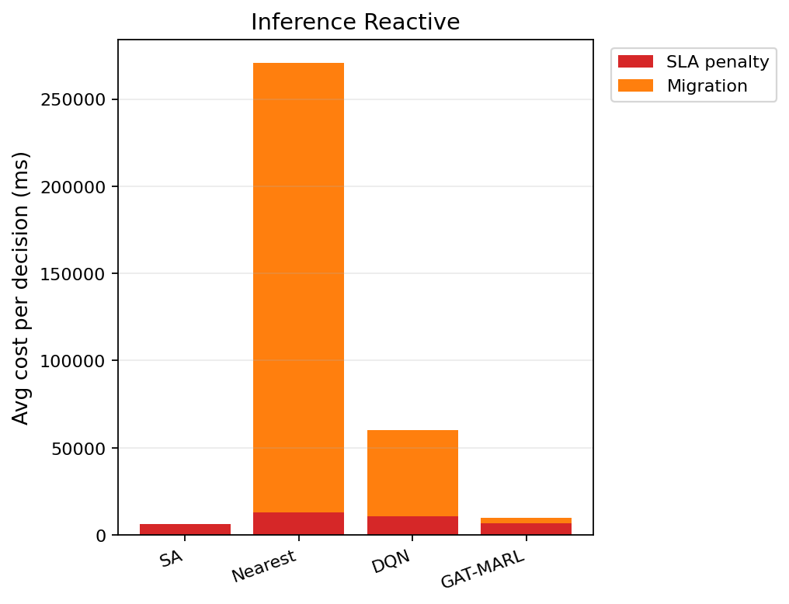

# 中等规模 cov50 数据验证报告（仅 Reactive）

**生成时间**：2026-06-10 22:06:08  
**输出目录**：`experiments\medium_validation_20260610_165047_reward_v21_p4_colocate_aH100_8ep`  
**模式**：仅 Reactive（无轨迹预测 / 无 Proactive TTV）  
**GAT-MARL epochs**：8（reactive）

## 训练段（Reactive）

| Algorithm | Migrations | SLA Risk | Severe | P95 Excess (km) | Avg SLA Penalty (ms) | Avg Total Cost (ms) | stay_ratio |
|-----------|------------|----------|--------|-----------------|----------------------|---------------------|------------|
| SA | 96 | 23758 | 6542 | 11.831779412611848 | 7853.51 | 8114.911651519889 | — |
| Nearest | 1998 | 5525 | 4987 | 11.51333567241429 | 20054.39 | 102367.40022683913 | — |
| DQN | 2386 | 7381 | 5174 | 11.820297125034735 | 20305.40 | 52313.74267303467 | — |
| GAT-MARL | 5401 | 21469 | 7059 | 12.31932288147345 | 7824.82 | 10458.779385399428 | 0.9518 |

## 推理段（Reactive）

| Algorithm | Migrations | SLA Risk | Severe | P95 Excess (km) | Avg SLA Penalty (ms) | Avg Total Cost (ms) | stay_ratio |
|-----------|------------|----------|--------|-----------------|----------------------|---------------------|------------|
| SA | 19 | 3691 | 704 | 6.016141594041155 | 6123.84 | 6352.13939094453 | — |
| Nearest | 874 | 956 | 443 | 4.9088367564877515 | 12901.84 | 270718.8318535106 | — |
| DQN | 579 | 1511 | 785 | 6.717745240159868 | 10838.47 | 60791.20652694876 | — |
| GAT-MARL | 193 | 2821 | 837 | 6.718237189094015 | 6701.49 | 10417.724126598141 | 0.9929 |

### 推理段 — 成本分解（单次决策均值）

| Algorithm | Migrations | Avg SLA (ms) | Avg Migration (ms) | Avg Tearing (ms) | Avg L_internal (ms) | Avg Total (ms) |
|-----------|------------|--------------|--------------------|------------------|---------------------|---------------|
| SA | 19 | 6123.84 | 94.31 | 28.17 | 103.73 | 6352.14 |
| Nearest | 874 | 12901.84 | 257814.89 | 0.00 | 0.00 | 270718.83 |
| DQN | 579 | 10838.47 | 49424.03 | 133.19 | 393.42 | 60791.21 |
| GAT-MARL | 193 | 6701.49 | 3321.60 | 142.21 | 250.34 | 10417.72 |

### train reactive — GAT-MARL per-epoch exploration
| Epoch | Phase | ε | Migrations | stay_ratio | act_1 | act_2 | act_3 | eps_greedy | migrate_opt_dec | mask_only_stay |
|-------|-------|---|------------|------------|-------|-------|-------|------------|-----------------|----------------|
| 0 | train | 0.020 | 6698 | 0.9554 | 792 | 1019 | 1639 | 1861 | 5679/16083 | 0.9214 |
| 1 | train | 0.020 | 2716 | 0.9671 | 312 | 805 | 1450 | 1583 | 5874/11737 | 0.5841 |
| 2 | train | 0.020 | 8108 | 0.9345 | 98 | 1855 | 2158 | 1273 | 5459/10475 | 0.9104 |
| 3 | train | 0.020 | 3487 | 0.9611 | 130 | 655 | 1111 | 950 | 5769/9152 | 0.8667 |
| 4 | train | 0.020 | 6004 | 0.9534 | 376 | 1032 | 1811 | 1351 | 5708/10694 | 0.9088 |
| 5 | train | 0.020 | 5661 | 0.8817 | 5 | 2555 | 3042 | 943 | 5665/8873 | 0.5428 |
| 6 | train | 0.020 | 4419 | 0.9766 | 73 | 651 | 826 | 1395 | 5718/10575 | 0.9064 |
| 7 | eval | 0.020 | 5401 | 0.9518 | 1 | 2559 | 2756 | 0 | 7064/18177 | 0.7408 |

### inference reactive — GAT-MARL per-epoch exploration
| Epoch | Phase | ε | Migrations | stay_ratio | act_1 | act_2 | act_3 | eps_greedy | migrate_opt_dec | mask_only_stay |
|-------|-------|---|------------|------------|-------|-------|-------|------------|-----------------|----------------|
| 0 | eval | 0.000 | 193 | 0.9929 | 1 | 42 | 96 | 0 | 1045/2807 | 0.8929 |

### inference reactive — GAT-MARL by DAG type
| DAG type | migrations | decisions | avg_total_cost_ms |
|----------|------------|-----------|-------------------|
| FanIn_Aggregator_1 | 85 | 968 | 5046.08 |
| FanOut_Broadcaster_1 | 108 | 1839 | 13245.22 |

### Phase C 历史对照（迁移学习基线）
来源：`experiments\medium_validation_20260526_phaseC_softguard_v1\results.json`

| 指标 | Phase C GAT | 说明 |
|------|-------------|------|
| 推理迁移 | 72 | v1 + softguard |
| Avg Total Cost (ms) | 17674.067271669766 | |
| P95 Excess (km) | 6.628608057966705 | |
| stay_ratio | 0.9936736666373781 | |

## 成本分解堆叠图（Reactive）

## 本轮验证关注点

- 仅 Reactive：无轨迹预测器、无 Proactive TTV。
- `stay_action_ratio` 接近 1.0 表示策略几乎不迁移；`candidate_action_counts` 中迁移动作计数应逐步上升。
- `migrations_by_dag_type` / `cost_by_dag_type` 用于观察反撕裂（Data_Heavy / FanOut 少迁、Simple 可拆）。
- SA 为 GAT-MARL 锚点（D0 后 L_internal 计入总成本，SA 应倾向少拆图）。

