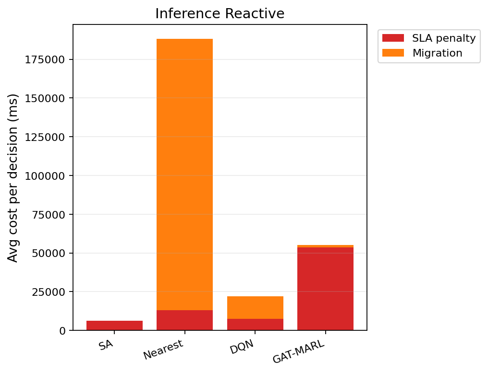

# 中等规模 cov50 数据验证报告（仅 Reactive）

**生成时间**：2026-06-11 13:31:30  
**输出目录**：`experiments\medium_validation_20260611_102757_reward_v21_p4_colocate_aH20_2ep`  
**模式**：仅 Reactive（无轨迹预测 / 无 Proactive TTV）  
**GAT-MARL epochs**：2（reactive）

## 训练段（Reactive）

| Algorithm | Migrations | SLA Risk | Severe | P95 Excess (km) | Avg SLA Penalty (ms) | Avg Total Cost (ms) | stay_ratio |
|-----------|------------|----------|--------|-----------------|----------------------|---------------------|------------|
| SA | 101 | 22908 | 6740 | 12.266388908883734 | 7683.77 | 7866.0184480470425 | — |
| Nearest | 1998 | 5525 | 4987 | 11.51333567241429 | 20054.39 | 102367.40022683913 | — |
| DQN | 3187 | 6131 | 5085 | 11.53471809342734 | 19590.84 | 72809.58703520722 | — |
| GAT-MARL | 516 | 14708 | 7149 | 27.318351461796382 | 48489.25 | 53128.07296982855 | 0.9943 |

## 推理段（Reactive）

| Algorithm | Migrations | SLA Risk | Severe | P95 Excess (km) | Avg SLA Penalty (ms) | Avg Total Cost (ms) | stay_ratio |
|-----------|------------|----------|--------|-----------------|----------------------|---------------------|------------|
| SA | 16 | 3764 | 825 | 7.513552787065596 | 6278.15 | 6698.475407917437 | — |
| Nearest | 817 | 956 | 443 | 4.9088367564877515 | 12901.84 | 188219.46655715958 | — |
| DQN | 1641 | 2921 | 1202 | 8.208616075236499 | 7454.60 | 22458.542757369025 | — |
| GAT-MARL | 119 | 4943 | 1097 | 22.037803766037925 | 53508.65 | 55392.004752371264 | 0.9937 |

### 推理段 — 成本分解（单次决策均值）

| Algorithm | Migrations | Avg SLA (ms) | Avg Migration (ms) | Avg Tearing (ms) | Avg L_internal (ms) | Avg Total (ms) |
|-----------|------------|--------------|--------------------|------------------|---------------------|---------------|
| SA | 16 | 6278.15 | 85.61 | 75.38 | 257.26 | 6698.48 |
| Nearest | 817 | 12901.84 | 175315.53 | 0.00 | 0.00 | 188219.47 |
| DQN | 1641 | 7454.60 | 14462.18 | 104.17 | 435.52 | 22458.54 |
| GAT-MARL | 119 | 53508.65 | 1529.95 | 118.94 | 232.36 | 55392.00 |

### train reactive — GAT-MARL per-epoch exploration
| Epoch | Phase | ε | Migrations | stay_ratio | act_1 | act_2 | act_3 | eps_greedy | migrate_opt_dec | mask_only_stay |
|-------|-------|---|------------|------------|-------|-------|-------|------------|-----------------|----------------|
| 0 | train | 0.020 | 2919 | 0.9812 | 345 | 538 | 655 | 1918 | 7850/17286 | 0.8808 |
| 1 | eval | 0.020 | 516 | 0.9943 | 0 | 0 | 359 | 0 | 5692/9220 | 0.4914 |

### inference reactive — GAT-MARL per-epoch exploration
| Epoch | Phase | ε | Migrations | stay_ratio | act_1 | act_2 | act_3 | eps_greedy | migrate_opt_dec | mask_only_stay |
|-------|-------|---|------------|------------|-------|-------|-------|------------|-----------------|----------------|
| 0 | eval | 0.000 | 119 | 0.9937 | 0 | 0 | 95 | 0 | 1365/2872 | 0.6722 |

### inference reactive — GAT-MARL by DAG type
| DAG type | migrations | decisions | avg_total_cost_ms |
|----------|------------|-----------|-------------------|
| Compute_Heavy_DAG_1 | 48 | 912 | 7475.77 |
| Diamond_DAG_3 | 0 | 1051 | 2570.86 |
| FanIn_Aggregator_1 | 71 | 909 | 164539.01 |

### Phase C 历史对照（迁移学习基线）
来源：`experiments\medium_validation_20260526_phaseC_softguard_v1\results.json`

| 指标 | Phase C GAT | 说明 |
|------|-------------|------|
| 推理迁移 | 72 | v1 + softguard |
| Avg Total Cost (ms) | 17674.067271669766 | |
| P95 Excess (km) | 6.628608057966705 | |
| stay_ratio | 0.9936736666373781 | |

## 成本分解堆叠图（Reactive）

## 本轮验证关注点

- 仅 Reactive：无轨迹预测器、无 Proactive TTV。
- `stay_action_ratio` 接近 1.0 表示策略几乎不迁移；`candidate_action_counts` 中迁移动作计数应逐步上升。
- `migrations_by_dag_type` / `cost_by_dag_type` 用于观察反撕裂（Data_Heavy / FanOut 少迁、Simple 可拆）。
- SA 为 GAT-MARL 锚点（D0 后 L_internal 计入总成本，SA 应倾向少拆图）。

