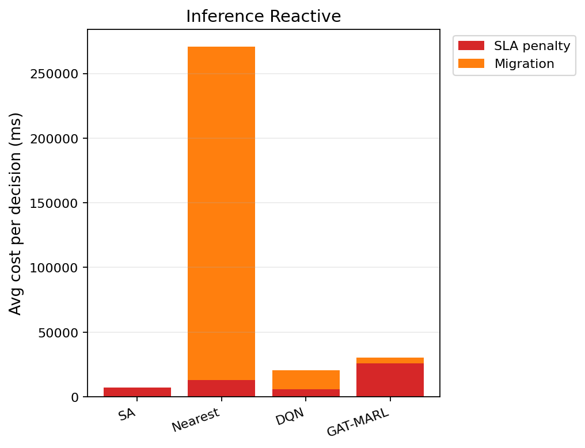

# 中等规模 cov50 数据验证报告（仅 Reactive）

**生成时间**：2026-06-12 12:24:04  
**输出目录**：`experiments\medium_validation_20260612_104442_reward_v21_p4_colocate_aH20_8ep`  
**模式**：仅 Reactive（无轨迹预测 / 无 Proactive TTV）  
**GAT-MARL epochs**：8（reactive）

## 训练段（Reactive）

| Algorithm | Migrations | SLA Risk | Severe | P95 Excess (km) | Avg SLA Penalty (ms) | Avg Total Cost (ms) | stay_ratio |
|-----------|------------|----------|--------|-----------------|----------------------|---------------------|------------|
| SA | 97 | 24211 | 6915 | 11.807791230346265 | 7408.95 | 7657.083045087654 | — |
| Nearest | 1998 | 5525 | 4987 | 11.51333567241429 | 20054.39 | 102367.40022683913 | — |
| DQN | 2559 | 9564 | 5320 | 11.546247421696467 | 17099.50 | 40115.41802367489 | — |
| GAT-MARL | 5670 | 20733 | 6353 | 12.45559990635402 | 15669.64 | 21468.8195782848 | 0.8808 |

## 推理段（Reactive）

| Algorithm | Migrations | SLA Risk | Severe | P95 Excess (km) | Avg SLA Penalty (ms) | Avg Total Cost (ms) | stay_ratio |
|-----------|------------|----------|--------|-----------------|----------------------|---------------------|------------|
| SA | 18 | 3510 | 711 | 6.017543111958119 | 7117.11 | 7335.650755228586 | — |
| Nearest | 874 | 956 | 443 | 4.9088367564877515 | 12901.84 | 270718.8318535106 | — |
| DQN | 1287 | 4058 | 646 | 6.685359573064268 | 5725.59 | 21098.88509228313 | — |
| GAT-MARL | 320 | 3838 | 1283 | 8.508345808519042 | 25721.57 | 30814.42045636687 | 0.9845 |

### 推理段 — 成本分解（单次决策均值）

| Algorithm | Migrations | Avg SLA (ms) | Avg Migration (ms) | Avg Tearing (ms) | Avg L_internal (ms) | Avg Total (ms) |
|-----------|------------|--------------|--------------------|------------------|---------------------|---------------|
| SA | 18 | 7117.11 | 90.96 | 28.25 | 97.25 | 7335.65 |
| Nearest | 874 | 12901.84 | 257814.89 | 0.00 | 0.00 | 270718.83 |
| DQN | 1287 | 5725.59 | 14746.89 | 162.35 | 461.97 | 21098.89 |
| GAT-MARL | 320 | 25721.57 | 4514.30 | 206.91 | 369.55 | 30814.42 |

### train reactive — GAT-MARL per-epoch exploration
| Epoch | Phase | ε | Migrations | stay_ratio | act_1 | act_2 | act_3 | eps_greedy | migrate_opt_dec | mask_only_stay |
|-------|-------|---|------------|------------|-------|-------|-------|------------|-----------------|----------------|
| 0 | train | 0.020 | 4518 | 0.9622 | 110 | 1288 | 969 | 1532 | 6463/13533 | 0.8840 |
| 1 | train | 0.020 | 4413 | 0.9620 | 58 | 2251 | 1992 | 2285 | 7648/16544 | 0.6849 |
| 2 | train | 0.020 | 671 | 0.9956 | 56 | 195 | 116 | 1696 | 9416/14082 | 0.8677 |
| 3 | train | 0.020 | 6614 | 0.9606 | 43 | 1814 | 1551 | 1712 | 6894/17277 | 0.9033 |
| 4 | train | 0.020 | 8570 | 0.9500 | 46 | 2382 | 2023 | 1810 | 7029/13459 | 0.9024 |
| 5 | train | 0.020 | 2814 | 0.9519 | 71 | 1483 | 1222 | 1178 | 7401/10796 | 0.5645 |
| 6 | train | 0.020 | 4335 | 0.9755 | 37 | 897 | 601 | 1281 | 5444/9898 | 0.9110 |
| 7 | eval | 0.020 | 5670 | 0.8808 | 0 | 2992 | 2588 | 0 | 5580/8933 | 0.5423 |

### inference reactive — GAT-MARL per-epoch exploration
| Epoch | Phase | ε | Migrations | stay_ratio | act_1 | act_2 | act_3 | eps_greedy | migrate_opt_dec | mask_only_stay |
|-------|-------|---|------------|------------|-------|-------|-------|------------|-----------------|----------------|
| 0 | eval | 0.000 | 320 | 0.9845 | 0 | 208 | 53 | 0 | 949/2410 | 0.9029 |

### inference reactive — GAT-MARL by DAG type
| DAG type | migrations | decisions | avg_total_cost_ms |
|----------|------------|-----------|-------------------|
| FanIn_Aggregator_1 | 202 | 539 | 91462.03 |
| FanOut_Broadcaster_1 | 118 | 1871 | 13342.98 |

### Phase C 历史对照（迁移学习基线）
来源：`experiments\medium_validation_20260526_phaseC_softguard_v1\results.json`

| 指标 | Phase C GAT | 说明 |
|------|-------------|------|
| 推理迁移 | 72 | v1 + softguard |
| Avg Total Cost (ms) | 17674.067271669766 | |
| P95 Excess (km) | 6.628608057966705 | |
| stay_ratio | 0.9936736666373781 | |

## 成本分解堆叠图（Reactive）

## 本轮验证关注点

- 仅 Reactive：无轨迹预测器、无 Proactive TTV。
- `stay_action_ratio` 接近 1.0 表示策略几乎不迁移；`candidate_action_counts` 中迁移动作计数应逐步上升。
- `migrations_by_dag_type` / `cost_by_dag_type` 用于观察反撕裂（Data_Heavy / FanOut 少迁、Simple 可拆）。
- SA 为 GAT-MARL 锚点（D0 后 L_internal 计入总成本，SA 应倾向少拆图）。

