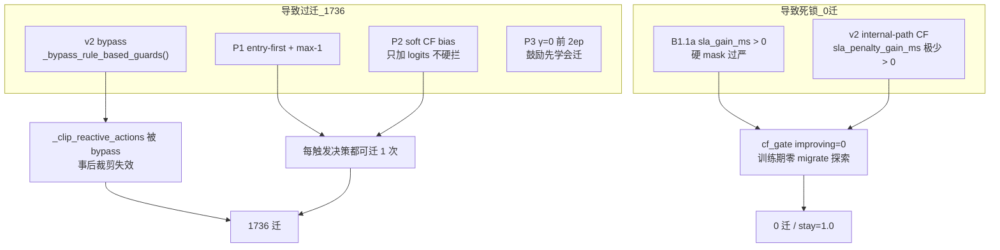

# Reward v2.1 / GAT-MARL 修改回顾与问题归因（2026-06-07）

**关联文档**：[docs/Reward_v21_P3总结与P4修改计划.md](docs/Reward_v21_P3总结与P4修改计划.md) · [docs/experiment_results_summary.md](docs/experiment_results_summary.md) · [test.md](test.md)

**代码真源**：`algorithms/marl_gat.py`、`core/reward.py`、`core/reward_curriculum.py`、`run_reward_v21_p3_cov50.py`

---

## 一、修改回顾与实验轨迹

| 阶段 | 改了什么 | 推理结果 | 状态 |
|------|----------|----------|------|
| **v2.1 主线** | v2 reward + 硬护栏 **bypass** | **0 迁**，stay=1.0 | 负 reward → 学会不动 |
| **P1** | entry-first + max-1 + DAG/CF 特征 | **1758 迁**，~89k ms | 打破死锁，但几乎每步都迁 |
| **P2** | S/αβ/λ 课程 + soft CF bias | ≈P1 | 2ep 无改善 |
| **P3** | L_internal **γ 蒙眼课程** | **1736 迁**，**45.8k ms**，P95 **6.7 km** | QoS/成本改善，迁移仍过频 |
| **B1** | 无 SLA 违规 → 强制 STAY | 3533 迁（无效） | `sla_gate=0/3533`，与 Reactive 触发重叠 |
| **B1.1a 快验** | `sla_gain_ms > 0` 硬 mask | **349 迁** | 旧 ckpt + 推理期 gate，有压迁效果 |
| **B1.1a 8ep** | 同上，训练期也 gate | **0 迁**，~55k ms，P95 31 km | **摆回 v2.1 式死锁** |

**实验目录**：

| 目录 | 要点 |
|------|------|
| `medium_validation_20260605_reward_v21_softguard_reactive_8ep_v1` | v2.1 主线，0 迁 |
| `medium_validation_20260605_145403_reward_v21_p1_v1` | P1，1758 迁 |
| `medium_validation_20260605_170422_reward_v21_p3_8ep` | P3，1736 迁 / P95 6.7 km |
| `medium_validation_20260607_001742_reward_v21_p3_b11a_8ep` | P3+B1.1a，0 迁 |

---

## 二、当前问题来自哪部分修改？

不是单一模块的锅，而是 **「放开迁移动作」与「约束迁移动作」两层修改失衡**。



### 2.1 过迁（1736 迁）——主要来自 P1 + v2 bypass + soft CF

| 修改点 | 文件/机制 | 作用 |
|--------|-----------|------|
| **v2 硬护栏 bypass** | `marl_gat.py` → `_bypass_rule_based_guards()` | `_clip_reactive_actions` **直接 passthrough**，不再按 CF 裁剪「无收益迁」 |
| **P1 entry-first + max-1** | `marl_gat.py` + `marl_state_builder.py` | 每步至少允许 1 次 entry 迁，**解决 0 迁，但未定义「该不该迁」** |
| **P2 soft CF bias** | `_apply_soft_counterfactual_bias()` | 只软推 logits，**不 mask 负收益动作** |
| **P3 γ 课程** | `reward_curriculum.py` | 改善 P95/成本 ✅，但 ep0–1 γ=0 **强化「迁=好」**，未压迁移频次 |

**P3 本身不是过迁主因**，它甚至把 P95 从 31 km 拉到 6.7 km；问题是 **P1 打开了水龙头，v2 bypass 关掉了龙头**。

### 2.2 B1 无效——触发逻辑与 gate 语义重叠

| 修改点 | 问题 |
|--------|------|
| **B1** `dag_current_sla_violation()` | Reactive 仅在 **已违规** 时才有决策 → gate 几乎永不触发（`sla_gate=0/3533`） |

B1 方向对，但绑错了层：**应在「违规状态下是否值得迁」**，而非「是否违规」。

### 2.3 0 迁死锁（8ep B1.1a）——几乎全来自 B1.1a 实现方式

| 修改点 | 问题 |
|--------|------|
| **B1.1a** `_apply_cf_sla_gain_action_gate()` | 门槛 `sla_gain_ms > 0` |
| **v2 internal-path CF** | `_score_counterfactual_action()` 用 `sla_penalty_gain_ms(..., use_e2e_qos=True)`，在已违规场景下 **绝大多数候选迁 sla_gain ≤ 0** |
| **结果** | 全 epoch `cf_gate=…/0`，`migrate_opt=0/3533`，策略只学 STAY |

C1 快验 349 迁是 **旧 P3 策略 + 推理期 gate** 的混合效应，**不能**代表 8ep 训练结果。

### 2.4 应保留的部分

- **P3 γ 课程**：P95 / 报表成本改善有效，参数可保留
- **P1 协调思想**（entry-first、max-1）：方向对，需配 **硬 guard**
- **P0 epoch_stats**：诊断必需

---

## 三、实验数据对照

### 3.1 推理段核心指标

| 配置 | 迁移 | Avg Cost | P95 | stay | 说明 |
|------|------|----------|-----|------|------|
| v2.1 主线 | 0 | — | — | ~1.0 | reward 死锁 |
| P1/P2 | 1758 | 88.9k | 31 km | 0.85 | 过迁 |
| **P3** | **1736** | **45.8k** | **6.7 km** | 0.86 | QoS 改善 |
| B1.1a C1（旧 ckpt） | 349 | 72.0k | 31 km | 0.89 | 推理期 gate |
| **B1.1a 8ep** | **0** | **55.2k** | **31 km** | **1.0** | CF gate 死锁 |
| SA（同批推理） | 14 | 9.6k | 6.6 km | — | 锚点 |
| Phase C v1 | 72 | 17.7k | 6.6 km | 0.994 | 历史标杆 |

### 3.2 关键日志信号

| 实验 | 信号 | 含义 |
|------|------|------|
| P3 | `migrate_opt=1736/1736` | 每决策都有 migrate 选项 |
| B1 | `sla_gate=0/3533` | 无违规决策，B1 从未触发 |
| B1.1a C1 | `cf_gate=32458/0`，`migrate_opt=0/2733` | 全 mask stay，但旧策略仍产出 349 实际迁 |
| B1.1a 8ep | 全 epoch `cf_gate=…/0`，stay=1.0 | 训练期无 migrate 探索 |

---

## 四、要做什么调整？

**目标**：Phase C 量级（~72 迁 / ~17k ms）→ 再逼近 SA（~14 迁 / ~9.6k ms）。  
不要在「1736 过迁」和「0 迁死锁」之间摆荡。

### 4.1 调整 1：B1.1a → B1.1b（放宽 CF 门槛）——优先级最高

当前 gate 用 **`sla_gain_ms`**，与 v2 internal-path 的 CF 评分不一致（过严）。应改为与 v1 rule guard **同一套判据**：

```text
# 建议门槛（与 _clip_reactive_actions 对齐）
允许 migrate 当且仅当：
  score > CF_SCORE_EPS
  或 (entry 节点 ∧ sla_gain_ms > 0)
  或 lightweight_entry_rescue
```

| 改什么 | 具体 |
|--------|------|
| `_apply_cf_sla_gain_action_gate()` | 用 **`effective_sla_gain_ms > 0`** 或 **`score > CF_SCORE_EPS`**，而非裸 `sla_gain_ms > 0` |
| entry 节点 | 违规时 **至少保留 1 个最近候选**（与 Phase C / SA 对齐） |
| 环境变量 | 保留 `MARL_CF_SLA_GAIN_GATE=1`，新增 `MARL_CF_GATE_MODE=score` 便于 ablation |

**验证**：先 C1 快验 → 迁移应在 **50–200** 区间，再 8ep。

### 4.2 调整 2：v2 bypass 有条件关闭——与 B1.1b 配套

| 改什么 | 具体 |
|--------|------|
| `_bypass_rule_based_guards()` | 当 `MARL_CF_SLA_GAIN_GATE=1` 时，**训练/推理均启用 `_clip_reactive_actions`** 作第二道防线 |
| 或 | bypass 保留，但 B1.1b mask + post-clip **双重一致** |

根因是 bypass 拿掉了 Phase C 里 **事后 CF 裁剪**，单靠 mask 一端不够。

### 4.3 调整 3：P1 保留，但不再单独扛「少迁」

- **保留** entry-first + max-1（避免动作空间爆炸）
- **不再指望** P1 自己学会少迁；少迁由 **B1.1b + clip** 保证

### 4.4 调整 4：P2 soft CF——在硬 gate 下降级或关闭

硬 mask 已决定合法动作时，soft CF bias **容易与 gate 冲突**（鼓励已被 mask 的动作）。

```text
MARL_SOFT_CF_BIAS=0   # B1.1b 验证期建议先关
```

### 4.5 调整 5：P3 γ 课程——保留现参，不动

P3 已证明对 P95/成本有效；当前失败不是 γ 的问题，是 **动作合法集定义错误**。

### 4.6 废弃 / 不再投入

| 方案 | 原因 |
|------|------|
| **B1**（无违规 → STAY） | 与 Reactive 触发重叠，实测无效 |
| **λ/γ 超参排列** | 已验证无底洞 |
| **纯 B1.1a `sla_gain_ms > 0`** | 8ep 已证明 → 0 迁死锁 |

---

## 五、推荐执行顺序

```
Step 1  实现 B1.1b（score/effective_gain 门槛 + entry 例外）
Step 2  CF gate 开启时恢复 _clip_reactive_actions（或等价 post-guard）
Step 3  关 soft CF，保留 P3 参数
Step 4  C1 快验（2ep 或 inference-only）
        判据：迁移 50–200，P95 < 10 km，成本 < 20k
Step 5  通过后再 8ep 全量（tag: reward_v21_p3_b11b_8ep）
```

---

## 六、一句话总结

| 现象 | 主要来自 |
|------|----------|
| **1736 过迁** | **P1 打开迁移** + **v2 bypass 关掉 rule guard** + **soft CF 只推不拦** |
| **B1 无效** | **B1 判据与 Reactive 触发重复** |
| **0 迁死锁** | **B1.1a 用 `sla_gain_ms > 0` 过严**，与 v2 internal-path CF 不兼容 |
| **P95/成本改善** | **P3 γ 课程有效，应保留** |

**下一步核心**：不是再加课程或调 λ，而是 **把 B1.1a 改成与 Phase C rule guard 等价的 B1.1b**，并在 v2 下 **恢复 CF 事后裁剪**，在「能迁 / 应迁 / 值得迁」三层对齐。

---

## 七、待办

- [x] 实现 B1.1b（`_apply_cf_sla_gain_action_gate` 门槛 + entry 例外）
- [x] CF gate 开启时恢复 `_clip_reactive_actions`
- [x] B1.1b 验证期 `MARL_SOFT_CF_BIAS=0`
- [x] C1 快验（225 迁 / 7.8k ms，收紧版）
- [x] 8ep 全量（`20260607_175355_reward_v21_p3_b11b_8ep`：推理 150 迁 / 8.1k ms / P95 4.9 km）
