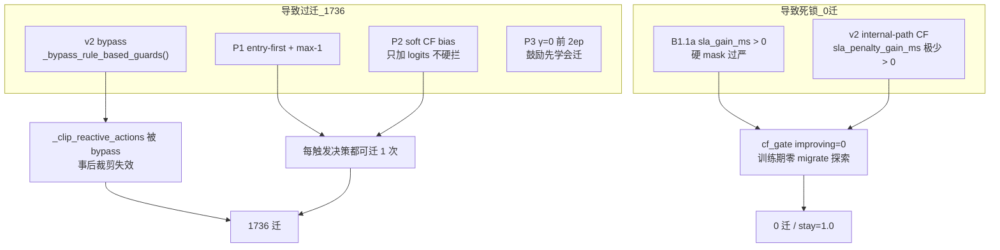
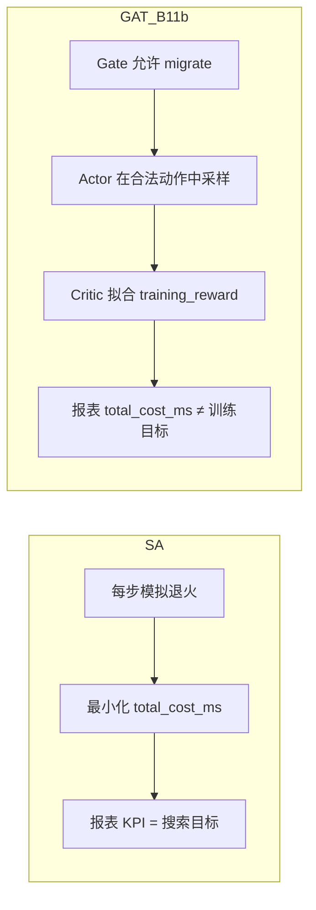

# Reward v2.1 / GAT-MARL 修改回顾与问题归因（2026-06-08）

**关联文档**：[docs/Reward_v21_P3总结与P4修改计划.md](docs/Reward_v21_P3总结与P4修改计划.md) · [docs/experiment_results_summary.md](docs/experiment_results_summary.md) · [test.md](test.md)

**代码真源**：`algorithms/marl_gat.py`、`core/reward.py`、`core/reward_curriculum.py`、`core/marl_reward.py`、`algorithms/sa.py`、`run_reward_v21_p3_cov50.py`

**定版实验**：`experiments/medium_validation_20260607_175355_reward_v21_p3_b11b_8ep/`

---

## 一、修改回顾与实验轨迹

| 阶段 | 改了什么 | 推理结果 | 状态 |
|------|----------|----------|------|
| **v2.1 主线** | v2 reward + 硬护栏 **bypass** | **0 迁**，stay=1.0 | 负 reward → 学会不动 |
| **P1** | entry-first + max-1 + DAG/CF 特征 | **1758 迁**，~89k ms | 打破死锁，但几乎每步都迁 |
| **P2** | S/αβ/λ 课程 + soft CF bias | ≈P1 | 2ep 无改善 |
| **P3** | L_internal **γ 蒙眼课程** | **1736 迁**，**45.8k ms**，P95 **6.7 km** | QoS/成本改善，迁移仍过频 |
| **B1** | 无 SLA 违规 → 强制 STAY | 3533 迁（无效） | `sla_gate=0/3533`，与 Reactive 触发重叠 |
| **B1.1a 快验** | `sla_gain_ms > 0` 硬 mask | **349 迁** | 旧 ckpt + 推理期 gate，有压迁效果 |
| **B1.1a 8ep** | 同上，训练期也 gate | **0 迁**，~55k ms，P95 31 km | **摆回 v2.1 式死锁** |

**实验目录**：

| 目录 | 要点 |
|------|------|
| `medium_validation_20260607_175355_reward_v21_p3_b11b_8ep` | **B1.1b 定版**；训练末 eval ~150 迁 / ~8.1k ms；最新四算法推理见 §八 |
| `medium_validation_20260605_170422_reward_v21_p3_8ep` | P3，1736 迁 / P95 6.7 km |
| `medium_validation_20260605_145403_reward_v21_p1_v1` | P1，1758 迁 |
| `medium_validation_20260605_reward_v21_softguard_reactive_8ep_v1` | v2.1 主线，0 迁 |
| `medium_validation_20260526_phaseC_softguard_v1` | Phase C 标杆，72 迁 |

---

## 二、当前问题来自哪部分修改？

不是单一模块的锅，而是 **「放开迁移动作」与「约束迁移动作」两层修改失衡**。



### 2.1 过迁（1736 迁）——主要来自 P1 + v2 bypass + soft CF

| 修改点 | 文件/机制 | 作用 |
|--------|-----------|------|
| **v2 硬护栏 bypass** | `marl_gat.py` → `_bypass_rule_based_guards()` | `_clip_reactive_actions` **直接 passthrough**，不再按 CF 裁剪「无收益迁」 |
| **P1 entry-first + max-1** | `marl_gat.py` + `marl_state_builder.py` | 每步至少允许 1 次 entry 迁，**解决 0 迁，但未定义「该不该迁」** |
| **P2 soft CF bias** | `_apply_soft_counterfactual_bias()` | 只软推 logits，**不 mask 负收益动作** |
| **P3 γ 课程** | `reward_curriculum.py` | 改善 P95/成本 ✅，但 ep0–1 γ=0 **强化「迁=好」**，未压迁移频次 |

**P3 本身不是过迁主因**，它甚至把 P95 从 31 km 拉到 6.7 km；问题是 **P1 打开了水龙头，v2 bypass 关掉了龙头**。

### 2.2 B1 无效——触发逻辑与 gate 语义重叠

| 修改点 | 问题 |
|--------|------|
| **B1** `dag_current_sla_violation()` | Reactive 仅在 **已违规** 时才有决策 → gate 几乎永不触发（`sla_gate=0/3533`） |

B1 方向对，但绑错了层：**应在「违规状态下是否值得迁」**，而非「是否违规」。

### 2.3 0 迁死锁（8ep B1.1a）——几乎全来自 B1.1a 实现方式

| 修改点 | 问题 |
|--------|------|
| **B1.1a** `_apply_cf_sla_gain_action_gate()` | 门槛 `sla_gain_ms > 0` |
| **v2 internal-path CF** | `_score_counterfactual_action()` 用 `sla_penalty_gain_ms(..., use_e2e_qos=True)`，在已违规场景下 **绝大多数候选迁 sla_gain ≤ 0** |
| **结果** | 全 epoch `cf_gate=…/0`，`migrate_opt=0/3533`，策略只学 STAY |

C1 快验 349 迁是 **旧 P3 策略 + 推理期 gate** 的混合效应，**不能**代表 8ep 训练结果。

### 2.4 应保留的部分

- **P3 γ 课程**：P95 / 报表成本改善有效，参数可保留
- **P1 协调思想**（entry-first、max-1）：方向对，需配 **硬 guard**
- **P0 epoch_stats**：诊断必需

---

## 三、实验数据对照

### 3.1 推理段核心指标

| 配置 | 迁移 | Avg Cost | P95 | stay | 说明 |
|------|------|----------|-----|------|------|
| v2.1 主线 | 0 | — | — | ~1.0 | reward 死锁 |
| P1/P2 | 1758 | 88.9k | 31 km | 0.85 | 过迁 |
| **P3** | **1736** | **45.8k** | **6.7 km** | 0.86 | QoS 改善 |
| B1.1a C1（旧 ckpt） | 349 | 72.0k | 31 km | 0.89 | 推理期 gate |
| **B1.1a 8ep** | **0** | **55.2k** | **31 km** | **1.0** | CF gate 死锁 |
| SA（同批推理） | 14 | 9.6k | 6.6 km | — | 锚点 |
| Phase C v1 | 72 | 17.7k | 6.6 km | 0.994 | 历史标杆 |

### 3.2 关键日志信号

| 实验 | 信号 | 含义 |
|------|------|------|
| P3 | `migrate_opt=1736/1736` | 每决策都有 migrate 选项 |
| B1 | `sla_gate=0/3533` | 无违规决策，B1 从未触发 |
| B1.1a C1 | `cf_gate=32458/0`，`migrate_opt=0/2733` | 全 mask stay，但旧策略仍产出 349 实际迁 |
| B1.1a 8ep | 全 epoch `cf_gate=…/0`，stay=1.0 | 训练期无 migrate 探索 |

---

## 四、要做什么调整？

**目标**：Phase C 量级（~72 迁 / ~17k ms）→ 再逼近 SA（~14 迁 / ~9.6k ms）。  
不要在「1736 过迁」和「0 迁死锁」之间摆荡。

### 4.1 调整 1：B1.1a → B1.1b（放宽 CF 门槛）——优先级最高

当前 gate 用 **`sla_gain_ms`**，与 v2 internal-path 的 CF 评分不一致（过严）。应改为与 v1 rule guard **同一套判据**：

```text
# 建议门槛（与 _clip_reactive_actions 对齐）
允许 migrate 当且仅当：
  score > CF_SCORE_EPS
  或 (entry 节点 ∧ sla_gain_ms > 0)
  或 lightweight_entry_rescue
```

| 改什么 | 具体 |
|--------|------|
| `_apply_cf_sla_gain_action_gate()` | 用 **`effective_sla_gain_ms > 0`** 或 **`score > CF_SCORE_EPS`**，而非裸 `sla_gain_ms > 0` |
| entry 节点 | 违规时 **至少保留 1 个最近候选**（与 Phase C / SA 对齐） |
| 环境变量 | 保留 `MARL_CF_SLA_GAIN_GATE=1`，新增 `MARL_CF_GATE_MODE=score` 便于 ablation |

**验证**：先 C1 快验 → 迁移应在 **50–200** 区间，再 8ep。

### 4.2 调整 2：v2 bypass 有条件关闭——与 B1.1b 配套

| 改什么 | 具体 |
|--------|------|
| `_bypass_rule_based_guards()` | 当 `MARL_CF_SLA_GAIN_GATE=1` 时，**训练/推理均启用 `_clip_reactive_actions`** 作第二道防线 |
| 或 | bypass 保留，但 B1.1b mask + post-clip **双重一致** |

根因是 bypass 拿掉了 Phase C 里 **事后 CF 裁剪**，单靠 mask 一端不够。

### 4.3 调整 3：P1 保留，但不再单独扛「少迁」

- **保留** entry-first + max-1（避免动作空间爆炸）
- **不再指望** P1 自己学会少迁；少迁由 **B1.1b + clip** 保证

### 4.4 调整 4：P2 soft CF——在硬 gate 下降级或关闭

硬 mask 已决定合法动作时，soft CF bias **容易与 gate 冲突**（鼓励已被 mask 的动作）。

```text
MARL_SOFT_CF_BIAS=0   # B1.1b 验证期建议先关
```

### 4.5 调整 5：P3 γ 课程——保留现参，不动

P3 已证明对 P95/成本有效；当前失败不是 γ 的问题，是 **动作合法集定义错误**。

### 4.6 废弃 / 不再投入

| 方案 | 原因 |
|------|------|
| **B1**（无违规 → STAY） | 与 Reactive 触发重叠，实测无效 |
| **λ/γ 超参排列** | 已验证无底洞 |
| **纯 B1.1a `sla_gain_ms > 0`** | 8ep 已证明 → 0 迁死锁 |

---

## 五、推荐执行顺序

```
Step 1  实现 B1.1b（score/effective_gain 门槛 + entry 例外）
Step 2  CF gate 开启时恢复 _clip_reactive_actions（或等价 post-guard）
Step 3  关 soft CF，保留 P3 参数
Step 4  C1 快验（2ep 或 inference-only）
        判据：迁移 50–200，P95 < 10 km，成本 < 20k
Step 5  通过后再 8ep 全量（tag: reward_v21_p3_b11b_8ep）
```

---

## 六、一句话总结

| 现象 | 主要来自 |
|------|----------|
| **1736 过迁** | **P1 打开迁移** + **v2 bypass 关掉 rule guard** + **soft CF 只推不拦** |
| **B1 无效** | **B1 判据与 Reactive 触发重复** |
| **0 迁死锁** | **B1.1a 用 `sla_gain_ms > 0` 过严**，与 v2 internal-path CF 不兼容 |
| **P95/成本改善** | **P3 γ 课程有效，应保留** |

**下一步核心（B11b 已完成）**：不是再加 gate 或调 λ，而是 **训练目标对齐 `total_cost_ms`**，并在 gate 合法动作内 **学会 stay（BC / CF Δcost / value gap）**，使 Total 追上 SA。

---

## 七、B11b 实施待办（已完成）

- [x] 实现 B1.1b（`_apply_cf_sla_gain_action_gate` 门槛 + entry 例外）
- [x] CF gate 开启时恢复 `_clip_reactive_actions`
- [x] B1.1b 验证期 `MARL_SOFT_CF_BIAS=0`
- [x] C1 快验（225 迁 / 7.8k ms，收紧版）
- [x] 8ep 全量（`20260607_175355_reward_v21_p3_b11b_8ep`：推理 ~150–214 迁 / ~8.0k ms / P95 ~4.9–8.2 km）

> P4（gate 再收紧 + 4ep 微调）已回退：4ep 未改善迁移质量，代码恢复 B11b 定版。

---

## 八、B11b 定版后：四算法推理对比与定位修正

### 8.1 推理段核心指标（`20260607_175355`，`INFERENCE_FORCE` 重跑）

来源：`experiments/medium_validation_20260607_175355_reward_v21_p3_b11b_8ep/result.md`（2026-06-08）

| Algorithm | Migrations | Avg SLA (ms) | P95 Excess (km) | Avg Total (ms) | stay_ratio |
|-----------|------------|--------------|-----------------|----------------|------------|
| **SA** | **42** | 6793 | **7.32** | **7180** | — |
| **GAT-MARL** | 214 | **6725** | 8.22 | 7962 | 0.982 |
| DQN | 640 | 7001 | 12.20 | 15249 | — |
| Nearest | 893 | 12902 | 4.91 | 211770 | — |

**定位修正（重要）**：

- GAT **Avg Total 高于 SA**（7962 vs 7180，约 **+11%**），**不能说「综合最优」**。
- 准确表述：**优于 DQN / Phase C / Nearest 等学习型基线**；**SLA 与 SA 接近且略优**（6725 vs 6793）；**总成本未 beat SA**。
- 迁移次数不必压到 SA 的 42 次；当前 214 次在「不过迁死锁」与「成本可控」之间，但 **多迁是 Total 高于 SA 的主因**。

### 8.2 成本分解（单次决策均值）

| Algorithm | Avg Migration | Avg SLA | Avg Tearing | Avg L_internal | **Avg Total** |
|-----------|---------------|---------|-------------|----------------|---------------|
| **SA** | **95** | 6793 | **62** | **228** | **7180** |
| **GAT** | 626 | **6725** | 136 | 474 | 7962 |
| DQN | 7836 | 7001 | 63 | 346 | 15249 |

**差距归因**（GAT − SA，按分项）：

| 分项 | GAT 相对 SA | 说明 |
|------|-------------|------|
| SLA | **−68 ms**（略优） | entry rescue 有效，但幅度小 |
| Migration | **+531 ms/dec** | 214 次 vs 42 次迁，单次均值也高 |
| Tearing | **+74 ms** | 多拆 / 多跨服边 |
| L_internal | **+246 ms** | 拓扑关键路径更长 |
| **Total** | **+782 ms** | SLA 收益不足以抵消迁 + 拓扑成本 |

### 8.3 按 DAG 类型（GAT 推理）

| DAG type | migrations | decisions | avg_total_cost_ms |
|----------|------------|-----------|-------------------|
| Compute_Heavy_DAG_2 | 34 | 968 | 11570 |
| Data_Heavy_DAG_1 | 68 | 594 | 2721 |
| FanIn_Aggregator_1 | 112 | 545 | 7267 |

FanIn / Compute_Heavy 迁频与成本仍偏高，是后续「gate 内学 stay」的重点场景。

### 8.4 与历史标杆对照

| 配置 | 迁移 | Avg Total | P95 | 说明 |
|------|------|-----------|-----|------|
| P3 无 gate | 1736 | 45.8k | 6.7 km | 过迁 |
| B11b 8ep（本定版） | 214 | 7962 | 8.2 km | 稳定区间 ✅ |
| Phase C v1 | 72 | 17.7k | 6.6 km | 历史学习型标杆 |
| SA（同批） | 42 | 7180 | 7.3 km | **成本 / QoS 搜索锚点** |

B11b 已解决「1736 过迁 ↔ 0 迁死锁」摆荡；**下一矛盾**是 **Total 未追上 SA**。

---

## 九、为何 GAT Total > SA？（结构性原因）

不是再调 gate 阈值能单独解决的，而是 **优化目标与决策机制不一致**。



| 维度 | SA | GAT-MARL（B11b） |
|------|-----|------------------|
| **决策目标** | 直接最小化 `details['total_cost_ms']`（`algorithms/sa.py` → `_sa_total_cost_ms`） | Gate 保证「CF 有 SLA 收益」，**不保证 total 下降** |
| **训练目标** | 无训练；每步搜索 | Critic 回归 `training_reward`（v2 的 `-objective/scale` + per-agent λ penalty + γ 课程后的 objective） |
| **报表 KPI** | `total_cost_ms`（完整物理量：access + tearing + migration + SLA + L_internal，γ=1） | 同上，但策略按 **变换后的 reward** 学习 |
| **迁移动机** | 仅当邻域搜索找到 **Δtotal < 0** | Gate 打开 migrate 后，策略常选迁而非 stay，即使 **Δtotal > 0** |

**结论**：214 次迁移里，相当一部分是「SLA 略好、总成本更差」的决策；SA 在同等报表口径下天然 avoid 这类 move。

---

## 十、后续优化方向（不引入调参机制）

**原则**：B11b 的 gate + clip + `MARL_SOFT_CF_BIAS=0` **定版不动**；后续增益来自 **改训练目标 / 改网络 / 改数据**，而非新 env 开关、gate 阈值 sweep、ε 课程或 P4 式 launcher 微调。

### 10.1 明确不做

| 方案 | 原因 |
|------|------|
| 新 gate 阈值 / `MARL_CF_SCORE_FLOOR` sweep | 已在 B11b 定版，再扫是调参无底洞 |
| Soft CF bias 再开 | 与硬 gate 冲突，B11b 已关 |
| P4 式 rescue 距离 / 可配 ε / 4ep 微调 | 已回退，效果不佳 |
| λ / γ 超参排列 | 已验证无底洞（P2/P4） |
| Full pipeline（100 车） | Reactive 未满意前不做 |

### 10.2 方向 A：训练目标与 KPI 对齐（优先级最高）

| 做法 | 类型 | 说明 |
|------|------|------|
| **Critic 直接回归 `-total_cost_ms`** | 一次性 objective 重构 | 与 SA、报表同一量纲；去掉 log/scale 带来的梯度扭曲 |
| **定版训练 γ=1** | 收敛到正确物理目标 | P3 γ 课程是「学会迁」的手段；定版后应全程感知 L_internal，消除 train/eval 不一致 |
| **审视 agent-level λ penalty** | 代码简化 | 若 `total_cost_ms` 已含 migration/tearing，local λ 可能与全局目标打架 |

### 10.3 方向 B：Gate 合法动作内学会 stay（学习侧）

Gate 保留（防 1736 过迁），**不再收紧 gate**，让策略在 `{stay, migrate}` 里选对：

| 做法 | 类型 | 说明 |
|------|------|------|
| **SA 行为克隆（BC）** | 训练流程 | 同一 state/mask 下用 SA 动作作监督，RL fine-tune；无新 env 变量 |
| **CF Δtotal_cost 进 Actor** | 特征增强 | 显式输入 stay vs migrate 的 counterfactual 总成本差，学 margin 而非靠 gate floor |
| **Value gap stay 偏好** | 推理 / 损失 | 仅当 `V(migrate) − V(stay)` 足够大才迁；阈值来自网络 scale，非手工 sweep |

### 10.4 方向 C：表示与信用分配

| 做法 | 说明 |
|------|------|
| 强化 cross-server 边 / L_internal 特征 | GAT 边权已有 traffic；让 actor 更直接看到「迁会拆哪条高流量边」 |
| 多步 return / 决策级 TD | 一次 joint migrate 影响后续 tearing/L_internal；单步 reward 易导致短视多迁 |
| DAG 类型 conditioning | FanIn 112 迁 / Compute_Heavy 11.6k ms — 复杂 DAG 过迁明显 |

### 10.5 方向 D：算法形态（若接受非纯 RL）

| 做法 | 说明 |
|------|------|
| GAT 提案 + SA 局部 refine | GAT 快速给候选，1–2 步邻域搜索验证 Δtotal_cost |
| Hybrid：gate 仅 entry，placement 用 cost-greedy | 保留 P1 协调，placement 层直接最小化 total_cost |

### 10.6 工程与指标（非算法调参）

- 四算法 `cost_by_dag_type` / cross-server 边比例 report 补全
- 定版 metrics 不被多次 `INFERENCE_FORCE` 覆盖（固定 checkpoint 口径）

### 10.7 推荐路线（Reactive 阶段）

```
B11b 定版（50–200 迁，不死锁）✅
    ↓
A. Critic / 训练目标对齐 total_cost_ms + γ=1 定版训练
    ↓
B. 同 gate 下 SA-BC 或 CF Δcost 特征
    ↓
验证：Avg Total ≤ SA 或 Total ≤ SA×1.05 且 Avg SLA ≤ SA
    ↓
满意后再做 Proactive / 轨迹预测
```

**成功标准（修订）**：

| 优先级 | 指标 | 目标 |
|--------|------|------|
| Primary | Avg Total | ≤ SA，或 ≤ SA×1.05 且 SLA 不劣 |
| Primary | Avg SLA | ≤ SA |
| Secondary | 迁移次数 | < 500（不过迁）；不必追 SA 的 42 次 |
| Secondary | P95 Excess | ≤ SA |

---

## 十一、B11b + 方向 A 环境（备忘）

**B11b 定版（legacy，Direction A 关闭时）**：

```text
REWARD_SCHEME=v2
MARL_P1=1
MARL_CF_SLA_GAIN_GATE=1
MARL_CF_GATE_MODE=score
MARL_SOFT_CF_BIAS=0
MEDIUM_VALIDATION_REACTIVE_ONLY=1
REWARD_V2_CURRICULUM=1
REWARD_V2_INTERNAL_GAMMA=1
MARL_TRAIN_TOTAL_COST=0
```

**方向 A（当前 `run_reward_v21_p3_cov50.py` 默认）**：

```text
REWARD_SCHEME=v2
MARL_P1=1
MARL_CF_SLA_GAIN_GATE=1
MARL_CF_GATE_MODE=score
MARL_SOFT_CF_BIAS=0
MEDIUM_VALIDATION_REACTIVE_ONLY=1
MARL_TRAIN_TOTAL_COST=1          # Critic/Actor → −total_cost_ms/10000
REWARD_V2_CURRICULUM=0           # 关 P2 课程
REWARD_V2_INTERNAL_GAMMA=0       # γ=1 固定（报表与训练 objective 一致）
```

**代码改动（方向 A）**：

| 模块 | 改动 |
|------|------|
| `core/marl_reward.py` | `train_total_cost_enabled()`、`total_cost_training_signal()`；`training_reward = −total_cost_ms/10000`，关 agent λ penalty |
| `core/reward_curriculum.py` | `MARL_TRAIN_TOTAL_COST=1` 时跳过 P2/P3 课程，强制 `internal_path_gamma=1` |
| `algorithms/marl_gat.py` | CF gate 仍用 `lambda_schedule`；`calculate_marl_rewards` 用 `train_lm=0`；启动日志 `A: train_total_cost=on` |
| `run_reward_v21_p3_cov50.py` | 默认开启 A，实验 tag 后缀 `_a`（如 `reward_v21_p3_b11b_a_8ep`） |

推理重跑 **B11b 定版 ckpt**（legacy 训练，无 A）：

```powershell
$env:MARL_TRAIN_TOTAL_COST="0"
$env:REWARD_V2_CURRICULUM="1"
$env:REWARD_V2_INTERNAL_GAMMA="1"
$env:MEDIUM_VALIDATION_STAMP="20260607_175355_reward_v21_p3_b11b_8ep"
$env:MEDIUM_VALIDATION_INFERENCE_ONLY="1"
$env:MEDIUM_VALIDATION_INFERENCE_FORCE="1"
python -u run_reward_v21_p3_cov50.py
```

**新训练（方向 A）**：

```powershell
python -u run_reward_v21_p3_cov50.py
# 或快筛 2ep：
# $env:MEDIUM_VALIDATION_MARL_EPOCHS="2"; python -u run_reward_v21_p3_cov50.py
```

---

## 十二、待办（B11b 之后）

- [x] B11b 定版（gate + clip + 关 soft CF）
- [x] 四算法推理对比与成本分解写入 report
- [x] **方向 A**：Critic/Actor 对齐 `−total_cost_ms/10000`，γ=1 固定，关 agent λ（`MARL_TRAIN_TOTAL_COST=1`）
- [ ] **方向 A 验证**：8ep 训练 + 推理，判据 Total ≤ SA×1.05 且 SLA ≤ SA
- [ ] **方向 B**：同 gate 下 SA-BC 或 CF Δcost 特征（二选一或组合）
- [ ] Reactive 满意后再开 Proactive / 轨迹预测
