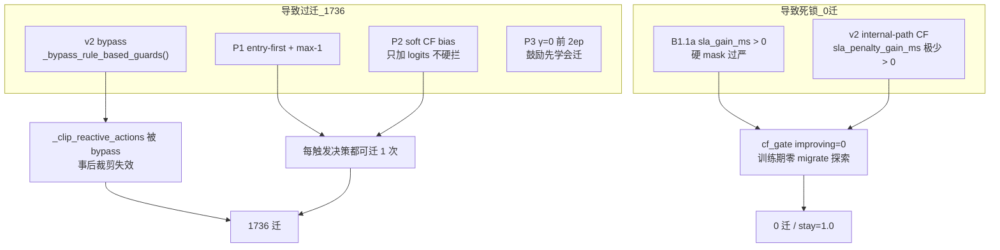
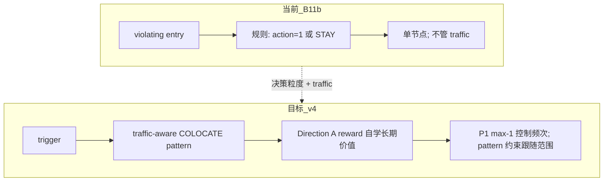
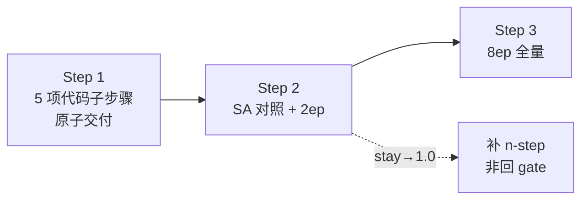

# Reward v2.1 / GAT-MARL 修改回顾与问题归因（2026-06-09 修订 v4）

**关联文档**：[docs/Reward_v21_P3总结与P4修改计划.md](docs/Reward_v21_P3总结与P4修改计划.md) · [docs/experiment_results_summary.md](docs/experiment_results_summary.md) · [test.md](test.md)

**代码真源**：`algorithms/marl_gat.py`、`core/reward.py`、`core/reward_curriculum.py`、`core/marl_reward.py`、`core/marl_state_builder.py`、`core/microservice_dags.py`、`algorithms/sa.py`、`run_reward_v21_p3_cov50.py`

**定版实验（gate 稳定）**：`experiments/medium_validation_20260607_175355_reward_v21_p3_b11b_8ep/`  
**当前最优训练（Direction A）**：`experiments/medium_validation_20260608_142708_reward_v21_p3_b11b_a_8ep/`

> **认知修订（v4）**：B11b 后 gate 已退化为 **纯规则 rescue + 二元 RL**；单节点 max-1 与物理层（access Δ≪ RPC/跳）矛盾。**核心矛盾是决策粒度 vs DAG 调用关系（边 traffic 权重）**；出路是 **traffic-aware 联合迁移**，让 RL 在 COLOCATE 动作空间下自学长期收益（Direction A reward），不设单步 gate，不加额外超参。

**文档结构**：§一–§五 为历史轨迹与 B11b 前方案；§六 起为当前结论；§十–§十一、§十四（v4）为 **现行真源**。

---

## 一、修改回顾与实验轨迹

| 阶段 | 改了什么 | 推理结果 | 状态 |
|------|----------|----------|------|
| **v2.1 主线** | v2 reward + 硬护栏 **bypass** | **0 迁**，stay=1.0 | 负 reward → 学会不动 |
| **P1** | entry-first + max-1 + DAG/CF 特征 | **1758 迁**，~89k ms | 打破死锁，但几乎每步都迁 |
| **P2** | S/αβ/λ 课程 + soft CF bias | ≈P1 | 2ep 无改善 |
| **P3** | L_internal **γ 蒙眼课程** | **1736 迁**，**45.8k ms**，P95 **6.7 km** | QoS/成本改善，迁移仍过频 |
| **B1** | 无 SLA 违规 → 强制 STAY | 3533 迁（无效） | `sla_gate=0/3533`，与 Reactive 触发重叠 |
| **B1.1a 快验** | `sla_gain_ms > 0` 硬 mask | **349 迁** | 旧 ckpt + 推理期 gate，有压迁效果 |
| **B1.1a 8ep** | 同上，训练期也 gate | **0 迁**，~55k ms，P95 31 km | **摆回 v2.1 式死锁** |

**实验目录**：

| 目录 | 要点 |
|------|------|
| `medium_validation_20260607_175355_reward_v21_p3_b11b_8ep` | **B1.1b 定版**；推理 214 迁 / 7962 ms；见 §八 |
| `medium_validation_20260608_142708_reward_v21_p3_b11b_a_8ep` | **方向 A 8ep**；推理 154 迁 / 8061 ms，SLA beat 同批 SA；见 §九 |
| `medium_validation_20260608_165512_reward_v21_p3_b11b_eba_2ep` | E/B/A' 2ep 快验；132 迁 / 8441 ms，improving 1.35% ❌ |
| `medium_validation_20260608_173515_reward_v21_p3_b11b_eba_cpm0p2_2ep` | E/B/A'/C' 2ep；与 EBA 推理完全相同 |
| `medium_validation_20260605_170422_reward_v21_p3_8ep` | P3，1736 迁 / P95 6.7 km |
| `medium_validation_20260605_145403_reward_v21_p1_v1` | P1，1758 迁 |
| `medium_validation_20260605_reward_v21_softguard_reactive_8ep_v1` | v2.1 主线，0 迁 |
| `medium_validation_20260526_phaseC_softguard_v1` | Phase C 标杆，72 迁 |

---

## 二、当前问题来自哪部分修改？

不是单一模块的锅，而是 **「放开迁移动作」与「约束迁移动作」两层修改失衡**。



### 2.1 过迁（1736 迁）——主要来自 P1 + v2 bypass + soft CF

| 修改点 | 文件/机制 | 作用 |
|--------|-----------|------|
| **v2 硬护栏 bypass** | `marl_gat.py` → `_bypass_rule_based_guards()` | `_clip_reactive_actions` **直接 passthrough**，不再按 CF 裁剪「无收益迁」 |
| **P1 entry-first + max-1** | `marl_gat.py` + `marl_state_builder.py` | 每步至少允许 1 次 entry 迁，**解决 0 迁，但未定义「该不该迁」** |
| **P2 soft CF bias** | `_apply_soft_counterfactual_bias()` | 只软推 logits，**不 mask 负收益动作** |
| **P3 γ 课程** | `reward_curriculum.py` | 改善 P95/成本 ✅，但 ep0–1 γ=0 **强化「迁=好」**，未压迁移频次 |

**P3 本身不是过迁主因**，它甚至把 P95 从 31 km 拉到 6.7 km；问题是 **P1 打开了水龙头，v2 bypass 关掉了龙头**。

### 2.2 B1 无效——触发逻辑与 gate 语义重叠

| 修改点 | 问题 |
|--------|------|
| **B1** `dag_current_sla_violation()` | Reactive 仅在 **已违规** 时才有决策 → gate 几乎永不触发（`sla_gate=0/3533`） |

B1 方向对，但绑错了层：**应在「违规状态下是否值得迁」**，而非「是否违规」。

### 2.3 0 迁死锁（8ep B1.1a）——几乎全来自 B1.1a 实现方式

| 修改点 | 问题 |
|--------|------|
| **B1.1a** `_apply_cf_sla_gain_action_gate()` | 门槛 `sla_gain_ms > 0` |
| **v2 internal-path CF** | `_score_counterfactual_action()` 用 `sla_penalty_gain_ms(..., use_e2e_qos=True)`，在已违规场景下 **绝大多数候选迁 sla_gain ≤ 0** |
| **结果** | 全 epoch `cf_gate=…/0`，`migrate_opt=0/3533`，策略只学 STAY |

C1 快验 349 迁是 **旧 P3 策略 + 推理期 gate** 的混合效应，**不能**代表 8ep 训练结果。

### 2.4 应保留的部分

- **P3 γ 课程**：P95 / 报表成本改善有效，参数可保留
- **P1 协调思想**（entry-first）：历史阶段有效；**max-1 语义**在 v4 中修订为主动决策预算（§11.2.5）
- **P0 epoch_stats**：诊断必需

---

## 三、实验数据对照

### 3.1 推理段核心指标

| 配置 | 迁移 | Avg Cost | P95 | stay | 说明 |
|------|------|----------|-----|------|------|
| v2.1 主线 | 0 | — | — | ~1.0 | reward 死锁 |
| P1/P2 | 1758 | 88.9k | 31 km | 0.85 | 过迁 |
| **P3** | **1736** | **45.8k** | **6.7 km** | 0.86 | QoS 改善 |
| B1.1a C1（旧 ckpt） | 349 | 72.0k | 31 km | 0.89 | 推理期 gate |
| **B1.1a 8ep** | **0** | **55.2k** | **31 km** | **1.0** | CF gate 死锁 |
| SA（同批推理） | 14 | 9.6k | 6.6 km | — | 锚点（**早期 P3 批次**；B11b 同批 SA 为 42 迁 / 7180 ms，见 §八） |
| Phase C v1 | 72 | 17.7k | 6.6 km | 0.994 | 历史标杆 |

### 3.2 关键日志信号

| 实验 | 信号 | 含义 |
|------|------|------|
| P3 | `migrate_opt=1736/1736` | 每决策都有 migrate 选项 |
| B1 | `sla_gate=0/3533` | 无违规决策，B1 从未触发 |
| B1.1a C1 | `cf_gate=32458/0`，`migrate_opt=0/2733` | 全 mask stay，但旧策略仍产出 349 实际迁 |
| B1.1a 8ep | 全 epoch `cf_gate=…/0`，stay=1.0 | 训练期无 migrate 探索 |

---

## 四、要做什么调整？

**目标**：Phase C 量级（~72 迁 / ~17k ms）→ 再逼近 SA（~14 迁 / ~9.6k ms）。  
不要在「1736 过迁」和「0 迁死锁」之间摆荡。

### 4.1 调整 1：B1.1a → B1.1b（放宽 CF 门槛）——优先级最高

当前 gate 用 **`sla_gain_ms`**，与 v2 internal-path 的 CF 评分不一致（过严）。应改为与 v1 rule guard **同一套判据**：

```text
# 建议门槛（与 _clip_reactive_actions 对齐）
允许 migrate 当且仅当：
  score > CF_SCORE_EPS
  或 (entry 节点 ∧ sla_gain_ms > 0)
  或 lightweight_entry_rescue
```

| 改什么 | 具体 |
|--------|------|
| `_apply_cf_sla_gain_action_gate()` | 用 **`effective_sla_gain_ms > 0`** 或 **`score > CF_SCORE_EPS`**，而非裸 `sla_gain_ms > 0` |
| entry 节点 | 违规时 **至少保留 1 个最近候选**（与 Phase C / SA 对齐） |
| 环境变量 | 保留 `MARL_CF_SLA_GAIN_GATE=1`，新增 `MARL_CF_GATE_MODE=score` 便于 ablation |

**验证**：先 C1 快验 → 迁移应在 **50–200** 区间，再 8ep。

### 4.2 调整 2：v2 bypass 有条件关闭——与 B1.1b 配套

| 改什么 | 具体 |
|--------|------|
| `_bypass_rule_based_guards()` | 当 `MARL_CF_SLA_GAIN_GATE=1` 时，**训练/推理均启用 `_clip_reactive_actions`** 作第二道防线 |
| 或 | bypass 保留，但 B1.1b mask + post-clip **双重一致** |

根因是 bypass 拿掉了 Phase C 里 **事后 CF 裁剪**，单靠 mask 一端不够。

### 4.3 调整 3：P1 保留，但不再单独扛「少迁」

- **保留** entry-first + max-1（避免动作空间爆炸）
- **不再指望** P1 自己学会少迁；少迁由 **B1.1b + clip** 保证

### 4.4 调整 4：P2 soft CF——在硬 gate 下降级或关闭

硬 mask 已决定合法动作时，soft CF bias **容易与 gate 冲突**（鼓励已被 mask 的动作）。

```text
MARL_SOFT_CF_BIAS=0   # B1.1b 验证期建议先关
```

### 4.5 调整 5：P3 γ 课程——保留现参，不动

P3 已证明对 P95/成本有效；当前失败不是 γ 的问题，是 **动作合法集定义错误**。

### 4.6 废弃 / 不再投入

| 方案 | 原因 |
|------|------|
| **B1**（无违规 → STAY） | 与 Reactive 触发重叠，实测无效 |
| **λ/γ 超参排列** | 已验证无底洞 |
| **纯 B1.1a `sla_gain_ms > 0`** | 8ep 已证明 → 0 迁死锁 |

---

## 五、推荐执行顺序

```
Step 1  实现 B1.1b（score/effective_gain 门槛 + entry 例外）
Step 2  CF gate 开启时恢复 _clip_reactive_actions（或等价 post-guard）
Step 3  关 soft CF，保留 P3 参数
Step 4  C1 快验（2ep 或 inference-only）
        判据：迁移 50–200，P95 < 10 km，成本 < 20k
Step 5  通过后再 8ep 全量（tag: reward_v21_p3_b11b_8ep）
```

> **历史说明**：§四–§五 为 **B11b 实施前**（2026-06-07 前）的方案记录，**已完成**（§七）。当前后续方向以 **§六、§十–§十一、§十四（v4）** 为准。

---

## 六、一句话总结

| 现象 | 主要来自 |
|------|----------|
| **1736 过迁** | **P1 打开迁移** + **v2 bypass 关掉 rule guard** + **soft CF 只推不拦** |
| **B1 无效** | **B1 判据与 Reactive 触发重复** |
| **0 迁死锁** | **B1.1a 用 `sla_gain_ms > 0` 过严**，与 v2 internal-path CF 不兼容 |
| **P95/成本改善** | **P3 γ 课程有效，应保留** |

**下一步核心（修订 v4）**：修改史是 gate **过松→过严→B11b 规则 rescue**；RL 退化为 **STAY vs action=1**。**核心矛盾 = 决策粒度 vs DAG 边 traffic（调用关系）**——出路是 **traffic-aware 部分 colocate 联合迁移**，让 RL 在 COLOCATE 动作空间下自学长期收益（Direction A reward 覆盖迁移成本 vs 持续节省的权衡），**不设单步 gate**，不加额外超参；SA Total 仅作 **架构对等后** 的参考上界。

---

## 七、B11b 实施待办（已完成）

- [x] 实现 B1.1b（`_apply_cf_sla_gain_action_gate` 门槛 + entry 例外）
- [x] CF gate 开启时恢复 `_clip_reactive_actions`
- [x] B1.1b 验证期 `MARL_SOFT_CF_BIAS=0`
- [x] C1 快验（225 迁 / 7.8k ms，收紧版）
- [x] 8ep 全量（`20260607_175355_reward_v21_p3_b11b_8ep`：推理 ~150–214 迁 / ~8.0k ms / P95 ~4.9–8.2 km）

> P4（gate 再收紧 + 4ep 微调）已回退：4ep 未改善迁移质量，代码恢复 B11b 定版。

---

## 八、B11b 定版后：四算法推理对比与定位修正

### 8.1 推理段核心指标（`20260607_175355`，`INFERENCE_FORCE` 重跑）

来源：`experiments/medium_validation_20260607_175355_reward_v21_p3_b11b_8ep/result.md`（2026-06-08）

| Algorithm | Migrations | Avg SLA (ms) | P95 Excess (km) | Avg Total (ms) | stay_ratio |
|-----------|------------|--------------|-----------------|----------------|------------|
| **SA** | **42** | 6793 | **7.32** | **7180** | — |
| **GAT-MARL** | 214 | **6725** | 8.22 | 7962 | 0.982 |
| DQN | 640 | 7001 | 12.20 | 15249 | — |
| Nearest | 893 | 12902 | 4.91 | 211770 | — |

**定位修正（重要）**：

- GAT **Avg Total 高于 SA**（7962 vs 7180，约 **+11%**），**不能说「综合最优」**。
- 准确表述：**优于 DQN / Phase C / Nearest 等学习型基线**；**SLA 与 SA 接近且略优**。
- **SA 对比需谨慎**：SA 每步 **全局联合搜索**（可 colocate 多节点）；GAT-MARL 受 **P1 max-1 + 单节点 gate** 约束——要求 GAT Total ≤ SA×1.05 **在架构不对等时过于苛刻**（见 §10.5）。

### 8.2 成本分解（单次决策均值）

| Algorithm | Avg Migration | Avg SLA | Avg Tearing | Avg L_internal | **Avg Total** |
|-----------|---------------|---------|-------------|----------------|---------------|
| **SA** | **95** | 6793 | **62** | **228** | **7180** |
| **GAT** | 626 | **6725** | 136 | 474 | 7962 |
| DQN | 7836 | 7001 | 63 | 346 | 15249 |

**差距归因**（GAT − SA，按分项）：

| 分项 | GAT 相对 SA | 说明 |
|------|-------------|------|
| SLA | **−68 ms**（略优） | entry rescue 有效，但幅度小 |
| Migration | **+531 ms/dec** | 214 次 vs 42 次迁，单次均值也高 |
| Tearing | **+74 ms** | 多拆 / 多跨服边 |
| L_internal | **+246 ms** | 拓扑关键路径更长 |
| **Total** | **+782 ms** | SLA 收益不足以抵消迁 + 拓扑成本 |

### 8.3 按 DAG 类型（GAT 推理）

| DAG type | migrations | decisions | avg_total_cost_ms |
|----------|------------|-----------|-------------------|
| Compute_Heavy_DAG_2 | 34 | 968 | 11570 |
| Data_Heavy_DAG_1 | 68 | 594 | 2721 |
| FanIn_Aggregator_1 | 112 | 545 | 7267 |

FanIn / Compute_Heavy 迁频与成本仍偏高——后续应做 **traffic-aware 部分 colocate**（§11.2），而非「gate 内学 stay」。

### 8.4 与历史标杆对照

| 配置 | 迁移 | Avg Total | P95 | 说明 |
|------|------|-----------|-----|------|
| P3 无 gate | 1736 | 45.8k | 6.7 km | 过迁 |
| B11b 8ep（本定版） | 214 | 7962 | 8.2 km | 稳定区间 ✅ |
| Phase C v1 | 72 | 17.7k | 6.6 km | 历史学习型标杆 |
| SA（同批） | 42 | 7180 | 7.3 km | **成本 / QoS 搜索锚点** |

B11b 已解决「1736 过迁 ↔ 0 迁死锁」摆荡；**下一矛盾**见 §十–§十一（v4：traffic-aware 联合迁）。0608 实验见 §九。

---

## 九、0608 阶段性汇总：已做修改与实验结果

### 9.1 已做修改（按层次）

| 层次 | 改动 | 意图 | 模块 |
|------|------|------|------|
| **B11b 定版** | CF gate + clip + 关 soft CF | 解决 1736 过迁 ↔ 0 迁死锁 | `marl_gat.py` |
| **方向 A** | 训练目标 = `-total_cost_ms/10000`，γ=1，关 agent λ | Critic 与 SA/报表 KPI 同量纲 | `marl_reward.py`、`reward_curriculum.py`、`marl_gat.py` |
| **E** | CF gate 评分用 1.0× 迁移成本（报表仍 1.5×） | 减轻 gate 过严 | `marl_gat.py` → `_cf_migration_mult_for_scoring()` |
| **B** | Reactive trigger 第三维 `1 + min(excess/SLA, 2)` | 改善 GAT 表示 | `marl_state_builder.py` |
| **A'** | Reactive urgency distance dense bonus | 给迁移动作更密信号 | `marl_reward.py` |
| **C'** | 训练期 `MARL_CF_TRAIN_SCORE_FLOOR=-0.2` | 略增 improving 槽位 | `marl_gat.py` |

### 9.2 推理段实验对照

| 配置 | 目录 | 迁移 | Avg Total | Avg SLA | vs 同批 SA |
|------|------|------|-----------|---------|------------|
| **B11b 8ep** | `20260607_175355` | 214 | **7962** | 6725 | Total **+11%**，SLA 略优 |
| **方向 A 8ep** | `20260608_142708` | 154 | 8061 | **6145** | Total +8%，**SLA beat SA**（9217） |
| **E/B/A' 2ep** | `20260608_165512` | 132 | 8441 | 6630 | Total +18%，improving **1.35%** ❌ |
| **E/B/A'/C' 2ep** | `20260608_173515` | 132 | 8441 | 6630 | 与 EBA **推理完全相同** |

**阶段性结论（修订）**：

- B11b 已将系统稳定在「50–200 迁、不死锁」区间，但 **Avg Total 仍高于 SA（约 +8%～+18%）**。
- 方向 A 8ep：**SLA 优、Total 次优**（8061 ms / 154 迁）。
- E/B/A'/C' 快验未改善 Total；**improving ratio 不是有效 gate 诊断指标**（见 §10.1）。
- **在单节点决策架构未改前，不宜继续堆 gate 判据 / RL 侧 patch 并期待 beat SA Total**。

### 9.3 快验验收（E/B/A'/C'）— 指标修订

| 判据 | EBA 2ep | EBA+C' 2ep | 备注 |
|------|---------|------------|------|
| improving ≥ 3% | ❌ 1.35% | ❌ 1.53% | **误导性指标**；≡ 有 migrate 选项的 agent 数（§10.1） |
| 推理迁移 50–200 | ✅ 132 | ✅ 132 | |
| `sla_improving_action_count > 0` | ❌ 0 | ❌ 0 | CF score 路径几乎从未触发 |
| Total vs SA | ❌ +18% | ❌ +18% | |

---

## 十、为何效果仍不好？（根因，v2 诊断 + v4 补全）

### 10.1 B11b gate 的实际行为：纯规则，不是 CF 评分筛选

此前文档（§10.2 旧版）称「CF score 不含 tearing/L_internal/access」——**不准确**。v2.1 下 `sla_gain_ms` 经 `sla_penalty_gain_ms(..., use_e2e_qos=True)` 计算，**已含 access + L_internal**（经 QoS 超额与距离超额进入二次惩罚）。

真正的问题是 **QoS 200× 等效 km 放大 + 二次方** 使 `sla_gain_ms` 在单节点 counterfactual 下 **几乎恒 ≤ 0**，general 路径（`sla_gain > 0 && score > floor`）**从不触发**。gate 实际行为由 **硬编码规则** 决定：

```text
# _cf_migrate_action_allowed，gate_mode=score
violating entry ∧ action==1  →  True（无条件放行，与 score 无关）
其余 migrate 槽位            →  False（sla_gain/score 路径走不通）
```

叠加 **P1 entry-first**（`build_marl_action_mask`：非 entry 仅 STAY）：

| 观察 | 含义 |
|------|------|
| `improving_slots ≡ agents_with_migrate_option_count`（1:1） | improving ratio **不是**「通过评分的候选占比」，而是 **有 migrate 选项的 agent 占比** |
| 每 agent 恰 1 个合法迁移动作 | 恒为 **action=1**（最近候选） |
| 非 entry 节点 | **永无** migrate 选项 |
| 所有 improving slots | 均为 **violating entry 的无条件 rescue** |

**结论**：B11b gate 在 Reactive 下是 **「violating entry → 允许 action=1；其余 STAY」** 的纯规则系统，**与 CF score 几乎无关**。日志里 improving ~1.5% 描述的是 **决策步中有 violating entry 的比例**，不能解读为「1.5% 迁移候选通过评分」。

### 10.2 为何换 gate 判据（CF / Δtotal / Δphysical）不能根治

修改史是 gate **过松（v2 bypass / P1）→ 过严（B1.1a）→ B11b 窄平衡**。但窄平衡靠的是 **规则 rescue**，不是找到了更好的 **连续评分**。

| 判据 | 单节点 counterfactual 下的行为 |
|------|-------------------------------|
| **CF score**（现 B11b） | `sla_gain≈0` → 仅 violating entry action=1 规则放行 |
| **Δtotal**（含 `sla_penalty_ms`） | QoS 二次 + 200× 放大；单节点迁常 **增大** L_internal → QoS 惩罚暴涨 → **Δtotal ≪ 0，几乎全部阻止**（与 sla_gain 同向） |
| **Δphysical**（不含 SLA） | 避开 SLA 爆炸，但 **单节点** access 收益（Δkm/200 ≈ 0.1 ms 级）仍 **≪** 跨服 RPC 基线（2 ms/跳）→ 仍倾向阻止 |

**核心矛盾不在「gate 用哪个标量」**，而在 **QoS 惩罚函数的数值性质** 与 **单节点独立决策** 的组合：只要用 **含 SLA/QoS 的 counterfactual** 评估单节点迁，结论几乎都是「不要迁」；规则 rescue 强行打开一条通道，但 RL 只能在 rescue 通道里做二元选择。

**数值示例（单节点 entry 20km→5km，示意）**：

- access 改善：~0.075 ms（距离/200 量级）
- internal path 因跨服边增加：~0.5 ms+
- SLA QoS 项（e2e，`qos_excess_km = qos_excess_ms × 200`）：惩罚可从 ~10³ ms **跃升至 ~10⁵–10⁶ ms 量级**
- → 任何 **含 SLA** 的单节点 Δ 判据：**阻止**；规则 rescue：**无条件放行**——中间无连续可调区间

**Gate 侧解法**（不改 QoS 公式本身）：~~联合 trial 上用 L1 Δphysical 作 gate~~ → 不可行（§11.3：典型 COLOCATE 单步 Δphysical **多为正**）。正确做法：不设单步 gate，让 Direction A reward 自学长期收益；若 RL 仍学不到 STAY，再考虑 n-step return（§11.7），而非回到 L1 gate。

### 10.3 RL 决策空间：已退化为单二元选择

§10.1 旧版称「RL 只在 ~1.5% 槽位学迁 vs 留」——仍不够准确。实际更极端：

```text
若 agent 是 violating entry：  { STAY, action=1 }   # 二选一，无 action=2/3
若 agent 是非 entry：          { STAY }              # 无 migrate
```

GAT 图注意力、4 动作空间、多候选特征——在 Reactive + P1 + B11b 下 **几乎全部被 gate/mask 废弃**。Direction A 的 `-total_cost_ms` 训练 **无法创造** 不存在的动作多样性。

### 10.4 第四层根因：物理层 + 决策粒度矛盾

此前「三层分裂」（gate / RL / SA）**缺第四层**——**物理层与架构层**：

| 物理事实 | 量级 |
|----------|------|
| `access_latency = distance/200 + 2ms` | BASE_ROUTER_DELAY **2 ms 占 95%+** |
| 单节点迁近 1 km | access 改善 **~0.005 ms**；距变 15 km 亦仅 **~0.075 ms** |
| 跨服 RPC 基线 | **~2 ms/跳**（`edge_effective_latency_ms`） |
| 单节点迁 | 常 **增加** L_internal / tearing |

**物理结论**：在 **逐节点独立迁** 架构下，「只迁 entry、下游不动」**几乎不可能** 物理净收益——需要 **entry + 高 traffic 下游 colocate**（§11.2）。且 **边 traffic 分布极不均匀**（`core/microservice_dags.py`），联合迁必须以 **traffic 权重** 而非拓扑 hop 数决定跟随哪些节点。

**traffic 数据示例**（原始 cluster traffic；reward 中经 `EDGE_RPC_SCALING` 缩放，**排序不变**）：

| DAG | 边 | traffic | 对比 |
|-----|-----|---------|------|
| FanIn_Aggregator_1 | MS_63670→MS_37691 | 25609 | vs MS_52363→MS_37691 **7562**（≈3.4:1） |
| FanOut_Broadcaster_2 | MS_4660→MS_55085 | 31764 | vs MS_4660→MS_8234 **1268**（≈25:1） |
| Compute_Heavy_DAG_1 | MS_9570→MS_20664 | 24106 | vs MS_20664→MS_7103 **5374**（≈4.5:1） |
| FanIn_Aggregator_3 | MS_4660→MS_46825 | 23240 | vs MS_4660→MS_51052 **2**（极低，不应为此同迁） |

拆 traffic=31764 的边 vs traffic=2 的边，跨服 RPC 代价可差 **25 倍**（`edge_effective_latency_ms ∝ traffic`）。

### 10.5 SA 对比基准的审慎解读

| 维度 | SA | GAT-MARL（B11b + P1） |
|------|-----|------------------------|
| 搜索单位 | **整图 assignment** 邻域（可一次 colocate 全部 deployable） | **逐 agent**，max-1，仅 violating entry 可迁 |
| 迁移语义 | 一次决策可 **多节点同服** | 一步 **最多 1 节点**，且仅 action=1 |
| 成本目标 | 完整 `total_cost_ms` | 同口径报表，但 **决策能力不对等** |

SA 推理 ~42 迁 / 7180 ms 是 **联合搜索能力** 下的结果。要求 GAT-MARL 在 **单节点框架** 下 Total ≤ SA×1.05 **不公平**；更合理的目标是：

- **架构升级后**（联合迁移）再与 SA 比 Total
- 当前框架下以 **学习型基线（DQN / Phase C）+ SLA 质量** 为主评估

### 10.6 E/B/A'/C' 为何无效（一致解释）

| 步骤 | 为何无效 |
|------|----------|
| **E** | CF score 路径本就不触发；仅影响未使用的 general 分支 |
| **B** | trigger embedding；gate 为规则，不看 embedding |
| **A'** | bonus 在 reward；决策空间无多候选 |
| **C'** | train floor；general 路径仍不触发 |
| **方向 A** | 训练目标对齐 total，但 **actor 只有 STAY vs action=1** |

**一句话**：B11b 解决了 **1736 过迁 ↔ 0 迁死锁**，但把系统锁进 **规则 rescue + 二元 RL**；继续调 gate 判据是在 **错误抽象层** 上优化。

---

## 十一、后续方向（修订 v4：traffic-aware 联合迁移）

**原则**：

1. **停止**在单节点 gate 上寻找更好阈值（CF / Δtotal / floor / λ sweep）。
2. **优先**改变决策语义——从「逐节点搬不搬」到 **「哪些节点一起搬到哪个服务器」**；**边 traffic 是核心依据**。
3. ~~Gate 用 L1 Δphysical~~ → **不可行**（典型 COLOCATE 单步 Δphysical 多为正，§11.3）；正确做法：不设单步 gate，Direction A reward 自学长期收益
4. Direction A 保留为联合动作空间就绪后的学习目标（reward 不变，−total_cost_ms/10000）。

### 11.1 明确不做（单节点框架下）

| 方案 | 原因 |
|------|------|
| gate floor / λ / C' sweep | B11b 已是规则 rescue；CF score 路径不触发 |
| 换 gate 判据（含 SLA 的 Δtotal / sla_gain） | 单节点 CF 下同向阻止；improving ratio 误导 |
| **机械 full colocate / 1-hop colocate** | 忽略 traffic 分布；FanIn_Aggregator_3 会多迁 traffic=2 的边 |
| SA-BC / Δcost 特征 / Value gap（当前 gate 下） | 仅 STAY vs action=1 |
| 表示 / 信用分配（当前 gate 下） | 瓶颈在动作空间，不在 GAT 表示 |
| 硬 KPI：Total ≤ SA×1.05（单节点 max-1） | 架构不对等（§10.5） |
| Full pipeline（100 车） | Reactive 联合迁未验证前不做 |

### 11.2 优先级 1：traffic-aware 联合迁移（colocate 原子动作）

#### 11.2.1 决策语义

**原子动作**：violating entry × `{ STAY, COLOCATE(server_k, pattern) }`

- 每个候选服务器 `k` 对应一个 **colocate pattern**（要同迁的节点集合）
- pattern 由 **边 traffic 排序** 驱动，**不是**机械「1-hop 邻居」或「全 deployable」
- **mode A（默认）** 对所有 DAG family 通用；mode B/C 可按 family 做 ablation，非 Step 1 目标

#### 11.2.2 Colocate 模式：默认 mode A

| 模式 | 语义 | 用途 |
|------|------|------|
| **A — critical-edge colocate** | 仅同迁 `traffic > T_critical` 的边 **两端** 节点 | **推荐默认**；唯一的超参 T_critical 从数据推导 |
| **B — path colocate** | 同迁 **traffic 加权关键路径**上节点 | 可选 ablation；实现更复杂 |
| **C — full colocate** | 同迁全部 deployable（SA colocate 邻域） | 对照 / 上界 |

**默认只用 mode A**。mode B/C 作为 ablation 对照保留定义，不作为实现目标。

**阈值**：`T_critical = median(edge_traffic) × 2`。这是唯一的新超参，且从 DAG 边 traffic 分布推导，不需手动调。

**部分 colocate 示例（FanIn_Aggregator_3）**：

```text
边 traffic：4660→46825: 23240（高）  51052→46825: 6077（中）  4660→51052: 2（极低）
合理 pattern：entry(MS_4660) + MS_46825 同迁；MS_51052 不迁（与 entry 边 traffic=2）
机械 full colocate：会不必要多迁若干节点
```

#### 11.2.3 Colocate pattern 生成算法

三种模式共享同一个生成流程，区别仅在"哪些边被选中触发同迁"。

**输入**：`entry_node`（violating entry）、`target_server`（候选服务器）、当前 `dag_assignment`（节点→服务器映射）、DAG 边集 `E` 及 traffic 权重

**输出**：`pattern_nodes`（应同迁到 target_server 的节点集合）

**通用流程**：

```text
1. 初始化 pattern_nodes = {entry_node}
2. 确定入选边集 E_selected ⊆ E（按模式 A/B/C 不同，见下）
3. 对 E_selected 中每条边 (u, v)：
     - 若 u ∈ pattern_nodes 或 v ∈ pattern_nodes：
       将 u, v 均加入 pattern_nodes（连通扩展）
4. 过滤：移除 is_external_node 的节点
5. 按迁移成本从小到大排序 pattern_nodes（先迁轻量节点，减少带宽竞争）
6. 返回 pattern_nodes
```

**Step 3 的连通扩展**是关键：不是对每条入选边独立判断"两端同迁"，而是从 entry 出发做连通传播。若 entry→A(traffic 高) 且 A→B(traffic 高)，则 A 和 B 都进入 pattern，即使 entry→B 没有直达边。这避免了"中间节点不迁导致链路断裂"的问题。

**各模式的 E_selected 定义**：

| 模式 | E_selected | 说明 |
|------|------------|------|
| **A** | `{ e ∈ E \| traffic(e) > T_critical }` | 只选高 traffic 边；T_critical = median(traffic) × 2 |
| **B** | 关键路径上的边 | 关键路径 = 从 entry 到所有 exit 的 **traffic 加权最长路径**（DAG 上可用动态规划求解）；该路径上所有边入选 |
| **C** | `E`（全部边） | 退化为全 deployable 同迁 |

**模式 A 示例（FanIn_Aggregator_3，边 traffic 分布）**：

```text
所有边 traffic：23240, 6077, 4156, 3658, 2915, 2893, 2
median = 3658，T_critical = 3658 × 2 = 7316
E_selected = {4660→46825(23240)}   # 仅此边 > 7316
连通扩展：entry(4660) + 46825 → pattern = {4660, 46825}
# 51052 不入选（4660→51052 traffic=2 < 7316，且 51052→46825=6077 < 7316）
```

**模式 B 示例（Compute_Heavy_DAG_1）**：

```text
边 traffic：9570→20664: 24106,  20664→66431: 10285,  20664→66701: 10199,  20664→7103: 5374
traffic 加权最长路径（entry→exit）：
  9570→20664→66431 = 24106 + 10285 = 34391（最长）
  9570→20664→66701 = 24106 + 10199 = 34305
E_selected = {(9570,20664), (20664,66431)}
pattern = {9570, 20664, 66431}
# 66701、7103 不在关键路径上，不跟随
```

**间接连接节点的处理**：若 A→B(高 traffic)、B→C(高 traffic) 但 A→C 无边或 traffic 低，连通扩展会将 A、B、C 都纳入 pattern。这正确——因为 B 迁移后，B→C 的跨服 RPC 代价 = traffic × edge_latency，高 traffic 边必须保持同服务器。

#### 11.2.4 主动迁移 vs 被动跟随

| 角色 | 语义 | 预算 |
|------|------|------|
| **主动迁移** | violating / 接近 violating 的 **entry** → 必须选目标 server | 计入 **主动决策**（见 P1 修订） |
| **被动跟随** | 与主动节点有高 traffic 边的下游 → 为减跨服 RPC 而同迁 | **不计入** max-1 主动预算；**迁移成本仍计入** `total_cost_ms` |

报表需区分 **`active_decisions`** 与 **`nodes_migrated`**（被动跟随增加后者、不增加前者）。

#### 11.2.5 P1 max-1 语义修订

```text
原：每步最多 1 个节点迁移
新：每步最多 1 次主动决策（entry 的 COLOCATE 选择）
    被动跟随节点不限数量，但全部 migration_delay 计入 total_cost_ms
```

#### 11.2.6 决策空间恢复（相对 B11b）

B11b：`{ STAY, action=1 }` 二元。联合迁后（示意）：

```text
{ STAY, COLOCATE(cand_1, pattern_A1), COLOCATE(cand_2, pattern_A2), COLOCATE(cand_3, pattern_A3) }
```

GAT 注意力、多候选特征、4 动作槽位 **方有意义**——每个候选 server 一个 traffic-aware pattern。

### 11.3 迁移约束：为何不需要额外的 gate

**L1 Δphysical gate 不可行**：联合迁移的收益分布在**后续多步**（L_internal / tearing 持续下降），而迁移成本是**一次性**的。在 **典型 mode-A 2 节点 COLOCATE、违规态低带宽** 下，单步 Δphysical **多为正**（数值验证见下）；若 pattern 更大或带宽更高，单步 Δphysical **理论上可为负**，但 **仍不适合** 做 step gate——因为 gate 会回到「单步判据 vs 长期收益」的根本矛盾。任何基于 **单步 Δ** 的 gate 在 COLOCATE 场景下要么 **全拦**（B1.1a 式死锁），要么 **全放**（B11b 式规则 rescue）。

**数值验证**（典型 COLOCATE，2 节点同迁到候选服务器；违规态 effective_bandwidth 偏低、Reactive×1.5）：

```text
Δmigration ≈ 73,000 ms   # entry(200MB) + follower(278MB) 同迁，带宽共享 ×1.5
ΔL_internal ≈ −500 ms    # 消除 traffic=25000 跨服边（rpc=250, base=2ms, 250×2）
Δtearing   ≈ −50 ms     # 同一边 tearing 消除
Δaccess    ≈ −0.075 ms   # 可忽略

单步 Δphysical ≈ 73,000 − 500 − 50 ≈ +72,450 ms >> 0   # 典型情形，非数学恒等式
```

迁移成本 ~73K ms 是一次性支出；L_internal 节省 ~550 ms/**触发步** 是持续收益。粗算 ~130 **触发步** 可回本——但 **决策步 ≠ 仿真步**（仅 Reactive 触发），且单步 gate 看不到滞后回报。

**正确做法：不设单步 gate，让 RL 自学长期价值**（见 §11.7 信用分配风险）。

联合迁移的约束靠三个**结构性机制** + 一个**训练目标**协同，不需要新增 gate：

| 约束来源 | 机制 | 作用 |
|----------|------|------|
| **触发约束** | Reactive 仅在 SLA 违规时触发决策 | 非违规不决策，天然防止无意义迁移 |
| **频次约束** | P1 max-1 每步最多 1 次 **主动** COLOCATE | 控制迁移节奏 |
| **pattern 约束** | mode A 的 T_critical 过滤低 traffic 边 | 只跟随高 traffic 节点，避免不必要迁移 |
| **长期价值** | Direction A reward = −total_cost_ms/10000 | RL 自学「现在付出迁移成本 → 后续持续节省」的权衡 |

前三个不引入新超参；第四个是 RL 训练目标。**与 SA 的差异（重要）**：SA 每步用 **即时 Δtotal < 0** 接受邻域移动（`sa.py` 搜索 + 全量 cost 评估），**不是** multi-step RL 信用分配；SA 能 colocate 是因为 **邻域含联合 trial + 即时 cost 比较**，而非「不设 gate 靠长期 reward」。GAT 需靠 Direction A 在 **多步触发** 上积累收益——这是 v4 最大不确定性（§11.7）。

**对 B11b 现有 gate 的处理**：B11b 的 `_apply_cf_sla_gain_action_gate()` 和 `_clip_reactive_actions()` 在 COLOCATE 动作空间下应**关闭**。原因：
1. 它们是单节点 CF gate，在联合 trial 上无定义
2. 即使强行适配，典型单步 Δ 多为正会导致全部阻止
3. COLOCATE 的 pattern 约束已替代 gate 的"过滤不合理的迁移"功能

**新增超参：无**。T_critical 从 DAG 边 traffic 分布推导（`median × 2`），不需手动设定。

### 11.4 Stateful 节点：不需要额外优先级机制

`microservice_dags.py` 中 `is_stateful` / `state_mb` 直接影响 `migration_delay_ms`（如 MS_27421 state_mb=512 vs MS_4660 state_mb=0）。但 **不需要为此设计额外的排序/过滤机制**——因为：

1. **migration_delay_ms 已在 total_cost_ms 中**：Direction A reward = −total_cost_ms/10000，RL 自然感知到迁移 stateful 节点成本更高
2. **COLOCATE pattern 由 traffic 决定**：一个 stateful 节点是否跟随，取决于它与 entry 之间边的 traffic 是否超过 T_critical，而非人为排序
3. **不需要 stateful × traffic 综合评分**：引入新评分函数 = 引入新超参，与精简原则矛盾

**正确的行为由 RL 自学**：如果同迁一个 stateful 节点的成本（高 migration_delay）大于收益（L_internal 下降），Direction A reward 会让 RL 学到选择 STAY 而非 COLOCATE 到该服务器。如果收益大于成本，RL 也会学到选择 COLOCATE。

**唯一需要的处理**：COLOCATE 动作执行时，pattern 内所有节点按 `migration_delay_ms` 从小到大迁移（先迁轻量节点，减少并发带宽竞争），这是工程优化而非算法机制。

### 11.5 Hybrid 快验

| 做法 | 说明 |
|------|------|
| **纯 SA mode-A 对照** | SA 使用 traffic-aware 部分 colocate 邻域（与 mode A 同规则），验证 pattern 本身能否接近 SA Total |
| **验收** | Total 趋势下降；**高 traffic 边同服比例** |

### 11.6 Direction A 训练（联合空间就绪后）

- `-total_cost_ms/10000`、γ=1、关 agent λ — **保留**
- **前提**：actor 面对 `{ STAY, COLOCATE×K}`，非 STAY vs action=1
- **不引入额外机制**：SA-BC / Δcost 特征 / Value gap 等待 RL 在联合动作空间下收敛后再评估是否需要

### 11.7 暂缓 / 降级与信用分配风险

| 原方案 | 处置 |
|--------|------|
| **L1 Δphysical gate** | **不可行**（§11.3：典型单步 Δphysical 多为正，gate 会阻止 COLOCATE） |
| 单节点 Δphysical gate | 同上，已由 COLOCATE pattern + Direction A reward 替代 |
| E/B/A'/C' | 停止叠加 |
| stateful 排序/过滤机制 | 不需要（§11.4：RL 通过 migration_delay_ms 自然感知成本） |
| 表示 / DAG conditioning alone | 联合动作空间前非瓶颈 |
| **n-step return / episode 级 reward** | **COLOCATE 默认开启**（2ep stay→1.0 后启用）；`MARL_NSTEP_N=16`，`MARL_NSTEP_GAMMA=1.0` |

**信用分配风险（v4 最大训练不确定性）**：

- COLOCATE 当步 `total_cost_ms` 可能 **+10⁴ ms 量级**（migration 主导），L_internal 节省要在 **后续多次 Reactive 触发** 才体现。
- Direction A 当前为 **单步** `−total_cost_ms/10000`；Critic 若无多步 return，可能学到 **永远 STAY**（再现 B1.1a 式死锁）或 **随机过迁**（再现 P1 式过迁）。
- **COLOCATE 训练（已实现）**：被动 follower 被 mask 为 STAY 但实际同迁 → memory 存 `policy_agent_mask`，`_optimize_marl` 仅对 **active entry** 回传 policy 梯度；actions 按 `node_names` 对齐。
- **缓解路径**（按优先级）：① Step 2 SA mode-A 验证 pattern ✅；② 2ep 监控 → stay→1.0 **已触发**；③ **n-step TD 已实现**（`MARL_NSTEP_RETURN=1`，N=16）；④ **不回** L1 gate。

### 11.8 成功标准与预期效果

**成功标准**：

| 阶段 | Primary | Secondary |
|------|---------|-----------|
| **Phase 1：原型** | COLOCATE 动作空间可用（非退化为 STAY vs action=1） | **高 traffic 边同服务器比例 ≥ 90%**；迁移 50–200 |
| **Phase 2：与 SA 可比** | Total **接近** SA（架构均有联合迁） | Avg SLA ≤ SA；P95 ≤ SA |
| **当前单节点框架** | 优于 DQN / Phase C | 不以 beat SA Total 为硬 KPI |

**若实现顺利，预期（待实验验证，非承诺 KPI）**：

| 指标 | B11b 现状 | 联合迁 hypothesis |
|------|-----------|-------------------|
| 决策空间 | STAY vs action=1 | STAY + K 个 COLOCATE pattern |
| 迁移次数 | ~214 | ~40–80（少于 B11b、多于 SA 42 亦可接受） |
| Avg Total vs SA | +11% | **接近** SA（架构对等后） |
| DAG 调用关系 | entry rescue 不管下游 | 高 traffic 边同服；低 traffic 边允许跨服 |
| Proactive | 难扩展 | 联合 colocate 规划可前置触发 |

### 11.9 推荐路线（修订 v4）

```
B11b 规则 rescue + 二元 RL ✅（非终态）
单节点 patch（A/E/B/A'/C'）❌
L1 Δphysical gate ❌（典型单步 Δphysical 多为正，§11.3）
         ↓
Step 1【原子交付】COLOCATE 动作空间 + P1 主动决策语义
         │  核心改动：
         │  · 动作空间：{ STAY, COLOCATE(cand_k, pattern) }
         │  · Pattern 生成：mode A（traffic > T_critical 边的连通扩展）
         │  · P1 修订：max-1 主动决策（被动跟随不计预算）
         │  · 关闭 B11b 的 CF gate / clip（单节点 gate 对 COLOCATE 无定义）
         │  · Direction A reward 不变（−total_cost_ms/10000）
         │  新增超参：仅 T_critical（= median(edge_traffic) × 2，数据推导）
         ↓
Step 2  SA mode-A 对照 + Direction A 2ep 快验
         ↓
Step 3  Direction A 8ep 全量
         ↓
Phase 2 与 SA 公平比 Total → Proactive
```



**一句话**：联合迁移不是让 gate 更宽松，而是 **重新定义决策**——**哪些节点应一起搬到哪台服务器**；**边 traffic** 决定跟随谁，**Direction A reward** 让 RL 自学长期收益。不设单步 gate，不加额外超参。

---

## 十二、环境与启动命令（备忘）

### 12.1 B11b 定版（legacy，Direction A 关闭时）

```text
REWARD_SCHEME=v2
MARL_P1=1
MARL_CF_SLA_GAIN_GATE=1
MARL_CF_GATE_MODE=score
MARL_SOFT_CF_BIAS=0
MEDIUM_VALIDATION_REACTIVE_ONLY=1
REWARD_V2_CURRICULUM=1
REWARD_V2_INTERNAL_GAMMA=1
MARL_TRAIN_TOTAL_COST=0
```

### 12.2 方向 A — 单节点 B11b（legacy，COLOCATE 实施前）

> **历史配置**：0608 Direction A 8ep 使用；**COLOCATE v4 实施后勿用**（gate 与 COLOCATE 冲突，见 §12.6）。

```text
REWARD_SCHEME=v2
MARL_P1=1
MARL_CF_SLA_GAIN_GATE=1
MARL_CF_GATE_MODE=score
MARL_SOFT_CF_BIAS=0
MEDIUM_VALIDATION_REACTIVE_ONLY=1
MARL_TRAIN_TOTAL_COST=1              # Direction A
MARL_CF_PHYSICAL_MIGRATION_COST=0    # 关闭 E
MARL_REACTIVE_DENSE_BONUS=0          # 关闭 A'
REWARD_V2_CURRICULUM=0
REWARD_V2_INTERNAL_GAMMA=0
```

实验 tag：`reward_v21_p3_b11b_a_8ep`

```powershell
$env:MARL_CF_PHYSICAL_MIGRATION_COST="0"
$env:MARL_REACTIVE_DENSE_BONUS="0"
python -u run_reward_v21_p3_cov50.py
```

### 12.3 E/B/A'（launcher 默认 — **单节点 patch，已暂停**）

> v2 认知：E/B/A'/C' 在 B11b 规则 gate 下无效；**勿再 8ep**。默认 env 待联合迁移方案落地后清理。

```text
MARL_TRAIN_TOTAL_COST=1
MARL_CF_PHYSICAL_MIGRATION_COST=1    # E
MARL_REACTIVE_DENSE_BONUS=1          # A'
```

实验 tag：`reward_v21_p3_b11b_eba_2ep` / `_eba_cpm0p2_2ep`

| 步骤 | 模块 | 改动 |
|------|------|------|
| **E** | `algorithms/marl_gat.py` | `_cf_migration_mult_for_scoring()` → Reactive CF 用 1.0x |
| **B** | `core/marl_state_builder.py` | Reactive trigger 第三维 `1 + min(excess/SLA, 2)` |
| **A'** | `core/marl_reward.py` | Reactive urgency bonus；Direction A 分支 `train_signal + bonus` |
| **C'** | `algorithms/marl_gat.py` | 训练期 `MARL_CF_TRAIN_SCORE_FLOOR`（可选 env） |

### 12.4 方向 A 代码改动（0608，已完成）

| 模块 | 改动 |
|------|------|
| `core/marl_reward.py` | `train_total_cost_enabled()`、`total_cost_training_signal()`；`training_reward = −total_cost_ms/10000`，关 agent λ penalty |
| `core/reward_curriculum.py` | `MARL_TRAIN_TOTAL_COST=1` 时跳过 P2/P3 课程，强制 `internal_path_gamma=1` |
| `algorithms/marl_gat.py` | CF gate 仍用 `lambda_schedule`；`calculate_marl_rewards` 用 `train_lm=0`；启动日志 `A: train_total_cost=on` |
| `run_reward_v21_p3_cov50.py` | 默认开启 A + E/B/A'；tag `reward_v21_p3_b11b_eba_*` |

### 12.5 常用命令

**推理重跑 B11b 定版 ckpt**（legacy 训练，无 A）：

```powershell
$env:MARL_TRAIN_TOTAL_COST="0"
$env:REWARD_V2_CURRICULUM="1"
$env:REWARD_V2_INTERNAL_GAMMA="1"
$env:MEDIUM_VALIDATION_STAMP="20260607_175355_reward_v21_p3_b11b_8ep"
$env:MEDIUM_VALIDATION_INFERENCE_ONLY="1"
$env:MEDIUM_VALIDATION_INFERENCE_FORCE="1"
python -u run_reward_v21_p3_cov50.py
```

**方向 A 8ep 训练**：

```powershell
$env:MARL_CF_PHYSICAL_MIGRATION_COST="0"
$env:MARL_REACTIVE_DENSE_BONUS="0"
python -u run_reward_v21_p3_cov50.py
```

**EBA 2ep 快验（已完成，未通过）**：

```powershell
$env:MEDIUM_VALIDATION_MARL_EPOCHS="2"
python -u run_reward_v21_p3_cov50.py

# +C'
$env:MARL_CF_TRAIN_SCORE_FLOOR="-0.2"
python -u run_reward_v21_p3_cov50.py
```

### 12.7 COLOCATE + n-step 2ep 快验（Step 2b，现行）

```text
MARL_COLOCATE_REACTIVE=1
MARL_NSTEP_RETURN=1
MARL_NSTEP_N=16
MARL_NSTEP_GAMMA=1.0
MARL_CF_SLA_GAIN_GATE=0
MARL_TRAIN_TOTAL_COST=1
SA_COLOCATE_MODE_A=1
```

实验 tag：`reward_v21_p4_colocate_a_nstep_2ep`  
目录：`experiments/medium_validation_20260609_163745_reward_v21_p4_colocate_a_nstep_2ep/`

**Step 2b 结果摘要**（vs 无 n-step `154837`）：

| 指标 | 无 n-step | n-step N=16 |
|------|-----------|-------------|
| 推理迁移 | 0 | **3** |
| stay_ratio | 1.0000 | **0.9998** |
| colocate_active（推理） | 0 | **3** |
| Avg Total（推理） | 55212 ms | 60473 ms |
| train ep0 迁移 | 354 | 305 |

结论：n-step **打破完全死锁**，但未达 Step 2 验收（50–200 迁、stay 显著 <1）。下一步可试 **N=32~64** 或 **4ep** 后再判是否上 8ep。

---

### 12.6 COLOCATE v4 训练 / 快验（基础 env）

> Step 1 代码落地后使用。**必须**关闭 B11b 单节点 CF gate；旧 B11b / Direction A ckpt **不可**直接加载。

```text
REWARD_SCHEME=v2
MARL_COLOCATE_REACTIVE=1             # feature flag：COLOCATE 动作空间 + 关 gate
MARL_P1=1
MARL_CF_SLA_GAIN_GATE=0              # COLOCATE 下关闭（或由 flag 强制 bypass）
MARL_SOFT_CF_BIAS=0
MEDIUM_VALIDATION_REACTIVE_ONLY=1
MARL_TRAIN_TOTAL_COST=1              # Direction A
MARL_CF_PHYSICAL_MIGRATION_COST=0
MARL_REACTIVE_DENSE_BONUS=0
REWARD_V2_CURRICULUM=0
REWARD_V2_INTERNAL_GAMMA=0
# T_critical = median(edge_traffic)×2，代码内默认推导，无需 env
```

实验 tag 建议：`reward_v21_p4_colocate_a_2ep` / `reward_v21_p4_colocate_a_8ep`

```powershell
$env:MARL_COLOCATE_REACTIVE="1"
$env:MARL_CF_SLA_GAIN_GATE="0"
$env:MARL_TRAIN_TOTAL_COST="1"
$env:MARL_CF_PHYSICAL_MIGRATION_COST="0"
$env:MARL_REACTIVE_DENSE_BONUS="0"
python -u run_reward_v21_p3_cov50.py
```

---

## 十三、待办（修订 v4）

- [x] B11b 定版（gate + clip + 关 soft CF）
- [x] 四算法推理对比与成本分解
- [x] 方向 A 8ep；E/B/A'/C' 快验（单节点 patch 无效）
- [x] 根因 v2/v3/v4：gate=规则 rescue；traffic-aware 联合迁；去掉 L1 gate；精简超参
- [x] **Step 1【原子交付】**：COLOCATE 动作空间 + P1 主动决策 + 关闭 B11b gate（`core/colocate_pattern.py`、`marl_gat.py`、`run_reward_v21_p3_cov50.py`）
- [x] **Step 2** SA mode-A 对照 + Direction A 2ep 快验（`154837`：GAT stay→1.0 / 0 迁；SA 7655 ms ✅）
- [x] **Step 2b** n-step（N=16）+ 2ep 重验（`163745`：推理 3 迁 / stay 0.9998 / 60473 ms — **部分改善，未达 50–200**）
- [ ] **Step 3** Direction A 8ep 全量（**暂缓**：stay≈1.0，需加大 N 或更多 ep 再试）
- [ ] 架构对等后与 SA 比 Total；满意后 Proactive

---

## 十四、可行性评估与代码实施（v4）

### 14.1 按修改后文档改代码，能否提升算法效果？

**结论：有条件地「能」——前提是 Step 1 完整落地且 Step 2 验证 pattern 物理性后再训 RL。**

| 维度 | 判断 | 依据 |
|------|------|------|
| **问题诊断** | ✅ 准确 | §十：B11b=规则 rescue + 二元 RL；单节点迁与 RPC/traffic 物理矛盾；SA 架构不对等 |
| **改对层** | ✅ 是 | 从「调 gate / patch RL」→「COLOCATE 决策粒度 + traffic pattern」；对准 §8.2 中 L_internal +531 ms/dec 差距 |
| **工程可行** | ✅ 高 | pattern 纯函数、P1 挂钩点明确、Direction A 已就绪、SA 有 colocate 邻域可参考 |
| **训练成功** | ⚠️ 不确定 | 单步 −total_cost 对 COLOCATE 当步极负；需 2ep 验证 stay 是否→1.0（§11.7） |
| **相对 SA Total** | ⚠️ 待验证 | 架构对等后 **有机会** 从 +8%～+11% 拉近；**非承诺 KPI** |

**预期改善路径（若实验顺利）**：

1. **L_internal / tearing 下降**：高 traffic 边同服 → 消除跨服 RPC（当前 GAT L_internal 474 vs SA 228 ms/dec）
2. **迁移次数下降、单次质量上升**：~214 次单节点 rescue → ~40–80 次 **主动** COLOCATE（被动跟随另计）
3. **Avg Total 向 SA 靠拢**：7962 ms → 架构对等后 **接近** 7180 ms（§11.8 hypothesis）

**不能改善的情况**（应及早从 2ep 信号识别）：

- stay_ratio → 1.0：信用分配失败 → 补 n-step，而非回 gate
- nodes_migrated 仍 ≫200：pattern 过宽或 ε 探索过强 → 收紧 T_critical 或降探索
- SA mode-A 对照 Total 仍远高于 SA：pattern 算法或 cost 模型问题 → **先修 Step 1**，勿上 8ep

**与继续单节点 patch 对比**：E/B/A'/C' 已证无效；**v4 是唯一对准根因（决策粒度）的代码路径**，值得实施；成功与否取决于 RL 能否学会长期权衡，而非方案方向错误。

### 14.2 实施步骤有几步？

**对外：3 个主步骤**（与 §11.9、§十三 一致）

| 主步骤 | 内容 | 产出 / 验收 |
|--------|------|-------------|
| **Step 1** | COLOCATE 动作空间 + P1 主动决策 + 关 gate（**原子交付，不可拆训**） | 代码可跑；动作非 STAY vs action=1 |
| **Step 2** | SA mode-A 对照 + Direction A **2ep** 快验 | pattern 降 Total；2ep 迁移 50–200、stay 非 1.0 |
| **Step 3** | Direction A **8ep** 全量 | Total 接近 SA；高 traffic 边同服率 ≥90% |

**Step 1 代码子步骤（5 项，须同 PR / 同次交付）**：

| 子步骤 | 模块 | 改动要点 |
|--------|------|----------|
| **1.1** | `core/colocate_pattern.py`（新建） | mode A pattern 生成；T_critical = median×2；连通扩展 ✅ |
| **1.2** | `algorithms/marl_gat.py` | 动作 mask / 落地：`{ STAY, COLOCATE(cand_k, pattern_k) }`；执行 pattern 批量迁 ✅ |
| **1.3** | `algorithms/marl_gat.py` | P1：`max-1` → **1 次主动 COLOCATE**；被动跟随不计 active_decisions ✅ |
| **1.4** | `algorithms/marl_gat.py` | `MARL_COLOCATE_REACTIVE=1` 时 bypass CF gate + reactive clip ✅ |
| **1.5** | `run_reward_v21_p3_cov50.py` + validation | env §12.6；报表 `colocate_active_decisions` / `high_traffic_colocated_ratio` ✅ |

**Step 2 附加（非 Step 1 代码，但同属 Step 2 实验）**：

| 子步骤 | 模块 | 改动要点 |
|--------|------|----------|
| **2.1** | `algorithms/sa.py` | 邻域改为 **mode-A traffic-aware colocate**（非 50% 随机全 deployable） |
| **2.2** | launcher / 脚本 | SA mode-A 对照跑批；GAT 2ep + 上述验收判据 |

**Step 3**：无新增代码（除非 2ep 触发 §11.7 n-step）；仅 8ep 训练 + 推理对比。



### 14.3 一句话

**修改后的 update.md v4 在工程上可执行；按此改代码是唯一对准根因的路径，有较大概率改善 L_internal 与 Total，但 RL 训练是否收敛需在 Step 2 的 2ep 中验证——共 3 个主步骤，其中 Step 1 含 5 项代码子步骤须原子交付。**
